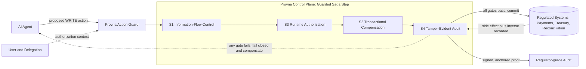

# Provna

> Every agent action, proven.

**Provna is a vendor-neutral runtime control plane that turns every WRITE action an AI agent takes inside regulated enterprise systems into a contract that is reversible, authorized, information-flow-controlled, and regulator-grade provable.** It sits between your agents and your systems of record as a Policy Enforcement Point, a transaction (saga) coordinator, and a tamper-evident evidence ledger — fused into one seam. Think of it as **escrow for agent actions**: nothing irreversible happens until it has cleared four gates. Provna does not sell security — it sells *permission to ship* agents into systems where a wrong write has consequences.

> **Status: pre-build / planning phase.** This repository currently holds planning, architecture, and roadmap **documentation only — there is no code yet.** Everything here describes what Provna *will* be. The name `Provna` is pending trademark and domain clearance — **UNVERIFIED**.

---

## The problem: agents can read, but they cannot safely write

Enterprises have happily wired LLM agents into their data because **reading is safe**. The moment an agent has to *write* — post a payment, move treasury, correct a reconciliation, mutate a record of regulatory consequence — it hits a wall. A single prompt injection, a hallucinated parameter, or a half-finished multi-step action can do real, compounding, and sometimes irreversible damage in a regulated system. Agent errors also cascade: one bad step feeds the next.

So agents in regulated back-offices stay stuck in read-only or human-in-the-loop purgatory. Four gaps keep them there: **(1)** no architectural defense against prompt injection, only probabilistic filters; **(2)** no way to *undo* a side effect once it has landed in an upstream system; **(3)** no runtime proof that *this* agent was actually authorized to do *this* thing for *this* user *right now*; and **(4)** no evidence trail a regulator will accept. Provna closes all four — at the exact point where the action happens.

---

## What Provna is

The atomic unit is the **guarded saga step**: every side-effecting call an agent makes passes through four gates before it is allowed to commit, and every gate emits proof. Pass all four, the action ships. Fail any one, it fails **closed** — and the half-done work is unwound. Each pillar is something Provna *builds* (its differentiated core) or *consumes* (integrates from existing infrastructure).

| Pillar | What it does | Build / Consume |
|---|---|---|
| **S1 — Information-Flow Control** | Deterministic, *architectural* defense against prompt injection: untrusted input is isolated and tainted so it can never silently steer a privileged write. Not a filter — a boundary. | **Build** (the IFC fusion is our own) |
| **S2 — Transactional Compensation** | The real moat. Per-connector inverse operations, dry-run preview, and reverse-saga so any committed side effect can be *undone*. This is what makes writes safe. | **Build** (per-connector inverse + harness) |
| **S3 — Runtime Authorization** | An **AND-gate**: agent AND user AND delegation AND intent must all check out, plus behavioral admission, evaluated at the instant of the action — not at login. | **Build** on consumed policy / identity primitives |
| **S4 — Tamper-Evident Audit** | A signed, Merkle-chained, externally-anchored evidence ledger (canonicalized via JCS) mapped to **EU AI Act Art. 12/14**, **DORA**, and **MiFID**. Regulator-grade by construction. | **Build** on standard crypto + anchoring |

The deepest differentiator is **S2**: anyone can *block* an action; Provna's bet is that the ability to *reverse* one — cleanly, per connector, with a dry-run first — is the greenfield moat that lets a regulated enterprise actually grant agents permission to write.

### Control-plane topology

Every arrow into an upstream system passes through all four gates. The audit pillar records both the action and its inverse, so the reverse-saga always has something to unwind with.

---

## Why it is different

- **It owns a four-way white space.** Vertical **EU financial-services back-office** × **S2 transactional compensation** × **S1 IFC fusion** × **S4 signed, anchored evidence**. No incumbent sits at that intersection.
- **Deliberately not horizontal agent governance.** Microsoft and the platform vendors give generic agent governance away for free; Provna does *not* compete there. It goes deep on the regulated write path instead of wide on dashboards, where the regulatory and compensation logic is hard and specific.
- **It sells permission to ship, not security.** The product isn't a firewall — it's the thing that lets a compliance officer say *yes, the agent may write to that system*.
- **Escrow for agent actions.** Reversible + authorized + flow-controlled + provable, enforced as one atomic contract at the point of the write.

---

## Documentation

Start at **[docs/README.md](docs/README.md)** — the documentation index. Key sections:

| Section | The question it answers |
|---|---|
| [Vision](docs/vision.md) · [Positioning](docs/positioning.md) | Why does Provna exist, what is the bet, and where does it sit in the market? |
| [Product scope](docs/product-scope.md) · [Glossary](docs/glossary.md) | What is in and out of scope, and what do the terms mean? |
| [Architecture overview](docs/architecture/README.md) | How is the control plane — the guarded saga step and the four pillars — built? |
| [Pillar 1 — IFC](docs/architecture/pillar-1-information-flow-control.md) · [Pillar 2 — Compensation](docs/architecture/pillar-2-transactional-compensation.md) · [Pillar 3 — Authorization](docs/architecture/pillar-3-runtime-authorization.md) · [Pillar 4 — Audit](docs/architecture/pillar-4-tamper-evident-audit.md) | How does each of the four gates work? |
| [Action lifecycle](docs/architecture/action-lifecycle.md) · [Build vs consume](docs/architecture/build-vs-consume.md) | What happens to a single write, step by step, and what do we build versus assemble? |
| [Tech stack](docs/tech-stack.md) · [Project structure](docs/project-structure.md) | What is it built with, and how is the repo laid out? |
| [Decisions (ADRs)](docs/decisions/README.md) | Why was each key choice made? |
| [Roadmap](docs/roadmap/README.md) · [Current phase](docs/roadmap/current.md) | What ships, and in what order (phases 0–2)? |
| [Standards](docs/standards/README.md) · [Compliance mapping](docs/compliance/regulatory-mapping.md) | How do the pillars map to EU AI Act, DORA, and MiFID? |
| [Business](docs/business/README.md) · [Risk register](docs/risks/risk-register.md) | Who buys it, and what could go wrong? |

---

## Where to start

1. Read the **[Vision](docs/vision.md)** for the core bet and the four-pillar thesis.
2. Read **[Positioning](docs/positioning.md)** to see the white space and what Provna is *not*.
3. Work through the **[Architecture overview](docs/architecture/README.md)** to see the guarded saga step in context.
4. Walk the **[Action lifecycle](docs/architecture/action-lifecycle.md)** to trace one write through all four gates, then skim **[Pillar 2 — Transactional Compensation](docs/architecture/pillar-2-transactional-compensation.md)** — the moat.
5. Check the **[Roadmap](docs/roadmap/current.md)** and **[Decisions](docs/decisions/README.md)** for what is next and why.

---

## Project status

**Pre-build. Planning and design phase.** What exists today is the documentation set in `docs/` — vision, positioning, a four-pillar architecture, fourteen ADRs, a regulatory mapping, a roadmap (phases 0–2), and a risk register. **No product code has been written yet.**

Immediate next steps, at a high level:

- **Name clearance** — confirm `Provna` trademark and domain availability (currently **UNVERIFIED**).
- **S2 compensation-harness PoC** — prove per-connector inverse + dry-run + reverse-saga on a first connector (the core moat).
- **S1 IFC-fusion PoC** — demonstrate the deterministic information-flow boundary end to end, on the write path.
- **Design-partner outreach** — secure an EU-exposed FS back-office partner (payments / treasury / reconciliation).

---

*Status: pre-build / planning-phase — documentation only. Contribution guidelines, build instructions, packages, and other specifics are **TBD** until the first PoC lands. No license is declared yet — license is **TBD**. The name `Provna` is pending clearance — **UNVERIFIED**.*
