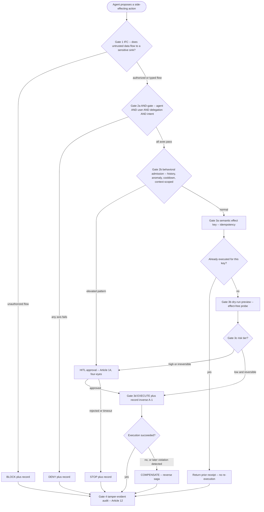

# Action Lifecycle -- The Guarded Saga Step

**Status:** Planned (pre-build)
**Last updated: 2026-06-24**
**Related:** [overview.md](overview.md), [pillar-1-information-flow-control.md](pillar-1-information-flow-control.md), [pillar-2-transactional-compensation.md](pillar-2-transactional-compensation.md), [pillar-3-runtime-authorization.md](pillar-3-runtime-authorization.md), [pillar-4-tamper-evident-audit.md](pillar-4-tamper-evident-audit.md), [../compliance/regulatory-mapping.md](../compliance/regulatory-mapping.md)

This is the canonical description of Provna's atomic unit: the **guarded saga step**. Every side-effecting action an agent proposes is wrapped into a single pass through this lifecycle. The unit is indivisible by design — IFC without compensation is a guardrail, compensation without IFC is durable-execution; the fusion is the product.

## Gate 1 -- IFC (S1)

The first question is whether untrusted data is flowing to a sensitive sink. Provna labels every value by source and propagates labels by capability and data-dependency (not by chronology). The check is **typed and fail-closed**: an unlabeled value is treated as untrusted.

- **Authorized flow** (untrusted data reaches a sink only via an explicitly-typed policy, or only trusted data reaches the sink): proceed to Gate 2.
- **Unauthorized flow** (untrusted data would reach a sensitive sink with no typed policy permitting it): **BLOCK + record**. This block is an architectural rule, not a classifier guess. Worked example: an AP agent reads an invoice (untrusted) carrying an injected `IBAN=DE89` (attacker account); the sink policy says the IBAN argument may only come from the verified supplier-master record; the injected IBAN cannot reach the payment sink, so Provna blocks before any money moves.

Declassification is possible only through a signed, principal-bound `trust_boundary` node that is itself audited. Honest limit: implicit-flow and side-channel leakage are not guaranteed. Canonical: [pillar-1-information-flow-control.md](pillar-1-information-flow-control.md).

## Gate 2a -- AND-gate authorization (S3)

A conjunction over four axes, all of which must hold: **agent AND user AND delegation AND intent**. The user and intent axes are the differentiator competitors lack. Delegation uses real caveat-attenuation (a constraint such as an amount-limit can be irreversibly added, never an exact-match subset selection) with genuinely-implemented transitive revocation and per-hop signature verification.

- **Any axis fails:** **DENY + record**.
- **All axes pass:** continue to behavioral admission.

The PDP itself is consumed (Cedar/OpenFGA + AuthZEN); Provna builds only the thin AND-gate resolver and the attenuation layer. Canonical: [pillar-3-runtime-authorization.md](pillar-3-runtime-authorization.md).

## Gate 2b -- behavioral / temporal admission (S3, the 5th dimension)

This is a **post-AND-gate orthogonal layer**, not a fifth member of the conjunction. It catches harmful patterns made of individually-valid requests (history, anomaly, cooldown) using integer-only deterministic logic. State is partitioned from the start by `PatternKey = hash(agent || capability || resource || intent)` so that benign reads cannot contaminate a sensitive transfer.

- **Elevated pattern:** route to HITL (or dry-run) — the default response is ESCALATE, **not** a categorical block.
- **Normal:** proceed to the action contract.

A cooldown is never a silent throttle; it is written to the ledger as an `AGENT_STATE_CHANGE` audit event.

## Gate 3a -- semantic effect key (idempotency)

Before any execution, Provna computes a semantic effect key for the action. If a prior successful execution exists for that key, Provna returns the prior receipt and does **not** re-execute (this is what makes resume/retry safe and prevents double-posting). Otherwise it proceeds to dry-run.

## Gate 3b -- dry-run preview

Every action gets an effect-free preview before the money path. The dry-run reads or simulates the upstream effect so the action can be previewed (and, for HITL, shown to a human) without causing a side effect.

## Gate 3c -- risk tier and Gate 3d -- HITL (Article 14)

The action is assigned a risk tier:

- **Low and reversible:** execute directly.
- **High or irreversible** (for example over a configured amount, or an action with no validated inverse): require **human approval** under EU AI Act Article 14 (four-eyes). Provna does not build its own durable suspend; on an integrated runtime it consumes the host's durable human-gate. If the human **rejects** or the gate **times out**: **STOP + record**. If **approved**: proceed to execute.

## Gate 3d -- execute and record compensation (S2)

Provna executes the action idempotently and, in the same step, records the inverse operation `A-1` (or, for irreversible actions, prefers a two-phase form: auth then capture, with void available before capture). The inverse comes from the API-version-pinned, round-trip-tested compensation catalog — this is the real moat. Never sold as "undo everything"; the honest claim is per-connector validated inverses plus two-phase for the rest. Canonical: [pillar-2-transactional-compensation.md](pillar-2-transactional-compensation.md).

- **Execution succeeds:** go to audit.
- **Execution fails, or a violation is detected later** (saga failure, downstream rejection, or a post-hoc IFC/policy violation): trigger the **reverse saga**.

## Reverse saga -- COMPENSATE (S2)

The reverse saga runs the recorded inverses in LIFO order to unwind the committed effects, then uses an **observe-probe** to read the real upstream state and confirm the compensation actually completed. Compensation is semantic and can itself fail; where it cannot guarantee a clean reversal, the action should have been gated as two-phase or HITL upstream. The compensation outcome is itself audited.

## Gate 4 -- tamper-evident audit (S4, Article 12)

Every branch terminates here. Whatever the outcome — allow, block, dry-run, reverse — Provna emits a signed, externally-anchored record: OpenTelemetry span, hash-chain link, Merkle root, RFC3161 external anchor, RFC8785 JCS canonicalization, `kid`-embedded portable witness, and a `policy_snapshot_ref` binding the decision to the exact policy version. Governance-failure signals are persisted as signed audit events, not silently dropped. The evidence is regulator-grade and forensic-reproducible, mapped to EU AI Act Article 12 (forensic reproducibility) and Article 14 (human oversight), plus DORA and MiFID II. "Court-admissible" is case-by-case UNVERIFIED and is never overclaimed. Canonical: [pillar-4-tamper-evident-audit.md](pillar-4-tamper-evident-audit.md).

## The four terminal outcomes

| Outcome | Reached from | Meaning |
|---|---|---|
| **allow** | Gate 3d success, or idempotency replay | Action executed (or already executed); receipt returned; inverse on file. |
| **block** | Gate 1, Gate 2a, or rejected/timed-out HITL | Action stopped before any side effect; recorded with reason. |
| **dry-run** | Gate 3b preview, or behavioral escalation to preview | Effect-free preview returned for human or policy review; no side effect. |
| **reverse** | Execution failure or later violation | Recorded inverses replayed and confirmed by observe-probe; net effect undone. |

All four are signed and anchored at Gate 4 -- the ledger is the system of record independent of verdict.
