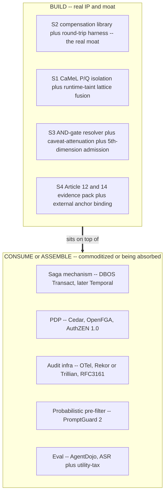

# Build vs Consume

**Status:** Planning (pre-build)
**Last updated: 2026-06-24**
**Related:** [overview.md](overview.md), [../product-scope.md](../product-scope.md), [../positioning.md](../positioning.md), [pillar-1-information-flow-control.md](pillar-1-information-flow-control.md), [pillar-2-transactional-compensation.md](pillar-2-transactional-compensation.md), [pillar-3-runtime-authorization.md](pillar-3-runtime-authorization.md), [pillar-4-tamper-evident-audit.md](pillar-4-tamper-evident-audit.md)

This is the canonical build-vs-consume doc. It is the discipline that keeps Provna thin-but-deep: build only the white space the market leaves open, consume everything that is commoditized or being absorbed by larger players. The decision is pinned in [../decisions/0003-build-vs-consume-boundary.md](../decisions/0003-build-vs-consume-boundary.md).

The shape is deliberate: **BUILD sits on top of CONSUME.** Provna never rewrites the commodity substrate; it assembles it and pours its years of effort into the narrow white space the substrate cannot fill.

## What Provna BUILDS

| Built capability | Pillar | Why build it (not consume) |
|---|---|---|
| **Per-connector inverse library + round-trip test harness + observe-probe + API-version-pinned auto-runnable catalog** | S2 | The four-way white space. No horizontal, durable-execution, or security vendor builds this — they treat reversal as a "developer problem." The saga *mechanism* is commodity, but the *content* (validated, version-pinned, domain-specific inverses for FS back-office) requires multi-year accumulation. This is the real moat — **conditional** on that accumulation genuinely being hard (the single most critical assumption, to be validated with design partners). |
| **S1 CaMeL P/Q-LLM isolation + runtime-taint dual-lattice fusion** | S1 | No vendor-neutral production IFC plane exists. The P/Q isolation (the Q-LLM cannot call tools, returns only typed values) is the architectural differentiator competitors lack. The deterministic guarantee must be anchored in our own lattice + sink-policy; it cannot be outsourced to a classifier. |
| **AND-gate resolver + real caveat-attenuation + transitive revocation + 5th-dimension behavioral admission** | S3 | The PDP itself is consumed; what is built is the *thin* resolver fusing four axes (user and intent are absent in competitors), genuinely-implemented attenuation (irreversibly add a constraint, not exact-match subset), and the context-scoped behavioral admission layer with `PatternKey` partitioning to avoid state-mixing. |
| **EU AI Act Article 12/14 evidence pack + external-anchor binding + portable witness + policy_snapshot_ref** | S4 | The crypto mechanisms are assembled, but the *regulator-grade FS evidence pack* (Article 12 forensic reproducibility, Article 14 human oversight, DORA, MiFID mapping) and the binding of governance-failure signals into the signed ledger are domain depth no horizontal player carries. |

## What Provna CONSUMES or ASSEMBLES

| Consumed component | Used for | Why consume it (commoditization / absorption) |
|---|---|---|
| **DBOS Transact** (later Temporal at scale) | The saga execution mechanism | Resumability and exactly-once are commoditized substrate. Stand the saga mechanism up in a weekend; spend the years on the compensation *content*. Building a durable-execution engine is horizontal drift. |
| **Cedar / OpenFGA + AuthZEN 1.0** | The PDP behind the AND-gate | S3 is a saturated market (CrowdStrike acquired SGNL for roughly 740M USD). Align and consume; do not try to own the PDP. AuthZEN alignment is a real differentiator because the leading horizontal substrate does not implement it. |
| **OpenTelemetry + Rekor/Trillian + RFC3161** | Audit transport, transparency log, external timestamp anchor | The format is open and the mechanism is commodity. Value accrues from being the system of record and from the FS mapping, not from reinventing the log. |
| **PromptGuard 2** | Optional probabilistic pre-filter | A classifier is only an optional pre-filter, never the architectural guarantee. Selling a classifier as a guarantee is exactly the weakness the IFC fusion is designed to avoid. |
| **AgentDojo** | Evaluation: attack success rate (ASR) plus utility-tax, measured together | Measurement infrastructure is commodity. What Provna owns is the discipline of publishing ASR and utility-tax together (so "block everything" is not a hidden win) plus FS-domain ground-truth. |

## The reasoning behind the boundary

Two forces decide every row:

- **Commoditization.** Anything where the mechanism is open, standardized, or weekend-buildable (saga execution, PDP, audit transport, eval harness) is consumed. Owning it adds no defensibility and burns the runway.
- **Absorption.** Anything a larger player is actively absorbing (the PDP market by identity giants; horizontal governance by Microsoft) is consumed and aligned with, never contested head-on. The pitch always rests on the two genuinely defensible pillars, S1 and S2.

Defensibility is in **substance (S1 + S2)**, not in **position (S3 + S4)** — roughly a 12 to 24 month window. The build list is therefore narrow on purpose. Absorption vectors and the counter-moves (S2 vertical-FS connectors, Article 12/14 depth, IFC fusion) are in [../positioning.md](../positioning.md).

## Tie to scope discipline

The single scope test, from [../product-scope.md](../product-scope.md): *does this make one guarded saga step more secure, more reversible, or more provable — or does it turn Provna into an agent platform?* If the latter, reject or consume it. Three concrete guards:

1. **Build only the white space the fusion does not close** (S2 compensation + S1 capability-IFC); the rest (PDP, durability, audit infra, eval) is consumed or assembled.
2. **Expand in the vertical, never horizontally** — add a second vertical (healthcare/insurance), never a second product category (gateway, framework).
3. **Pitch always rests on S1 + S2** — becoming "a runtime plus a bit of governance" is fatal.
