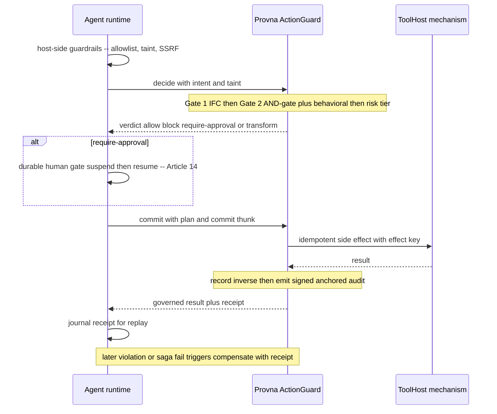

# Integration Surfaces

**Status:** Planned (pre-build)
**Last updated: 2026-06-24**
**Related:** [overview.md](overview.md), [action-lifecycle.md](action-lifecycle.md), [build-vs-consume.md](build-vs-consume.md), [../positioning.md](../positioning.md), [../decisions/0009-action-guard-seam-vendor-neutral.md](../decisions/0009-action-guard-seam-vendor-neutral.md)

Provna is a vendor-neutral control plane, so it must attach to many agent runtimes through one consistent seam and several equivalent surfaces. The same enforcement logic is exposed via an SDK, an MCP hook, and a proxy; the integration contract is the **ActionGuard seam**.

## The ActionGuard seam

The seam is **host-injected, optional, and default-OFF**: the agent runtime defines a side-effect boundary where it can call out to an external action-governance implementation, and Provna is the reference implementation of that boundary. The contract is a two-phase `decide -> commit` plus an out-of-band `compensate`, mapping one-to-one onto the four gates of the [action-lifecycle.md](action-lifecycle.md):

| Seam method | Pillars | What it does |
|---|---|---|
| `decide(intent, taint)` | S1 IFC + S3 authz + risk | check information flow, run the AND-gate plus behavioral admission, assign a risk tier, return a verdict: allow, block, require-approval, or transform |
| `commit(plan, commitThunk)` | S2 transactional + S4 audit | execute idempotently (semantic effect key), record the inverse, emit the tamper-evident audit record, return a governed result plus receipt |
| `compensate(receipt)` | S2 compensation | on later violation or saga failure, run the reverse saga and confirm with observe-probe |



Note the order: host-side guardrails run **first**, so Provna only ever sees already-permitted calls — it can attenuate them, never re-authorize a call the host already denied. On an integrated runtime, Provna gets the durable human-gate, the replay journal, and the existing untrusted/secret taint marks for free, and plugs in only its own real IP (IFC engine, compensation library, per-action authz resolver, tamper-evident audit).

## Vendor-neutral surfaces

The same `decide / commit / compensate` logic is offered through three equivalent surfaces so that no buyer is locked to one runtime — vendor neutrality is both a moat precondition and an adoption precondition:

- **SDK (Python and TS)** — wrap a tool in process; the lowest-friction path. Backed by gRPC to the control plane.
- **MCP hook** — intercept at the Model Context Protocol tool boundary; an ingress, with the enforcement point still being the action itself.
- **Proxy** — sit inline as a network proxy for runtimes that cannot be modified.

## Reference integration: Relavium

**Relavium is the first reference integration of the ActionGuard seam, not the only one.** It provides a side-effect tool boundary, a durable human-in-the-loop gate, secret/untrusted taint marks, a run-events replay journal, an MCP client, and a multi-LLM seam — substrate Provna reuses so the MVP does not build interception from scratch. The vendor-neutrality thesis requires that the same logic also serve LangChain, the OpenAI SDK, and custom runtimes via the surfaces above. Those are **roadmap, not yet proven** [OPINION]; proving them is an explicit Phase-1 milestone. See [../positioning.md](../positioning.md).

## Govern in two lines -- the layered model

First value in five minutes, zero infrastructure, opt-in by layer. The developer first earns trust by *observing* (signed audit), then turns on *enforcement* — never a big-bang "block everything." This is the developer-scale reflection of the enterprise shadow-mode-to-enforce journey.

```python
from provna import govern

# Layer 0 -- zero config, audit-only but SIGNED and ANCHORED observation.
# This is NOT plain logging: every call produces JCS + signature + Merkle evidence.
tool = govern(tool)

# Layer 1 -- add policy (deny + dry-run): risky actions stop before the side effect.
tool = govern(tool, policy="fs-backoffice")

# Layer 2 -- add compensation (connector-backed one-click reversal).
tool = govern(tool, policy="fs-backoffice", compensate=True)
```

- **Layer 0 (audit-only, signed + anchored).** This is deliberately not plain logging. Even at Layer 0, every governed call is canonicalized (RFC8785 JCS), signed, and Merkle-anchored, which is what separates Provna from unsigned trace push and general APM. It is how a champion produces a risk-committee evidence pack from two weeks of the customer's own shadow-mode traffic.
- **Layer 1 (policy: deny + dry-run).** Enforcement turns on: the IFC gate and the AND-gate can now block, and high-risk actions are previewed via dry-run before the money path.
- **Layer 2 (compensate).** Connector-backed one-click reversal is enabled, where a validated inverse exists. The honest line is "risky actions are prevented, connector-backed actions are reversed" — never "everything is reversible."

## Claude Code: a real PreToolUse deny

For Claude Code, Provna attaches as a **PreToolUse hook plus an MCP proxy** and issues a **real deny** (a genuine block before the action), not a post-hoc audit. The distinction from observe-only shipped hooks is decisive: a PostToolUse "observe" mode that always exits zero is an observability shim, not a reference monitor. Provna's value on this surface is **prevention** — an S1 deny plus the risk gate stops the action before it happens. The compensation moat (S2) lives in the FS connectors (for example Stripe void, NetSuite reversal), where the inverse is recorded and round-trip-validated; not every prevented action is reversible (a raw destructive command, an uncontrolled prod write), so on this surface the honest claim is "risky actions are prevented, connector-backed actions are reversed." Fail-closed throughout: an error implies BLOCK, with no downgrade path. See [../standards/architectural-principles.md](../standards/architectural-principles.md).
