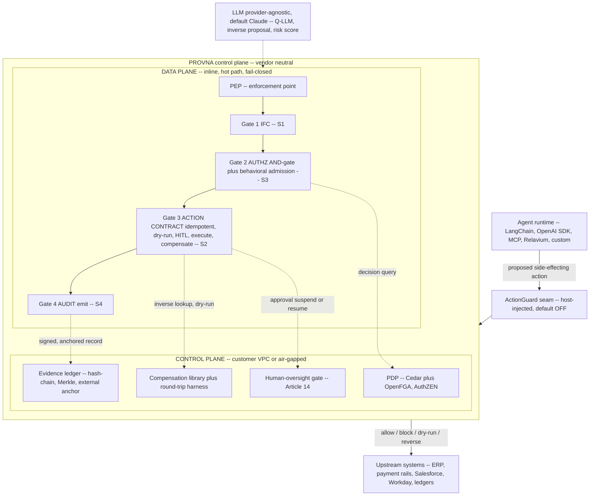

# Architecture Overview

**Status:** Planning (pre-build)
**Last updated: 2026-06-24**
**Related:** [README.md](README.md), [action-lifecycle.md](action-lifecycle.md), [build-vs-consume.md](build-vs-consume.md), [integration-surfaces.md](integration-surfaces.md), [../tech-stack.md](../tech-stack.md)

## Where Provna sits

Provna is not an application and not an agent framework. It is a **control plane / middleware** that sits inline between the agent and the real-world side effects it wants to cause: payment rails, ERP, reconciliation, PHI. Architecturally it is three things fused into one path:

- a **Policy Enforcement Point (PEP)** — it intercepts the proposed action and decides;
- a **transaction (saga) coordinator** — it executes the action idempotently and records how to reverse it;
- an **evidence ledger** — it produces a signed, externally-anchored record of what happened and why.

The position is `agent <-> Provna <-> upstream`. The agent proposes; Provna decides, executes, and proves; the upstream system only ever sees actions that have passed all four gates. The CISO question changes from "do we trust the agent?" to "do we trust the gate?" — that shift is the core of the product.

## Data plane vs control plane

Provna is split deliberately, and the split maps to the technology choices in [../tech-stack.md](../tech-stack.md).

**Data plane (inline, hot path).** The PEP and the four-gate chain run on the action's critical path. They must be fast, deterministic, and fail-closed: any error blocks the action, with no downgrade path. The production-target hot path is implemented in a systems language (Go/Rust) so that inline enforcement does not add unacceptable money-path latency. The MVP runs the same logic in TS/Python in a single container to move fast; hardening the hot path is a later-phase concern.

**Control plane (customer VPC / air-gapped).** The PDP, the compensation library and round-trip harness, the human-oversight gate, and the evidence ledger live alongside the data plane but off the synchronous hot path where possible. The PDP is *consumed* (Cedar/OpenFGA + AuthZEN); the compensation library and the evidence ledger are the *built* IP. Deployment is into the customer's own environment (VPC or air-gapped), because the buyer is a regulated FS institution that will not export money-path traffic.

**The LLM is provider-agnostic and never on the trust boundary.** The model is used for the quarantined Q-LLM, for proposing candidate inverse operations, and for risk scoring — never as the thing that grants permission. The deterministic guarantee is anchored in the lattice and sink-policy, not in any model output. See [pillar-1-information-flow-control.md](pillar-1-information-flow-control.md).

## The four-gate chain

Every side-effecting call passes four gates in a single pass, in fixed order. This ordered chain is the **guarded saga step** — the atomic unit. The full per-branch semantics are canonical in [action-lifecycle.md](action-lifecycle.md); here is the chain at a glance:

1. **Gate 1 — IFC (S1).** Source/sink labels, typed and fail-closed (unlabeled implies untrusted). Untrusted data cannot reach a sensitive sink unless an explicitly-typed policy authorizes the flow. Canonical: [pillar-1-information-flow-control.md](pillar-1-information-flow-control.md).
2. **Gate 2 — Authorization (S3).** An AND-gate over four axes — agent AND user AND delegation AND intent — backed by a consumed PDP, followed by an orthogonal context-scoped behavioral/temporal admission layer (the "5th dimension"). Canonical: [pillar-3-runtime-authorization.md](pillar-3-runtime-authorization.md).
3. **Gate 3 — Action contract (S2).** Idempotency key, then dry-run, then risk-tiered HITL, then execute while recording the inverse for later compensation. This is the moat. Canonical: [pillar-2-transactional-compensation.md](pillar-2-transactional-compensation.md).
4. **Gate 4 — Audit (S4).** OpenTelemetry plus hash-chain plus Merkle root plus external anchor plus portable witness; every outcome (allow, block, dry-run, reverse) is recorded as a signed, anchored event. Canonical: [pillar-4-tamper-evident-audit.md](pillar-4-tamper-evident-audit.md).

The four outcomes that leave the control plane are **allow / block / dry-run / reverse**. Every one of them, including a block, terminates in a tamper-evident audit record — the ledger is the system of record regardless of the verdict.

## Why fuse instead of layer

Competitors keep these gates in separate products and architecturally apart. The white space Provna owns is precisely the fusion: IFC-aware compensation (the preventive side and the transactional side talking to each other), a ready per-connector inverse library, and action-bound signed-and-anchored evidence. Why each capability is built versus consumed — and why splitting them would surrender the moat — is the subject of [build-vs-consume.md](build-vs-consume.md). How an agent runtime attaches to this topology is the subject of [integration-surfaces.md](integration-surfaces.md).
