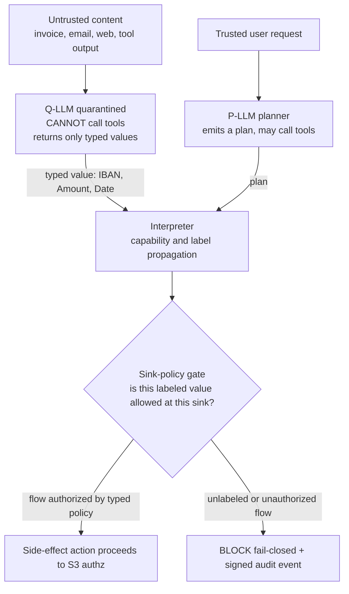

# Pillar 1 - Information Flow Control (S1)

**Status:** Planned (pre-build) - design target for Phase-0 PoC
**Last updated: 2026-06-24**
**Related:** [../decisions/0004-s1-camel-pq-isolation-runtime-taint-fusion.md](../decisions/0004-s1-camel-pq-isolation-runtime-taint-fusion.md), [action-lifecycle.md](action-lifecycle.md), [build-vs-consume.md](build-vs-consume.md), [pillar-4-tamper-evident-audit.md](pillar-4-tamper-evident-audit.md), [../tech-stack.md](../tech-stack.md)

---

S1 is the first gate of the guarded saga step: before any side-effecting call is authorized, executed, or audited, the IFC gate decides whether the data feeding that call is allowed to reach a sensitive sink. This document is the deep technical plan for that gate. The architectural decision and its alternatives live in [the S1 ADR](../decisions/0004-s1-camel-pq-isolation-runtime-taint-fusion.md); this file specifies *how it is built and what it does (and does not) guarantee*.

## Purpose - a deterministic ARCHITECTURAL defense, not detection

The lethal trifecta (private data + untrusted content + an external communication channel) makes any agent that touches all three unconditionally exploitable via prompt injection. The major model vendors have publicly acknowledged this is not patchable inside the model. A classifier that *detects* a malicious instruction is a probabilistic bet; it answers "does this text look like an attack?" and is wrong on the long tail by construction. Provna does not make that bet.

S1's purpose is to make a **structural** claim instead of a statistical one: untrusted data structurally *cannot* reach a sensitive sink unless an explicitly-typed policy authorizes that exact flow. The CISO question shifts from "do we trust the agent?" (unanswerable) to "do we trust the gate?" (a finite, reviewable artifact). This is the architectural core of permission-to-ship: the block in the canonical demo (a hidden `IBAN=DE89` injected into an incoming invoice never reaching the SEPA payment sink) is enforced by a lattice rule, not by a model guessing the IBAN is malicious.

## Build vs consume - consume the reference, build the money-path PEP

The old premise that "no production IFC plane exists, CaMeL and FIDES are only research blueprints" is **outdated**. Microsoft FIDES now ships as real, MIT-licensed, provider-agnostic code in `microsoft/agent-framework`, and `microsoft/dromedary` (MIT) is a working CaMeL implementation (privileged LLM + a quarantined `query_ai_assistant` + a custom interpreter + OPA policy). So the framing inverts: Provna **consumes** these as the isolation + label-propagation *reference and prototype substrate*, and concentrates its BUILD effort on the parts that are still missing - the inline, fail-closed, money-path enforcement that no reference ships.

What Provna **consumes** (reference / prototype substrate):

- **FIDES** (`microsoft/agent-framework`, MIT, Python, provider-agnostic) as the Q-LLM-isolation + label-propagation reference and the prototype substrate for the Phase-0 PoC and the AgentDojo eval.
- **dromedary** (`microsoft/dromedary`, MIT, a CaMeL implementation) as the interpreter / capability reference (privileged LLM + quarantined `query_ai_assistant` + custom interpreter + OPA policy).
- The evaluation harness (**AgentDojo**) and an *optional, off-path* probabilistic pre-filter.

What Provna **builds** (the sharpened, real moat - the part no reference provides):

- The **inline, fail-closed reference-monitor data-plane in Go** on the synchronous money-path: enforcement happens before the side-effecting call, not as an after-the-fact observer.
- The **immutable, server-side label store**: in-process code cannot raise its own integrity (a gap in mutable-provenance references such as MVAR, whose `ProvenanceNode` is not frozen).
- The **signed, principal-bound declassification node** for high-capacity declassification: the single, audit-visible way to raise integrity or lower confidentiality.
- The **per-connector sink-policy catalog**: the typed flow-authorization rules per sink.
- The **S1<->S4 forensic declassification bridge**: every declassification is recorded as a tamper-evident event an auditor can later enumerate.

The reference implementations are framework-bound research substrates: they prove the isolation and label-propagation primitives but do not give you a vendor-neutral PEP sitting inline on the regulated money-path with an immutable label store and an external audit anchor. That inline PEP is the build boundary. Reviews of adjacent open-source implementations confirm the gap - mature dual-lattice references carry mutable provenance nodes and no transactional or external-audit side, host-dependent horizontal substrates leave uninstrumented paths outside the guarantee, and DSL-ergonomics references treat the prompt-injection classifier as "just a heuristic" and define "flow" as message chronology. The full evaluation and source URLs live in [../architecture/tech-stack-analysis.md](../architecture/tech-stack-analysis.md). See also [build-vs-consume.md](build-vs-consume.md).

## Target architecture

The target is a fusion: a **CaMeL P/Q-LLM isolation core** (prototyped on consumed FIDES + dromedary references) plus a **runtime-taint dual-lattice sink-gate complement** built by Provna, surfaced through an Invariant-style DSL whose backend is capability/label propagation rather than chronology. The isolation and label-propagation primitives ride the consumed reference substrate; the inline fail-closed enforcement, the immutable label store, and the signed declassification node are Provna's own data-plane.

### Core - CaMeL P/Q-LLM isolation

Two LLM roles are architecturally separated:

- **P-LLM (privileged planner).** Receives the *trusted* user request and emits a plan (effectively code). It may call tools. It never sees raw untrusted content; it sees only typed *handles* to values the Q-LLM produced.
- **Q-LLM (quarantined).** Processes all untrusted content (invoices, emails, web pages, prior tool outputs). It **cannot call tools** and **returns only typed values** (e.g. `IBAN`, `Amount`, `Date`). It has no path to a side effect.

This is the differential the torn-down adjacent references lack: where LLM output flows into a single provenance graph via a shared `create_derived_node`, there is no isolation boundary. By contrast, in Provna the only way an untrusted-derived value reaches a sink is as a *typed, labeled* value threaded through the interpreter - and the ASR guarantee rests on this isolation, not on a classifier. The FIDES reference supplies this Q-LLM isolation pattern directly; dromedary supplies the interpreter / capability shape (its quarantined `query_ai_assistant` is the Q-LLM channel).

The interpreter adopts the **2026 CaMeL side-channel hardening** to tighten the implicit-flow boundary: **loop clamping** (bounded iteration so a label-dependent loop count cannot leak via repetition), **structured error handling**, and **constant-time error paths** (so error presence/timing/message does not differ by the secret being processed). These mitigations narrow - but do not eliminate - the implicit-flow and side-channel class that the honest guarantee still excludes; they are defense-in-depth on the interpreter, not a new guarantee.

### Complement - runtime-taint dual-lattice sink-gate

Around the isolation core sits a runtime-taint layer modeled on MVAR's mature dual lattice but hardened. Two orthogonal lattices travel with every value:

- **Integrity** (low = untrusted ... high = trusted), propagated **min-integrity**: a derived value is only as trustworthy as its *least*-trusted input.
- **Confidentiality** (low = public ... high = sensitive), propagated **max-confidentiality**: a derived value is at least as sensitive as its *most*-sensitive input.

The sink-gate is two-layer and fail-closed: an `UNTRUSTED + CRITICAL` flow is BLOCKED first, before any policy lookup. The sink-policy then asks, for the specific sink and the specific labeled argument, "is this exact flow authorized by a typed policy?" If yes, the action proceeds to S3; if no (or if the label is missing), it is blocked.

### Surface - DSL ergonomics, capability backend

The author-facing surface borrows Invariant's readable operator distinction - `->` (transitive flow) and `~>` (immediate flow) - because it is genuinely ergonomic. But the backend is **not** chronology. Invariant's `->` draws an edge from every earlier message to every later one, so it reports `1 -> 3` whenever message 1 precedes message 3 in time, regardless of whether data actually flowed (temporal reachability, not data dependency). Provna keeps the syntax and binds it to capability / label propagation: `a -> b` holds only if a labeled value derived from `a` actually reaches `b`'s argument.

## Design decisions

Four decisions are load-bearing; each closes a specific failure mode observed in a torn-down competitor.

1. **Typed + fail-closed; unlabeled => untrusted.** Every value carries a type and a label. An *absent* label is not a downgrade path - it is treated as `UNTRUSTED` and (where the sink is sensitive) blocked. The biggest real-world IFC risk is annotation coverage gaps multiplied by fail-open behavior; the regulated vertical lets us choose the strict default (fail-closed) without an unacceptable usability cost.
2. **Node-immutable labels (frozen value-object + server-side store).** MVAR's `ProvenanceNode` is not frozen (its own source comments "not frozen for backward compatibility"), which permits in-process mutation to *upgrade* a label and launder taint. Provna's labels are immutable value-objects held in a server-side store; in-process code cannot raise its own integrity.
3. **Conservative propagation (min-integrity / max-confidentiality).** Stated above; the conservative direction is deliberate - the cost is a higher block/escalate rate, the benefit is that no derivation silently *gains* trust or *loses* sensitivity.
4. **Declassification is explicit, never implicit - two channels by capacity.** There is no implicit declassification. The **default channel is FIDES-style typed constrained-decoding**: the Q-LLM emits only a low-capacity output type (a `bool`, an `enum`, a small fixed `dict`) under constrained decoding, so the maximum information that can cross the trust boundary is bounded by the type itself - a few bits, not free-form text. This is the common-case declassification and it needs no per-event signature because its capacity is structurally tiny. The **signed, principal-bound `trust_boundary` node is reserved for high-capacity declassification** (free-form or large-payload values): it is signed, bound to a principal, and audit-visible. Both channels are forensic events recorded by S4 (this is the S1<->S4 bridge), so an auditor can later enumerate every place trust was injected and by whom; the high-capacity channel additionally carries a principal-bound signature precisely because it can move more than a few bits.

## Deterministic-guarantee honesty

The deterministic guarantee is anchored **only** in the lattice + sink-policy. The measured Attack Success Rate (ASR) is a property of those two artifacts, not classifier luck.

A probabilistic pre-filter is **optional** and runs *before* the lattice purely to cheaply drop obvious attacks and reduce load. The chosen pre-filter is **self-hosted Llama Prompt Guard 2** (the 86M multilingual model, or the 22M low-latency variant) - explicitly **off** the deterministic guarantee path. Provna does **not** depend on Lakera (proprietary, acquired by Check Point) or any SaaS detector, both because the guarantee must not rest on a third party's classifier and because air-gapped deployment forbids network egress. The pre-filter is never marketed as an "architectural guarantee." If the pre-filter is removed, the guarantee is unchanged; if the pre-filter passes a malicious value, the lattice + sink-policy still block the unauthorized flow. This separation is the honesty hinge that distinguishes Provna from guardrail/inspection tools whose entire defense *is* the classifier.

## The honest guarantee (sell exactly this sentence)

> For every side-effecting action, untrusted data cannot reach a sensitive sink unless an explicitly-typed policy authorizes that flow; all flows are enforced deterministically before execution and are tamper-evidently logged (EU AI Act Article 12). We do not guarantee against implicit-flow or side-channel leakage.

The excluded class is stated plainly: implicit flows (e.g. control-flow-dependent leakage) and side channels (timing, error-message differences) are **not** covered. Overclaiming here is punished by the audit persona; the credibility of the whole guarantee depends on naming its boundary.

## Measurement

S1 is measured on **AgentDojo**, reporting ASR and utility-tax **together** - never ASR alone. ASR-alone is a trap ("block everything" drives ASR to 0 while destroying utility); the paired numbers prove the gate did not simply refuse all work. We additionally publish FS-domain ground-truth (e.g. reconciliation correctness) so the claim is not just "we blocked" but "the agent still completed the task correctly."

- Known IFC utility-tax reference: roughly 7 points [OPINION] - consistent with a single typed-IFC AgentDojo data point (~77% task completion vs ~84% undefended), not a general empirical confirmation; still to be validated against a design partner's FS workflow.
- The reported ASR is to be presented as the lattice + sink-policy guarantee, explicitly *not* attributed to classifier coverage.

The ASR/utility-tax numbers feed the broader eval discipline shared with the other pillars; see [build-vs-consume.md](build-vs-consume.md) and [../tech-stack.md](../tech-stack.md) for the AgentDojo dependency.

## Open validations

Tracked items that must be resolved before the S1 guarantee is sold as production-grade:

- **Annotation coverage.** Confirm that fail-closed (`unlabeled => untrusted`) holds across every ingress path in the target runtime, with no uninstrumented bypass (the failure mode that weakens horizontal substrates).
- **Utility-tax in a real FS workflow.** Re-validate the ~7-point reference [OPINION] (consistent with one typed-IFC AgentDojo data point, not a general confirmation) against a design partner's reconciliation / AP workflow on AgentDojo + FS ground-truth.
- **P/Q isolation under real connectors.** Prove the Q-LLM genuinely has no tool-call path and that typed handles are the only channel from untrusted content to a sink, end to end.
- **Declassification ergonomics.** Confirm the signed `trust_boundary` node is usable enough that operators do not route around it (an unusable declassification path becomes a shadow fail-open).
- **Patent caution.** Re-implement primitives independently from prior art (Jif / FlowCaml / Capsicum-style capabilities); do not copy any third party's taint-laundering-prevention or execution-witness-binding combination claims, and do not use competitor trademarks. The consumed references (FIDES, dromedary) are MIT-licensed, which simplifies the reference path, but Provna's own data-plane primitives are still implemented independently. [UNVERIFIED - legal review pending.]
