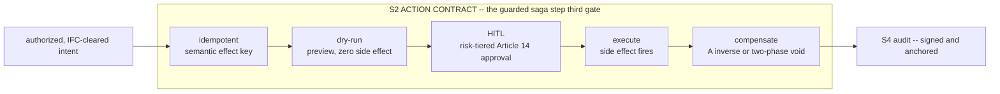
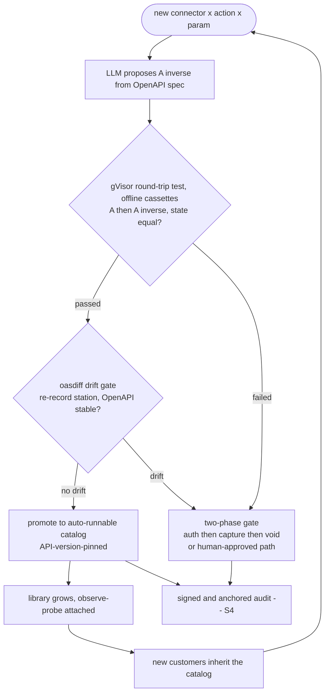

# Pillar 2 — Transactional Compensation (S2)

**Status:** Planned (pre-build) — THE REAL MOAT
**Last updated: 2026-06-24**
**Related:** [../decisions/0005-s2-dbos-substrate-compensation-library.md](../decisions/0005-s2-dbos-substrate-compensation-library.md), [../roadmap/phase-0-mvp.md](../roadmap/phase-0-mvp.md), [action-lifecycle.md](action-lifecycle.md), [build-vs-consume.md](build-vs-consume.md), [pillar-1-information-flow-control.md](pillar-1-information-flow-control.md), [../tech-stack.md](../tech-stack.md)

---

## Purpose

S2 is the gate that turns a side-effecting agent call into a **reversible contract**. Within the guarded saga step it owns the third gate — the ACTION CONTRACT: `idempotent -> dry-run -> HITL -> execute -> compensate`. Its job is not to inspect or to authorize; it is to ensure that every WRITE Provna lets through can be **previewed before it happens, made exactly-once, and undone after it happens** — either by a per-connector inverse (A⁻¹) or, where no honest inverse exists, by a two-phase hold (auth -> capture -> void) that never lets the irreversible effect fire in the first place.

This is the pillar Provna **builds** as its deepest IP. The other three pillars consume or assemble commodity substrate (a PDP, a durable-execution engine, an audit-anchoring stack); S2 consumes only the *mechanism* (the saga/durable-execution machinery from DBOS Transact + Postgres, held behind a thin `SagaCoordinator` interface) and builds the *content* — the verified, version-pinned library of inverse operations and the harness that proves they actually round-trip. **The mechanism is a commodity; the content is the company.**

---

## Why this is the real moat

The defensibility of Provna does not rest on any single pillar in isolation — S3 (authorization) is a saturated market, S4 (audit) is assembled from commodity primitives, and S1 (IFC) is an architectural differentiator but conceptually anticipated by published work. **S2 is the one axis the entire surveyed landscape leaves structurally empty**, and it is empty for a reason that is hard to copy: compensation is *semantic*, not mechanical.

### The market and four named competitors all leave S2 empty

- **Microsoft MGAT** (horizontal governance substrate): the saga capability is self-declared a **stub** — checkpoint/DSL/fan-out scaffolding with no per-connector inverse content. Horizontal breadth, S2 hollow.
- **MVAR** (Apache-2.0 solo project, the closest S1+S4 concept-twin): a non-test search for `compensate | rollback | saga | dry_run` returns **zero**. Its nearest gesture toward reversal is a credential kill-switch — a forward cut, not an inverse.
- **Invariant** (Snyk): its enforcement enum is only `BLOCK` / `LOG`. There is no notion of executing-then-undoing; it inspects and stops, it does not reverse.
- **ACP** (solo S3 prior-art project): architecturally **excludes** reversal — its own specification states "there is no rollback of approved requests." Its payment surface proves settlement; it has no auth/capture/void/refund inverse.

Beyond the four torn-down competitors, the broader market confirms the gap from every side: **Verity** does exactly-once-*forward* with no undo and no dry-run; **Rubrik** (Agent Rewind) does snapshot/restore, not per-action inverse — a snapshot cannot un-send a sent email or un-trigger a released payment; **Temporal** ($5B) treats compensation as a **manual pattern a developer hand-writes per workflow**, not a library; **DBOS** gives the saga mechanism free but ships no compensation *content*. Every adjacent player treats reversal as "a developer problem" — which is precisely why none of them accumulate the content.

### Compensation is semantic, and that is the moat

An inverse is not a generic rollback. `void` is not `refund`; a reversing journal entry in NetSuite is not a delete; un-releasing a SEPA payment in the auth window is a different operation from clawing back a settled one. Each inverse is **per-connector, per-action, pinned to a specific API version, and only trustworthy once an observe-probe has confirmed the real downstream system actually returned to the prior state.** That content cannot be generated generically; it must be authored, tested round-trip, and accumulated. **If — and the conditional below makes this explicit — that accumulation genuinely takes years for the regulated-FS back office, then "buy < build" holds and the library is a moat no horizontal, durable-execution, or security vendor will replicate.**

---

## Architecture and components

S2 is five components layered on a consumed saga substrate. Each is a piece of *content* Provna builds; the competitor column records why this content is greenfield.

| Component | What it does | Competitor status |
|---|---|---|
| **Per-connector inverse (A⁻¹)** | A real, named inverse operation per (connector, action): Stripe `void` / `refund`, NetSuite reversing journal entry, payment-rail reversal. Not a generic "delete"; the semantically-correct undo for that specific effect. | ACP has settlement-proof but no auth/capture/void/refund. MVAR's nearest is a forward credential kill-switch. None ship an inverse catalog. |
| **Round-trip test harness** | Automated `A -> A⁻¹` verification in a gVisor-isolated runner: apply the action, apply its inverse, assert the system state equals the pre-action state. Connector round-trips are air-gap-native — replayed offline from recorded VCR-style cassettes — so the proof runs in CI without network egress. Every inverse carries a machine-checked round-trip proof. | Exists in **none** of the four. This harness is the engine that lets the catalog grow with confidence rather than hope. |
| **Observe-probe** | After executing (or compensating), read the *real* downstream state to confirm the side effect actually occurred / was actually undone. Answers "did the effect happen?" and "did the undo complete?" rather than trusting the API return code. | None. Competitors trust the call result; Provna verifies against ground truth. |
| **Dry-run** | An effect-free rehearsal on the money path before any real write — the preview the HITL approver and the audit pack are built on. | None. Verity/Temporal/DBOS have no preview-before-execute on the action itself. |
| **API-version-pinned auto-runnable catalog** | Inverse definitions pinned to the connector's API version and promoted to "auto-runnable" only after passing the round-trip harness. A separate connected re-record station refreshes the cassettes and runs `oasdiff` (OpenAPI diff) as a drift gate before a connector is promoted; new customers inherit the catalog; drift between API versions is detected, not silently trusted. | None. This pinning + auto-runnable promotion is what makes the library *inheritable* and therefore a flywheel rather than a per-customer rewrite. |

The atomic-unit warning applies here: split S2 from S1 and the moat dilutes. **Compensation without IFC is just durable-execution; IFC without compensation is just a guardrail.** The value is the fusion — an inverse that fires *because* a post-execution IFC violation was detected is something no compensation-only or inspection-only product can produce.

---

## The flywheel

The catalog grows by a self-reinforcing loop. A new connector enters; an LLM proposes the inverse from the connector's OpenAPI spec; the gVisor-isolated round-trip harness tests it offline against recorded cassettes; on pass — and after the connected re-record station clears the `oasdiff` drift gate — it is promoted to the API-version-pinned auto-runnable catalog and every customer inherits it; on fail the action is routed to a two-phase (auth/capture/void) gate or human-approved path instead of being sold a false undo. Each cycle the library gets denser and the cost of the next connector drops.

**Read:** the LLM is an *accelerator* of catalog authoring, never the guarantee — the harness is the guarantee. An inverse the LLM proposes but the round-trip test rejects never reaches the auto-runnable catalog; it falls back to two-phase or HITL. The flywheel's compounding value is in the *passed* path: tested, pinned, inheritable content.

---

## DBOS substrate — consume the mechanism, build the content

S2 **consumes** the saga / durable-execution mechanism from DBOS Transact + Postgres now, for the MVP and early production. Durability, resumability, and exactly-once step execution are commodity substrate — DBOS gives them away. Provna does **not** rewrite the saga engine.

The substrate is held strictly behind the gRPC ActionGuard seam plus a thin `SagaCoordinator` interface, so the durable-execution engine is judged on its own merits and can be swapped without touching the compensation content. **Temporal is a triggered contingency, not a scheduled migration:** a Temporal adapter spike is pre-written, but the team migrates only if a concrete trigger fires — multi-tenant fan-out, a Postgres throughput/latency ceiling, or a buyer mandate. The compensation library/content remains the moat (BUILD) independent of which substrate sits behind the interface. See [../architecture/tech-stack-analysis.md](../architecture/tech-stack-analysis.md) for the substrate evaluation.

What Provna builds on top is the part the substrate does not have: the **verified, FS-back-office-specific, version-pinned inverse library + observe-probes + round-trip harness.** Stand up the saga machinery in a weekend; spend the years on compensation content. This is the single sentence that governs the pillar:

> **The mechanism is a commodity; the content is the company.**

This is also why Temporal "moving up" with a $5B war chest is not a simple substrate-consumption threat: a horizontal durability firm can add a compensation *pattern*, but IFC-aware compensation + signed/anchored regulator-grade reversal evidence + vertical-FS connector content is not its category. See [../decisions/0005-s2-dbos-substrate-compensation-library.md](../decisions/0005-s2-dbos-substrate-compensation-library.md) for the full build-vs-consume rationale and substrate choice.

---

## Honest difficulties

Provna must **never sell "undo everything."** That promise is dishonest and the audit / risk persona punishes dishonesty. The honest difficulties of compensation are first-class design constraints, not footnotes:

- **Compensation is sometimes genuinely impossible.** Some side effects have no inverse — a sent email, an executed irreversible settlement, an external notification already read. For these, the answer is **not** a fake undo; it is to **prefer two-phase from the start**: hold in an authorized intermediate state (auth -> capture -> void) so the irreversible effect can be cancelled *before* it fires rather than "reversed" after. This is the escrow metaphor made literal: value is held until conditions are met, then captured or voided.
- **"Did the side effect actually happen?"** is a real question with no free answer. Network partitions, partial failures, and ambiguous API responses mean the call result cannot be trusted. The **observe-probe** exists precisely to read the real downstream state and resolve the ambiguity rather than guess.
- **Compensation can itself fail.** The inverse is another side-effecting call and can error, partial-complete, or hit a system in a changed state. Fail-closed discipline applies: a failed compensation is a signed audit event and an escalation, never a silent swallow. The observe-probe confirms the undo actually completed; if it did not, that is surfaced, not hidden.
- **API-version drift.** An inverse verified against connector API v1 may be wrong against v2. This is why every catalog entry is **API-version-pinned** and why drift is *detected* (the re-record station re-runs `oasdiff` and the harness re-tests against the new version) rather than silently trusted. An entry whose pinned version no longer matches the live connector is demoted from auto-runnable until re-verified.

---

## The moat is conditional — to be validated with design partners

The entire S2 moat thesis rests on **one assumption that is not yet proven**: that compensation content for the regulated-FS back office is *genuinely hard enough* to require multi-year accumulation. This is the single most critical assumption in the whole Provna plan and it must be written conditionally, never as certainty.

- **If** building the verified, version-pinned, observe-probe-backed inverse library genuinely takes years per vertical, **then** "buy < build" holds, the flywheel compounds, and no horizontal / durable-execution / security vendor will replicate it (they classify it as a "developer problem"). The moat is real.
- **If** the inverse content turns out to be shallow — easily generated, low-maintenance, copyable in a sprint — **then** the flywheel weakens and S2 is a feature, not a moat.

This uncertainty is **explicitly a design-partner validation item**, not something to assert with confidence in a pitch. The kill-criterion "we can build it with OPA in one sprint" is the authorization analogue; the S2 analogue is "our connectors already expose void/reversal, the inverse library is trivial." The discovery process must probe directly: how long does it actually take this bank to author and trust an inverse for *their* NetSuite / payment-rail configuration, including the observe-probe and round-trip proof? Until that is answered with paying design partners, S2 is the **strongest moat candidate**, written conditionally — not a proven moat. See [../roadmap/phase-0-mvp.md](../roadmap/phase-0-mvp.md), where the first connector A -> A⁻¹ round-trip PoC and the harness flywheel are the concrete vehicles for validating this assumption.
