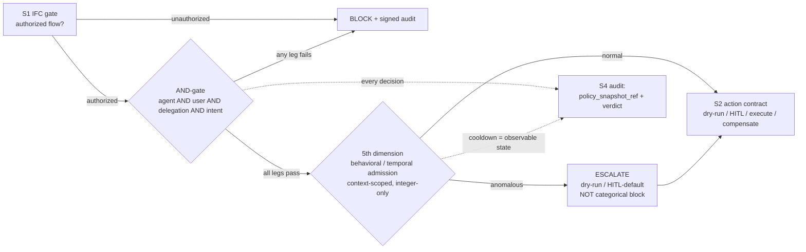
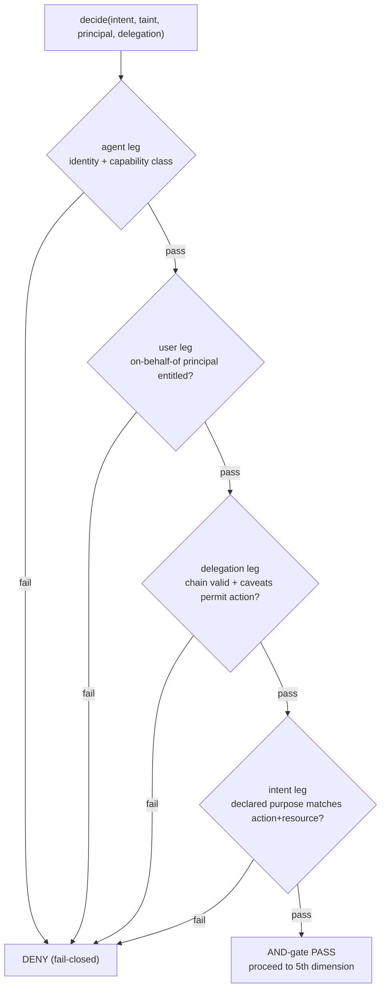
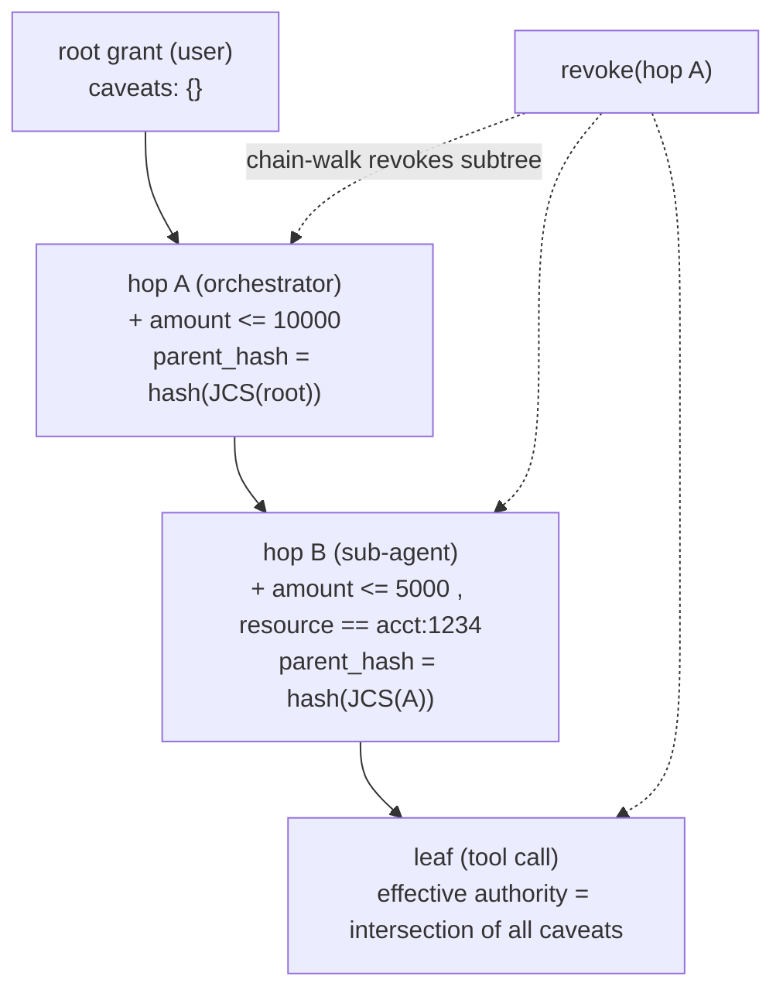
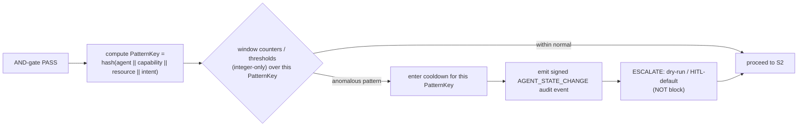

# Pillar 3 — Runtime Authorization

**Status:** Plan (pre-build)
**Last updated: 2026-06-24**
**Related:** [../decisions/0006-s3-and-gate-attenuation-behavioral-admission.md](../decisions/0006-s3-and-gate-attenuation-behavioral-admission.md) · [./action-lifecycle.md](./action-lifecycle.md) · [./build-vs-consume.md](./build-vs-consume.md) · [./pillar-4-tamper-evident-audit.md](./pillar-4-tamper-evident-audit.md) · [../tech-stack.md](../tech-stack.md) · [../positioning.md](../positioning.md)

---

## Purpose

S3 answers one question at the moment a side-effecting call is about to execute: **is this specific agent, acting for this specific user, under this specific delegation chain, with this specific declared intent, allowed to perform this exact action on this exact resource right now?** It is the second gate of the guarded saga step — it runs after the IFC gate [S1] has confirmed the data flow is authorized, and before the action contract [S2] commits anything reversible.

The authorization decision is a hard precondition for execution. A `deny` here is fail-closed: the action does not run, and the denial is itself a signed audit event [S4]. S3 also feeds the lifecycle's degraded paths — instead of a binary allow/deny it can return `require-approval` (route to a Article 14 four-eyes HITL gate) or `dry-run` (preview only, no commit).

S3 is deliberately the **thinnest** of the four pillars to BUILD. It is a saturated, commoditized market, and Provna does not try to own it. Provna owns S1 (information-flow control) and S2 (transactional compensation); it **consumes** the policy decision point (PDP) for S3 and builds only the thin resolver and attenuation/admission logic that no off-the-shelf PDP provides.



---

## Why CONSUME + thin-resolver-BUILD

Runtime authorization is the most saturated layer of the agent-control market. Generic per-action authorization has been commoditized by mature PDPs (Cedar, and OpenFGA for ReBAC), standardized by AuthZEN 1.0, and consolidated by identity incumbents. The defining market datapoint: **CrowdStrike acquired SGNL for ~$740M** — SGNL ships very strong per-action authorization plus CAEP and transaction-token primitives. Okta/Entra/CrowdStrike own this space outright.

[OPINION] The strategic consequence is blunt: if Provna pitches "better authorization" to a CISO, it gets crushed by incumbents who already sell exactly that. Provna's pitch leans on the S1+S2 fusion; S3 is something Provna **aligns with and consumes**, not something it competes on. Defensibility in substance is S1+S2; S3 (and S4 mechanism) is commodity to be assembled, with a ~12-24 month window before the absorption wave closes the gap [OPINION].

So the BUILD surface in S3 is intentionally narrow — just the parts the commodity PDPs do **not** provide:

1. **The AND-gate resolver** — fusing four authorization axes (the `user` and `intent` axes are absent in competitors).
2. **Real caveat-attenuation** for delegation — irreversibly adding constraints, evaluated at the engine level (PDPs and competitor protocols carry constraints but do not evaluate them).
3. **Genuinely-implemented transitive revocation** with per-hop signature verification.
4. **The 5th-dimension behavioral/temporal admission layer** — a context-scoped, post-AND-gate orthogonal risk layer.

Everything else — the policy language (embedded Cedar), relationships (modelled as Cedar entities for the MVP, behind a relationship-resolver seam), the AuthZEN PEP/PDP wire protocol — is consumed. See [./build-vs-consume.md](./build-vs-consume.md).

---

## The AND-gate: agent AND user AND delegation AND intent

The core resolver evaluates a **conjunction of four independent axes**. The action is authorized only if all four legs pass; any single failing leg is a fail-closed deny. The conjunction is what makes the decision meaningful: a valid agent identity is not enough, because the agent acts on behalf of a principal, under a delegated and attenuated authority, for a declared purpose.

| Axis | Question | Source |
|------|----------|--------|
| **agent** | Is this agent identity authenticated and entitled to this capability class? | PDP (embedded Cedar) + agent identity |
| **user** | On whose behalf is the agent acting, and is that principal entitled? | PDP + transaction-token `sub` |
| **delegation** | Does an unbroken, signed, non-revoked delegation chain carry this authority, and do its accumulated caveats permit this exact action? | BUILD: attenuation + revocation engine |
| **intent** | Does the declared purpose match the action, and is this capability in-scope for that intent? | BUILD: resolver, bound to S1 intent label and S2 action type |

The **`user` and `intent` legs are the net differentiator**. Competing agent-control protocols implement a strong agent-and-capability invariant but have no `user` axis (the subject is a parameter that does not exist in their gate) and no `intent` axis at all. Without `user`, a compromised or over-eager agent acts with the union of every principal's authority. Without `intent`, a capability granted for purpose A can be silently exercised for purpose B. The intent leg also forms the bridge to S1 (the declared intent is the same typed label the IFC lattice reasons about) and to S2 (intent selects which action-contract template and compensation applies).



The PDP (**embedded Cedar** for the MVP, with relationships modelled as Cedar entities) resolves the `agent` and `user` legs from policy and relationship data. The resolver is the thin glue that assembles the four leg-results into a single AND verdict and emits a `policy_snapshot_ref` (a `policy_hash`) with every decision so the verdict is forensically reproducible [S4].

---

## Delegation = real biscuit/macaroon caveat-attenuation

When authority is delegated down a chain (user -> orchestrator agent -> sub-agent -> tool call), each hop must be able to **narrow** the authority it passes on, and that narrowing must be cryptographically enforced and engine-evaluated.

**Attenuation is irreversible constraint-addition, NOT subset selection.** The model is biscuit/macaroon caveats: a holder can add a caveat (e.g. `amount <= 5000`, `resource == account:1234`, `expires_at < T`) to a token, producing a strictly weaker token, and cannot remove a caveat to widen it. A delegated token is the parent token plus an append-only list of caveats; the effective authority is the **intersection of all caveats along the chain**.

This is the precise gap in competitor protocols. Their delegation check is exact-string equality on capability identifiers, so a narrowing like `financial.*` -> `financial.payment` is **unsupported**, and even when constraints are carried alongside the capability they are propagated but never evaluated at decision time. Provna's resolver does both: real caveat-attenuation **and** engine-level constraint evaluation against the concrete action parameters at the gate.

**Chain integrity — adopt what the prior art got right.** Each delegation node binds to its parent with `parent_hash = hash(JCS(parent))`, using RFC8785 JCS canonicalization so the hash is stable across serializations (the same canonicalization used by S4). This forms a tamper-evident chain: altering any ancestor node breaks every descendant's `parent_hash`. This specific construction is one place the competing protocol is correct, and Provna adopts it directly rather than reinventing it.

**Transitive revocation, genuinely implemented.** Revocation must walk the chain. A common failure in the prior art is checking only the leaf nonce against a revocation set, which leaves "zombie delegations" alive when an ancestor is revoked; a second failure is never actually calling the signature-verification primitive on the chain. Provna's revocation is:

- **Recursive / chain-walking:** revoking any node revokes the entire subtree rooted at it. The check evaluates every node from leaf to root against the revocation set, not just the leaf.
- **Per-hop signature verification, mandatory:** every hop's signature (Ed25519) is actually verified during chain validation; an unverified or invalid hop fails the delegation leg.
- **Fail-closed:** if the revocation store is unreachable or returns an error, the decision is DENY. There is no fail-open path on revocation (the opposite of the prior-art CRL-fail-open defect). See [../decisions/0010-fail-closed-everywhere.md](../decisions/0010-fail-closed-everywhere.md).



> **Patent caution.** Implement delegation primitives from first-principles prior art (macaroons, biscuit, Ed25519) and do not reuse competitor trademarks or combination-claim framing. See [../risks/risk-register.md](../risks/risk-register.md).

---

## The 5th dimension: behavioral / temporal admission

The AND-gate catches individually-invalid requests. It cannot catch a **harmful pattern composed of individually-valid requests** — e.g. an agent issuing 500 separately-authorized transfers that together drain an account, or a slow exfiltration spread across many in-scope reads. The 5th dimension is a stateful admission layer that observes request history and flags anomalous patterns.

It is governed by three non-negotiable design rules, each a direct fix to a known failure mode in the prior art:

**(i) It is NOT the 5th member of the AND-gate.** It is a **post-AND-gate orthogonal layer**. Folding it into the conjunction would make a stateful, probabilistic signal a hard precondition for every action — turning a transient anomaly or a state-mixing artifact into a categorical deny.

**(ii) Its output is ESCALATE, not block.** On an anomalous pattern it returns `dry-run` or `HITL-default` (route to human approval) — it raises friction, it does not categorically deny. This keeps the layer safe to run on the hot path: a false positive degrades to a preview or an approval prompt, never to a hard outage of an otherwise-legitimate workflow.

**(iii) Context-scoping is mandatory from the start.** State must never be mixed across unrelated action classes. The prior art's defect is an agent-global counter: 11 harmless `data.read` calls contaminate the counter and cause a `financial.transfer` to be false-denied — a self-inflicted availability attack. The fix is to key all behavioral state on a narrow pattern, not on the agent alone:

```
PatternKey = hash(agentID || capability || resource || intent)
```

All counters, windows, and cooldowns live under a `PatternKey`, so reads cannot poison transfers and one resource's activity cannot poison another's.

**Integer-only and deterministic.** The admission logic is integer arithmetic only (counts, sliding-window thresholds, cooldown durations) — no floating point, no ML scoring in the decision path. This makes the layer deterministic and reproducible: the same history yields the same admission verdict, which is required for the decision to be forensically replayable [S4]. (An ML anomaly detector may exist as an optional advisory pre-filter, but it never makes the admission decision.)

**Cooldown is an observable, audited state — not a silent throttle.** When the layer puts a `PatternKey` into cooldown (e.g. escalate-to-HITL for the next N minutes after an anomalous burst), that transition is written to the audit log as a signed `AGENT_STATE_CHANGE` event. Cooldown is part of the system of record, queryable and provable — never an invisible side effect. This matters for the availability story: operators can see exactly why a workflow is being escalated and for how long.



> **Prior-art / patent note.** Stateful temporal admission as a concept is prior art in a competing protocol. Provna's originality is **not** the concept but the implementation discipline above — context-scoped `PatternKey`, ESCALATE-default, post-AND-gate placement, and audited cooldown — which corrects that prior art's state-mixing defect. Position it as a "context-scoping-corrected implementation" and avoid competitor trademarks. See [../decisions/0006-s3-and-gate-attenuation-behavioral-admission.md](../decisions/0006-s3-and-gate-attenuation-behavioral-admission.md).

---

## CONSUME the PDP: Cedar-embedded for the MVP + AuthZEN 1.0

Provna does not build a policy engine. The `agent` and `user` legs are resolved by consuming a mature PDP, and Provna's resolver is the PEP that calls it over a standard protocol. For the MVP the PDP is **embedded Cedar only** — a single, deliberately-bounded choice:

- **Cedar (embedded), MVP PDP** — in-process policy evaluation for attribute/permission rules. Cedar is the right MVP choice on four counts that matter for an inline, air-gappable money-path gate: it is **formally verified** (the Cedar evaluator and its analysis are mechanized), it keeps the decision in a **single failure domain** (no network hop to a separate authorization service on the hot path), it gives the **lowest latency** (in-process evaluation), and it has the **best air-gap story** (no external service to provision behind the gap). See [../architecture/tech-stack-analysis.md](../architecture/tech-stack-analysis.md).
- **Relationships as Cedar entities** — graph-shaped entitlements (who-can-act-for-whom, group/resource hierarchies) are modelled **as Cedar entities and their parent/ancestor relations**, resolved inside Cedar rather than by a separate relationship engine. This keeps the whole `agent`/`user` resolution in one formally-verified, in-process evaluation for the MVP.
- **OpenFGA deferred behind a relationship-resolver interface** — Provna defines a thin `RelationshipResolver` seam that the PDP path calls to answer relationship queries. For the MVP this seam is backed by Cedar entities. **OpenFGA is not built into the MVP**; it is added behind that same interface **only when a design partner's entitlements are provably ReBAC** (genuinely relationship-shaped at a scale or shape Cedar entities cannot express cleanly). The seam means adopting OpenFGA later is a backing-implementation swap, not a re-architecture of the gate. See [./build-vs-consume.md](./build-vs-consume.md).
- **AuthZEN 1.0** — the standard PEP <-> PDP decision protocol. Aligning on AuthZEN is a **real differentiator**: the leading horizontal substrate ships a PDP but does not implement AuthZEN, so Provna's AuthZEN alignment is a concrete interoperability advantage, not just box-checking. Keeping the PEP <-> PDP boundary AuthZEN-shaped is also what makes the relationship-resolver seam (and any future OpenFGA backing) cleanly substitutable.
- **biscuit + transaction-tokens** — align the `agent`/`user` legs with the IETF transaction-token model: the token's `sub` carries the on-behalf-of principal (the `user` leg) and `act` carries the acting agent (the `agent` leg), and **biscuit** carries the delegated, caveat-attenuated authority (the `delegation` leg) as the attenuation wire-format. This keeps Provna interoperable with the same primitives incumbents (e.g. the SGNL/CrowdStrike line) standardize on, rather than fighting them. Delegation/attenuation standards remain draft (not yet RFC) UNVERIFIED, so Provna implements caveat-attenuation directly (biscuit-shaped) while staying wire-compatible.

A Rust PDP from the horizontal-substrate ecosystem is **not** the MVP choice (embedded Cedar wins on the single-failure-domain, latency, and air-gap criteria above); it remains a candidate to technically evaluate only if a future trigger demands it, and only after confirming it lacks the delegation/attenuation we build — that gap is precisely Provna's thin-BUILD surface, and it must not be confused with the horizontal substrate's own offering (the "Specification" vs "Protocol" naming collision). See [../positioning.md](../positioning.md) and [../architecture/tech-stack-analysis.md](../architecture/tech-stack-analysis.md). Pinned versions for the consumed PDP and token libraries live in [../tech-stack.md](../tech-stack.md).

---

## The availability warning: stateful-deny on the hot path

The single biggest operational risk in S3 is that a **stateful, fail-closed authorization layer sitting inline on the money path can turn a false signal into an outage.** Two mitigations are baked into the design:

1. **The behavioral layer ESCALATES, it does not block.** The only categorical-deny source is the AND-gate (a missing/invalid leg — a genuine authorization failure). The stateful 5th dimension degrades to dry-run/HITL, so its false positives cost friction, not availability. This is the deliberate inverse of the prior-art design where stateful admission produces hard denies.

2. **Context-scoping bounds the blast radius.** Because all behavioral state is keyed on `PatternKey`, a runaway counter can only affect one `(agent, capability, resource, intent)` tuple. Unrelated workflows are structurally insulated from each other's state.

Fail-closed still applies absolutely to the **authorization** decision: if the PDP, the delegation/revocation store, or signature verification is unavailable or errors, the AND-gate denies. The asymmetry is intentional — **authorization failures fail closed (deny); behavioral anomalies fail soft (escalate)** — and both outcomes are signed audit events carrying the `policy_snapshot_ref`, so the system of record can always answer "why did this action not execute, and was enforcement actually on?" See [./pillar-4-tamper-evident-audit.md](./pillar-4-tamper-evident-audit.md) and [../decisions/0010-fail-closed-everywhere.md](../decisions/0010-fail-closed-everywhere.md).
