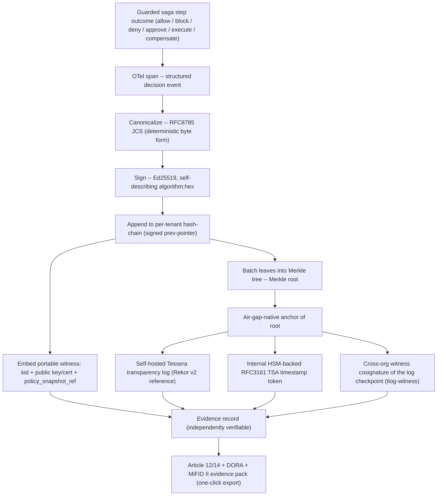
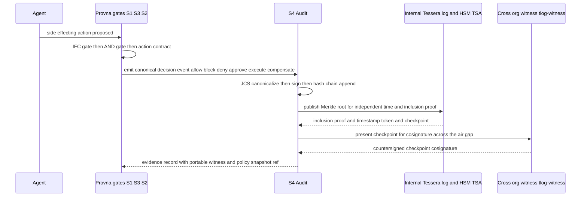
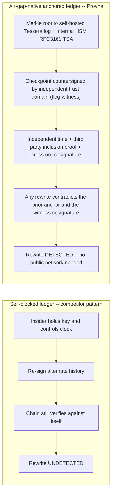

# Pillar 4 - Tamper-Evident Audit

**Status:** Planned (pre-build); evidence-pack v1 targeted for Phase-0 MVP
**Last updated: 2026-06-24**
**Related:** [../decisions/0007-s4-merkle-external-anchor-jcs.md](../decisions/0007-s4-merkle-external-anchor-jcs.md), [../compliance/regulatory-mapping.md](../compliance/regulatory-mapping.md), [action-lifecycle.md](action-lifecycle.md), [pillar-3-runtime-authorization.md](pillar-3-runtime-authorization.md), [build-vs-consume.md](build-vs-consume.md)

---

## 1. Purpose - Regulator-Grade Evidence, Not Logging

S4 is the fourth gate of the guarded saga step. Every action that passes through Provna - whether it was allowed, blocked at the IFC gate (S1), denied at the AND-gate (S3), held for human approval, executed, or compensated - terminates in S4 by producing a **tamper-evident, externally-anchored, portable evidence record**.

The purpose is narrow and load-bearing: convert each governed action into a record that an independent auditor or regulator can reproduce and trust *without trusting Provna, the customer, or any single key-holder*. This is the Verifier persona's deal-unblocker. Internal Audit / SOX does not buy Provna; they **veto** it - and their veto kills the sale. S4 is the artifact that turns their veto into a signature: per-action structured evidence, available instantly, that cannot be silently rewritten by anyone - not even the operator running the system.

This pillar is emphatically **not** logging and **not** observability. An unsigned HTTP trace push to an APM or SIEM does not close the insider-rewrite threat (see Section 5) and does not satisfy a forensic-reproducibility obligation. Provna's bottom-up entry tier is "audit-only" - but "audit-only" here means **signed + externally anchored observation**, never plain logs.

> Honest framing (sell verbatim): the evidence is **regulator-grade and forensic-reproducible**. Whether it is **court-admissible is case-by-case and jurisdiction-dependent** (UNVERIFIED). These two claims are distinct; conflating them invites punishment from the audit persona. See the Honesty Anchor in Section 8.

---

## 2. Why ASSEMBLE + Article 12/14-BUILD

The build-vs-consume boundary for S4 is deliberate and asymmetric: **assemble the cryptographic machinery, build the regulatory mapping.**

- **ASSEMBLE the machinery.** Hash chains, Merkle trees, transparency logs (self-hosted Tessera, the Go successor to Trillian; Rekor v2 as reference design), RFC3161 timestamping, witness cosignatures (tlog-witness), and JSON canonicalization (RFC8785) are commodity, well-understood, independently audited primitives. Reinventing any of them would be cost without defensibility. Provna's contribution at the mechanism layer is **integration discipline and fail-closed assembly**, not cryptographic novelty. See [tech-stack-analysis.md](tech-stack-analysis.md) for the substrate evaluation.
- **BUILD the Article 12 / Article 14 evidence pack.** The defensible value is the **EU-FS regulatory depth** none of the surveyed competitors have: a per-action dossier that maps directly to EU AI Act Article 12 (record-keeping / forensic reproducibility) and Article 14 (human oversight), plus DORA operational-resilience and MiFID II record obligations. The horizontal governance substrates touch audit shallowly and leave it unsigned; vertical regulatory mapping is the moat-adjacent work here.

The market lesson is concrete. Across the surveyed landscape, the audit layer is the **common gap**: ledgers rely on a local self-clock (`datetime.now`-style), do not embed a portable key identifier, and never bind governance-failure signals into the ledger itself. Provna closes each of these gaps not by building better crypto but by **assembling the right primitives in a fail-closed order and binding them to the regulatory artifact a Verifier must produce.**

---

## 3. Evidence-Chain Architecture

The S4 chain is a layered pipeline. Each governed-action decision emits a canonical event; events are hash-chained and Merkle-batched; batch roots are externally anchored; each record carries a portable witness so an independent verifier needs nothing from Provna's runtime to check it.

### 3.1 Components

- **OTel decision event.** The hot-path PEP emits a structured OpenTelemetry span for every gate outcome. This is the raw forensic record: which action, which agent, which user, which delegation chain, the IFC verdict, the AND-gate verdict, the behavioral/temporal admission result, the risk tier, the approval decision, and the execute/compensate outcome. OTel is consumed, not built.
- **RFC8785 JCS canonicalization.** Before signing, every event is canonicalized to a deterministic byte form. Without canonical JSON, two semantically-identical records can serialize differently and break signature verification across implementations. JCS is the precondition for **independent** verification.
- **Ed25519 signature, self-describing.** Each record is signed and the signature is stored in self-describing `algorithm:hex` form (a pattern worth adopting from prior art). The signed object includes a **signed previous-pointer**, so the chain links are themselves authenticated, not merely adjacent.
- **Hash chain (per tenant).** Records are appended into a per-tenant append-only hash chain. Any retroactive edit breaks the chain from the edit point forward - locally detectable, but on its own only as trustworthy as the clock and keys (which is why external anchoring is mandatory, Section 5).
- **Merkle root + air-gap-native anchor.** Chain segments are batched into a Merkle tree; the root is published to a **self-hosted Tessera transparency log** (Rekor v2 as the reference design) and timestamped by an **internal HSM-backed RFC3161 TSA**. The log checkpoint is additionally **countersigned by an independent trust domain (cross-organization witness cosignature, tlog-witness)** whose root of trust is pre-provisioned on both sides of the air gap. Together these provide an **independent time source**, a **third-party inclusion proof**, and **genuine cross-organization non-repudiation** that does not depend on Provna's or the customer's clock - and, critically, requires **no public-network egress** (Section 5).
- **Portable witness.** Each record embeds the **`kid`** (key identifier) plus the embedded public key / certificate, so the witness is **not bound to a local key** an auditor would have to be granted access to. An external auditor can verify with only the exported record. (The competitor failure mode here is omitting `kid`/`public_key`, which couples the witness to local key material.)
- **`policy_snapshot_ref`.** Every decision record carries a `policy_hash` referencing the exact policy snapshot that produced the verdict. This is the **S4<->S3 bridge**: it lets a regulator reproduce *why* a given decision was made under the policy in force at that moment - the core of Article 12 forensic reproducibility.
- **Offline verifier.** A standalone verifier (with `--json` / `--require-chain` modes) lets a dual-control auditor validate an exported pack with no live connection to Provna - chain integrity, signatures, Merkle inclusion, and anchor proofs all checkable offline.

### 3.2 Tamper-evident policy versioning

Policy is itself versioned in a tamper-evident manner. Because `policy_snapshot_ref` points at a hashed, anchored policy snapshot, the question "what rule was in force when this action ran?" has a cryptographically pinned answer. A changed policy cannot be backdated to make a past decision look compliant.

---

## 4. Where S4 Sits in the Guarded Saga Step

S4 is not an afterthought appended to successful actions; it is the **terminal gate for every path**, including the blocked and denied ones. A block at S1 or a deny at S3 is itself court-relevant evidence that enforcement is effective.

Note the ordering: S4 records the outcome **and** waits on the air-gap-native anchor for the inclusion proof and the cross-organization witness cosignature. Anchoring is part of producing the evidence, not a best-effort background task that can be silently skipped.

---

## 5. Why the Air-Gapped Anchor Is Critical

The single most important design decision in S4 is the **air-gap-native anchor**, because it closes the threat every competitor leaves open: **the insider / key-holder who rewrites history** - and it does so **without any public-network egress**, which is a hard constraint in the regulated, in-VPC, and air-gapped deployments Provna targets.

The attack: an operator (or any principal holding the signing key and controlling the host clock) wants the audit trail to say something other than what happened - to delete a record, alter an amount, or change a timestamp. If the ledger relies on a **self-clock** and a **locally-held key**, this principal can re-sign a consistent, internally-valid alternate history. The chain still verifies against itself. Nothing in a self-contained log detects it. This is precisely the failure mode observed in competitor ledgers that timestamp with the local clock and never anchor.

Provna closes the gap by anchoring the Merkle root to a **self-hosted transparency log (Tessera, the Go successor to Trillian; Rekor v2 as the reference design)** and an **internal HSM-backed RFC3161 timestamp authority**, and then having the log checkpoint **countersigned by an independent trust domain (cross-organization witness cosignature, tlog-witness)** whose root of trust is **pre-provisioned on both sides of the air gap**. The witness cosignature is what supplies genuine **third-party non-repudiation**: a self-hosted log and an internal TSA are both inside the operator's blast radius, so on their own they would not bind the operator. A countersignature from an independent trust domain places the witnessed past beyond any single key-holder's reach. Once a checkpoint is anchored and countersigned, the historical state at that point in time is witnessed by an independent party. Any later rewrite produces a chain whose roots no longer match the previously anchored - and previously countersigned - values; the contradiction is externally observable. The key-holder can stop new records, but **cannot silently alter the witnessed past** - and none of this requires reaching a public network.

This is the mechanical basis of the strongest claim Provna makes to Internal Audit: *the operator cannot change the audit history.* It is also a precondition of S4 being a credible **system-of-record** - if the operator could rewrite it, leaving Provna would not mean losing audit history, and the switching-cost argument would collapse.

---

## 6. BAR-Style Governance-Failure Signal as a Signed Audit Event

A durable, signed answer to the regulator's question "is your enforcement actually effective?" requires more than recording allowed and blocked actions. Provna persists a **behavioral-anomaly / governance-failure (BAR-style) signal as a first-class, signed audit event** in the ledger.

The competitor failure mode here is instructive: a monitor that merely returns an in-memory `*Alert` and is **not wired into the ledger**. An alert that evaporates is not evidence. Provna's rule:

- When the system detects a governance-relevant condition - a behavioral/temporal admission escalation (the S3 "5th dimension"), a cooldown trigger, a repeated-pattern anomaly, or an enforcement-effectiveness signal - it persists it as a **signed `compliance_finding` / `AGENT_STATE_CHANGE` event** in the same anchored chain as ordinary decisions.
- Because it is signed, hash-chained, and anchored, the governance-failure signal carries the same tamper-evidence guarantee as any other record. It becomes **court-grade evidence that the control was operating and reacting**, not silently throttling.

This converts "we have controls" (an assertion) into "here is the anchored, signed record of the controls firing" (forensic evidence). For the Verifier persona, the difference between those two is the difference between veto and signature.

---

## 7. Privacy-Aware Evidence

Regulator-grade evidence must not itself become a data-exfiltration or secrets-leak liability. S4 is **privacy-aware by construction**: the evidence record stores **pointers and hashes, not raw payloads.**

- **No raw arguments, PII, or secrets in the ledger.** Sensitive action arguments (e.g., full account data, PHI, credentials) are not written verbatim. The record stores a **content hash** plus a reference (pointer) to the controlled store where the underlying data lives under its own access controls and retention policy.
- **Hash-pinning preserves verifiability without exposure.** Because the canonical record commits to a hash of the sensitive content, an auditor can later verify that a specific produced value matches the recorded decision - reproducibility is preserved - without the audit chain itself carrying the plaintext.
- **Deployment fit.** This aligns with Provna's VPC / air-gapped deployment model: the evidence chain can be exported and independently verified without exporting the regulated data it references.

The guarantee to the Verifier: the evidence pack proves *what was decided and that it was not tampered with*, while keeping the regulated payload behind its own controls.

---

## 8. Article 12 / Article 14 Mapping and the Honesty Anchor

The BUILD deliverable is the regulatory evidence pack. Canonical regulatory detail lives in [../compliance/regulatory-mapping.md](../compliance/regulatory-mapping.md); this section states only the S4 mechanism-to-obligation binding.

| Obligation | What it requires | How S4 produces it |
|---|---|---|
| **EU AI Act Article 12** (record-keeping / forensic reproducibility) | Automatic, traceable records sufficient to reconstruct events | Per-action canonical (JCS) decision event + `policy_snapshot_ref` (reproduce the *why*) + hash-chain + Merkle + air-gap-native anchor with cross-org witness cosignature (reproduce the *what* and prove it is unaltered) |
| **EU AI Act Article 14** (human oversight) | Demonstrable human-in-the-loop on high-risk actions | Signed record of dry-run preview, risk-tier escalation, and four-eyes HITL approval/rejection, anchored like any other event |
| **DORA** (operational resilience, long retention) | Durable, integrity-protected operational records | Anchored + cross-org-witnessed chain + optional ML-DSA (FIPS 204) PQC-hybrid signature for long-retention integrity (Section 9) |
| **MiFID II** (record obligations) | Reconstructable transaction-related records | Same per-action evidence record, exportable as a dossier |

### Honesty Anchor (sell verbatim)

> Provna's evidence is **regulator-grade and forensic-reproducible**. Whether it is **court-admissible is case-by-case and jurisdiction-dependent** (UNVERIFIED). Article 12 forensic-reproducibility is **not** a guarantee of evidentiary admission; the two are distinct and must never be conflated.

This discipline mirrors the S1 honesty anchor (Provna does not guarantee against implicit-flow / side-channel leakage). The audit persona trusts a vendor that draws its guarantee boundary honestly and punishes one that over-promises. Over-claiming "court-admissible" is a sales-killer with the exact persona whose signature unblocks the deal.

---

## 9. Optional PQC-Hybrid Signatures for Long Retention

Regulated financial-services retention windows are long (often many years under DORA and related obligations). Over such horizons, the cryptographic-agility risk to a single classical signature scheme is non-trivial. S4 therefore supports an **optional post-quantum-hybrid signature mode (ML-DSA, FIPS 204, alongside Ed25519)**.

- **Hybrid, not replacement.** Records are signed with the classical scheme and, when the long-retention tier is enabled, **additionally** with ML-DSA. Verification succeeds on the classical path today and remains independently checkable on the PQC path against future threat models.
- **Genuinely wired into the production ledger.** The competitor failure mode is having an ML-DSA capability that sits **isolated** while the production ledger signs directly with classical crypto. Provna's requirement is that the PQC-hybrid signature is **actually bound into the production ledger path** for the long-retention tier - not a demo artifact.
- **Tiered.** PQC-hybrid is a cost/latency trade-off offered for the long-retention / DORA tier; it is not forced on every record by default.

---

## 10. Fail-Closed Discipline in S4

Consistent with Provna's cross-cutting fail-closed principle, S4 never degrades silently:

- If canonicalization, signing, chaining, or the mandatory anchor step - publication to the self-hosted Tessera log, the internal HSM TSA timestamp, and the cross-organization witness cosignature - cannot complete, the action's evidence path is treated as a failure; there is **no downgrade to unsigned/unanchored/un-countersigned logging.**
- The portable witness is always embedded; a record without `kid`/embedded-key is not a valid record.
- Governance-failure and cooldown signals are **persisted as audit events**, never expressed only as transient throttling.

The net effect: an exported Provna evidence pack is either fully verifiable by an independent auditor, or it is visibly incomplete - never quietly weaker than it appears.
