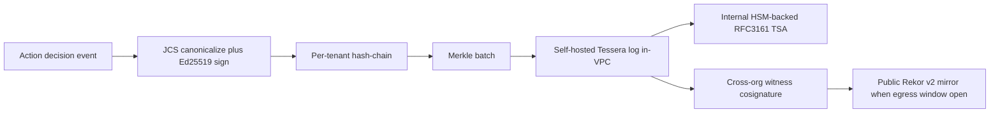

# Tech-Stack Analysis

**Status:** Analysis (pre-build)
**Last updated: 2026-06-24**
**Related:** [tech-stack.md](../tech-stack.md), [build-vs-consume.md](build-vs-consume.md)

This document evaluates each layer of Provna's pinned technology stack against Provna's own constraints — an inline, fail-closed reference monitor on the synchronous money-path; self-hostable customer-VPC / air-gapped deployment for regulated EU financial services; a small pre-build team optimizing speed-to-validation with a clear hardening path; a polyglot architecture with a clean gRPC ActionGuard seam; and the discipline of building only the white space (S1 IFC fusion, S2 compensation content) while consuming or assembling everything commoditized. Each layer was judged on its 2026 maturity using current web research (versions, licenses, GA status, funding, production-readiness), with load-bearing claims cited and anything unconfirmed marked UNVERIFIED. The headline finding: **every layer survives as keep-with-changes — no pillar thesis is reversed, but several pins need to be made concrete, and three commodity dependencies (Redis, MinIO, HashiCorp Vault) should be swapped for maintained, permissively-licensed, air-gap-clean alternatives.**

## Summary table

| Layer | Current pin | Recommendation | Recommended | One-line why |
|---|---|---|---|---|
| Inline PEP / data-plane language | Go (Rust where needed) | keep-with-changes | Go >= 1.24 (FIPS module on); name concrete Rust triggers; drop Zig/C++ | Go wins MVP-to-prod on FIPS-in-stdlib + Stable OTel + canonical gRPC + hiring; Rust latency edge not yet load-bearing. |
| S1 IFC engine | BUILD (CaMeL P/Q + FIDES/MVAR lattice) | keep-with-changes | BUILD core; CaMeL/MVAR/MAF as blueprints only; structured-output Q-LLM; PromptGuard 2 below the lattice | Determinism must stay in Provna-controlled code; MAF 1.0 GA validates the architecture but is framework-bound. |
| S2 durable-execution substrate | DBOS (MVP) -> Temporal (scale) | keep-with-changes | Keep DBOS; demote Temporal from planned migration to seam-isolated contingency | No engine ships FS compensation content, so the substrate is interchangeable; optimize for air-gap + runway. |
| S2 compensation library + harness | BUILD (moat); tooling unpinned | keep-with-changes | BUILD; gVisor + VCR cassettes + oapi-codegen + oasdiff + effect-key idempotency + observe-probe | Keep the moat; pin commodity tooling; effect-key idempotency is load-bearing (DBOS exactly-once is same-Postgres only). |
| S3 authZ PDP + delegation | Cedar + OpenFGA + AuthZEN; biscuit/macaroon | keep-with-changes | Cedar embedded (primary); OpenFGA deferred/optional; Biscuit over macaroon; AuthZEN 1.0 final | Cedar is the only Lean-proof-gated, in-process PDP; defer the second engine; macaroons are forgery-symmetric. |
| S4 tamper-evident audit | OTel + hash-chain + Rekor/Trillian + RFC3161 + JCS | keep-with-changes | Self-hosted Tessera + internal TSA + cross-org witness; own schema; RFC3161 retimestamping primary | Tile-logs + offline witness cosignature close insider-rewrite in air-gap without egress. |
| Data + state | Postgres + Redis + S3/MinIO | keep-with-changes | Postgres 18; DROP Redis (Valkey if needed); SeaweedFS not MinIO; OpenBao KMS; pg_tde | MinIO is archived/unpatched, Redis is tri-licensed; fewer datastores tightens the fail-closed path. |
| SDK + wire + integration surfaces | Python/TS SDK; gRPC; MCP hook + proxy | keep-with-changes | gRPC core + Connect-ES edge, buf-governed; connect-python deferred; MCP 2025-11-25 + track RC | gRPC stays inline; buf governs the contract; Connect fixes the browser/TS DX without an Envoy hop. |
| Cross-cutting (panel, deploy, eval, LLM) | Next.js; Docker/Helm/TF; AgentDojo; Claude | keep-with-changes | Next.js; add Zarf + OpenBao + SLSA/cosign; AgentDojo + NIST AgentDojo-Inspect; LiteLLM + Pydantic AI | Off the money-path: optimize iteration; close the air-gap/no-SaaS/no-BSL gaps the current pins gloss over. |

## Per-layer analysis

### 1. Inline PEP / data-plane language and runtime

**Current choice.** Go-first for the inline PEP (IFC gate + action-contract + audit emit), "Rust where needed." The MVP ships the PEP in TS/Python in shadow-mode, then pulls it into Go/Rust for production over 6-12 months. The seam is gRPC ActionGuard (`decide`/`commit`/`compensate`).

**Alternatives weighed.** Rust-first wins on no-GC tail-latency determinism, memory safety, FFI quality, and small musl binaries — but loses for Provna *now* on four counts. Zig is pre-1.0 (latest 0.15.2, Oct 2025) with explicitly unstable async/IO — disqualifying for a production reference monitor. C++ is fast and mature but has no default memory safety and a heavier supply-chain/SBOM and air-gapped build story — strictly dominated by Go (velocity) and Rust (safety).

**2026 maturity (key facts).** Go 1.24+ ships a CMVP **FIPS 140-3 validated crypto module in the standard library** (Ed25519, SHA-256, TLS key schedule; Cert #5247; v1.26 pending CMVP review as of 2026-04-28), enabled with a single build flag ([go.dev/blog/fips140](https://go.dev/blog/fips140), [go.dev/doc/security/fips140)](https://go.dev/doc/security/fips140)). The **OpenTelemetry Go SDK has traces and metrics STABLE** (logs beta); the **OpenTelemetry Rust SDK has traces, metrics, and logs all still BETA** ([opentelemetry.io/status](https://opentelemetry.io/status/), [github.com/open-telemetry/opentelemetry-rust](https://github.com/open-telemetry/opentelemetry-rust)). gRPC — the seam itself — is canonical and battle-tested in Go (`google.golang.org/grpc`), while Rust's gRPC is mid-migration: **Tonic moved under CNCF and is frozen to bug-fixes**, with the new official `grpc` crate at Beta and Stable targeted "later in 2026" (UNVERIFIED exact GA) ([grpc.io/blog/grpc-welcomes-tonic](https://grpc.io/blog/grpc-welcomes-tonic/), [github.com/grpc/grpc-rust](https://github.com/grpc/grpc-rust)). Rust's FIPS story requires shelling out to a validated OpenSSL/BoringSSL — reintroducing a C dependency and undercutting the memory-safety argument; RustCrypto/ed25519-dalek are high-quality but NOT CMVP-validated. Green Tea GC is experimental in Go 1.25 (up to ~40% GC-throughput in some benchmarks, neutral/negative under sub-ms-p99 SLAs in others; default-on track for 1.26, UNVERIFIED) ([infoq.com/news/2025/11/go-green-tea-gc](https://www.infoq.com/news/2025/11/go-green-tea-gc/)).

**Recommendation + rationale.** Keep Go as the default hot-path language and make "Rust where needed" concrete rather than aspirational. The IFC decide path is CPU-light (label-lattice lookups + policy match + Ed25519 sign + JCS) and runs inside an LLM-mediated agent loop whose latency floor is tens-to-hundreds of ms; a well-tuned Go service (sub-ms to low-ms p99 with `GOMEMLIMIT` set and low allocation) sits far below that budget. The fail-closed guarantee lives in the lattice + sink-policy (data + deterministic code), not in the language memory model — so Rust's marginal latency edge buys no stronger guarantee here. Against the regulated/air-gapped constraint, Go's FIPS-in-stdlib is a direct procurement/DORA/SOC2 asset Rust cannot match, the single static binary is the simplest air-gapped artifact to sign and SBOM, and the gRPC seam (not FFI) neutralizes Rust's interop advantage. For a pre-build team, Go's ~3-4x talent pool and faster iterate loop directly serve the MVP mandate.

The "with-changes" is to: (1) keep Go for the PEP/IFC-gate/action-contract/audit-emit; (2) carve out a narrow, stable **guarantee-kernel interface** (lattice label-propagation + sink-policy decision + JCS canonicalize + sign) so it CAN be reimplemented in Rust later without touching the rest of the PEP — but do NOT build it in Rust now; (3) reserve Rust for a future leaf with a proven trigger (sub-ms-p99 inline proxy datapath, untrusted-connector sandbox/WASM host, or constrained-footprint sidecar); and (4) drop Zig and C++ so the fork is binary (Go vs Rust). Pin Go >= 1.24 with `GODEBUG=fips140=on` for regulated builds, and enforce a p99 latency budget in CI with explicit `GOGC`/`GOMEMLIMIT` tuning.

**Trade-offs.** A GC means tail latency is *bounded* by GC behavior, not eliminated — it must be engineered (low-allocation hot path, object reuse, p99 budget in CI, Green Tea evaluated per-workload since it can regress sub-ms SLAs). Go's memory safety is weaker than Rust's (data races, nil-deref panics) — mitigate with the race detector in CI, fail-closed panic recovery at the PEP boundary, and fuzzing of the label-propagation/sink-policy code. Static linking can obscure SBOM component boundaries — use build-time SBOM (CycloneDX/Syft), not binary-only analysis. Choosing Go now *defers, not cancels* the Rust question; the guarantee-kernel interface is the insurance premium that keeps the option cheap.

### 2. S1 IFC engine

**Current choice.** BUILD the IFC engine (P/Q-LLM isolation core + runtime-taint dual-lattice sink-gate + typed declassification node), surfaced through Invariant-style DSL ergonomics. CONSUME only AgentDojo (eval) and an optional probabilistic pre-filter (PromptGuard 2). The deterministic guarantee is anchored only in the lattice + sink-policy; LLMs are never on the guarantee path. The Q-LLM uses a provider-agnostic SDK, default Claude.

**Alternatives weighed.** (a) Adopt **MVAR** as the runtime IFC plane — rejected: single-author, mutable provenance nodes (taint-laundering), no P/Q isolation boundary, and now a US provisional patent (filed 2026-02-24) over the exact taint-laundering-prevention + witness-binding combination Provna needs. (b) Adopt **Microsoft Agent Framework (MAF) SecureAgentConfig** as the IFC substrate — rejected as substrate: host-owns-propagation and framework-bound, breaking the vendor-neutral inline-PEP constraint; kept as interop + credibility. (c) Buy a guardrail classifier (Lakera/ProtectAI/NeMo) *as the defense* — rejected: the defense becomes a probabilistic, long-tail-wrong classifier, and Lakera is SaaS-managed (fails air-gap). (d) Make the Q-LLM tool-capable — rejected: reintroduces the lethal trifecta.

**2026 maturity (key facts).** CaMeL's reference impl ([github.com/google-research/camel-prompt-injection](https://github.com/google-research/camel-prompt-injection)) is Apache-2.0 but an **explicitly-unmaintained research artifact** (authors warn the interpreter may crash / may not be fully secure); the paper reports ~67% AgentDojo ASR reduction at 77% task completion ([arxiv.org/pdf/2503.18813](https://arxiv.org/pdf/2503.18813)). FIDES (Microsoft Research) has now been **productionized: Microsoft Agent Framework 1.0 reached GA on 2026-04-02 with IFC in the supported Python core** via `SecureAgentConfig` (dual-LLM/quarantined-LLM pattern, confidentiality/integrity lattice, GitHub-MCP top-level labels) ([devblogs.microsoft.com/agent-framework](https://devblogs.microsoft.com/agent-framework/microsoft-agent-framework-version-1-0/), [commandline.microsoft.com](https://commandline.microsoft.com/information-flow-control-moving-toward-secure-autonomous-agents/)); its "stopped all prompt-injection attacks, +16% task completion" claim is Microsoft-internal — UNVERIFIED externally. MVAR ([github.com/mvar-security/mvar](https://github.com/mvar-security/mvar), Apache-2.0) is single-author, v1.5.3 (2026-04-21), early, with a concrete US provisional patent — PATENT CAUTION. Llama Prompt Guard 2 (Meta) ships 86M (mDeBERTa, multilingual, ~92ms/A100, 97.5% recall@1%FPR EN) and 22M (~19ms) variants, self-hostable via HF Transformers, Llama Community License (commercial OK below 700M MAU); Meta's own model card says it is an **additional layer, not a sole defense** ([huggingface.co/meta-llama/Llama-Prompt-Guard-2-86M](https://huggingface.co/meta-llama/Llama-Prompt-Guard-2-86M)). Claude structured outputs (`output_config.format`) + `strict:true` tool schemas are GA on the Anthropic SDK — the mechanism that makes the Q-LLM return only typed values with no tool path; two-tier policy = Haiku 4.5 (~$1/$5, 200K) for cheap extraction, Sonnet 4.6 (~$3/$15) when quality matters.

**Recommendation + rationale.** Keep BUILD (the four load-bearing decisions stay: typed + fail-closed, node-immutable labels, conservative min-integrity/max-confidentiality propagation, signed principal-bound declassification). Consume deliberately with concrete pins: (1) treat CaMeL and MVAR as **reference blueprints, not runtime dependencies** (unmaintained / patent-encumbered); (2) **track MAF 1.0 GA IFC** as the closest production prior art, an interop surface, and a credibility anchor — the same dual-LLM IFC Microsoft shipped, delivered as a vendor-neutral inline reference monitor; (3) Q-LLM = provider-agnostic SDK, default Claude, with the typed channel enforced server-side via structured outputs / strict tool schema, kept behind the gRPC seam so a self-hosted Llama can honor the same `output_config.format` contract for air-gapped deployments; (4) optional pre-filter = self-hostable PromptGuard 2 placed strictly **below the lattice** as a load-shedder, never the guarantee, avoiding SaaS-only options (Lakera) on the inline path. Everything probabilistic sits outside the guarantee; the guarantee is lattice propagation + two-layer fail-closed sink-gate + typed signed declassification, all deterministic and pre-execution. This keeps determinism in Provna-controlled code, stays air-gappable, and still moves fast.

**Trade-offs.** Re-implementing the dual-lattice + P/Q interpreter independently (to dodge MVAR's patent, mutable-node, and no-isolation flaws) is the slowest item in the layer — mitigated by using CaMeL/MVAR as readable blueprints and AgentDojo to measure ASR + utility-tax together from day one. PromptGuard 2 adds ~20-92ms and a known false-negative tail before the lattice — acceptable only because it is a load-shedder. Conservative propagation raises the block/escalate rate (the chosen direction); the cost is declassification friction, which the signed `trust_boundary` node must keep ergonomic or operators route around it. Tracking MAF gives credibility and a labeling convention to align with, but coupling to it would forfeit vendor-neutrality. The honesty hinge: sell the one honest pillar-1 sentence, including the named excluded class (implicit flows, side channels).

### 3. S2 durable-execution substrate

**Current choice.** DBOS Transact (Postgres-backed) for the MVP, Temporal "at scale" — a two-substrate path. S2 consumes only the saga/durable-execution *mechanism*; the inverse library + harness + observe-probe are built on top and are substrate-independent.

**Alternatives weighed.** **Temporal** is the most mature and best-funded option but loses as the *MVP* substrate on operational weight (a separate clustered service + its own datastore burns a pre-build team's runway); it wins only as the scale/heavy-multi-tenant contingency. **Restate** is the lightest ops (single Rust binary, no extra DB) but loses on a **runtime BSL production restriction** — a source-available-with-production-license runtime inline on the money path is a supply-chain/compliance liability the constraints reject. **Inngest** loses hard on self-host/air-gap (SaaS-centric engine). **LangGraph** is checkpoint persistence, not durable execution, and has no saga/compensation — wrong layer entirely. **Custom-on-Postgres** is exactly the horizontal drift the build-vs-consume doc forbids.

**2026 maturity (key facts).** DBOS Transact is actively shipping (RBAC, OpenMetrics, workflow patching for live upgrades — Mar/Jun 2026 notes); the **Go SDK is at v0.18.0 (2026-06-19), MIT, still 0.x with no GA label** — Python/TS SDKs are more mature, and the Go SDK's at-scale hardening is UNVERIFIED ([github.com/dbos-inc/dbos-transact-golang](https://github.com/dbos-inc/dbos-transact-golang)). The core is a library against the customer's own Postgres — the cleanest air-gap story; the Conductor ops console is proprietary/paid but optional and itself air-gap-self-hostable. **Temporal raised a $300M Series D at a $5B valuation (a16z, 2026-02-17)**, core MIT, self-host free ([temporal.io/blog](https://temporal.io/blog/temporal-raises-usd300m-series-d-at-a-usd5b-valuation)). Restate's runtime is BSL (SDKs MIT); whether a clean Apache/MIT runtime or a formal air-gapped commercial GA exists in 2026 is UNVERIFIED ([restate.dev](https://www.restate.dev/)). Critically, **no engine ships FS compensation content** — DBOS and Temporal both expose saga/compensation only as a developer-authored pattern.

**Recommendation + rationale.** Keep DBOS Transact (Postgres-backed, MIT) as the MVP substrate, with two corrections. (1) **Stop pinning a DBOS->Temporal migration as the default**; reframe Temporal as a contingency triggered only by concrete signals (multi-tenant fan-out, Postgres throughput/latency ceilings, or a buyer mandating Temporal). For in-VPC single-tenant regulated deployments, that pressure may never bind, so a scheduled rewrite is likely wasted runway. (2) **Isolate the substrate strictly behind the gRPC ActionGuard seam and a thin `SagaCoordinator` interface** so the compensation content (the moat) never imports a vendor SDK type — making the engine genuinely pluggable. DBOS wins the MVP on air-gap simplicity (durability rides the customer's already-trusted Postgres, zero added orchestration infra), full polyglot SDKs including Go for the hot path, and weekend stand-up. Because the moat is substrate-independent, this is a low-stakes, reversible decision — over-optimizing it is itself a trap; the seam discipline is what de-risks it.

**Trade-offs.** Keeping DBOS: cleanest air-gap, MIT polyglot incl. Go, minimal ops, one fewer audited datastore — but the Go SDK is 0.x and less proven than Py/TS, DBOS Inc. is younger than Temporal (vendor-continuity risk), and the Conductor console is paid if you want managed observability (mitigated: optional, off the durability path). Reframing Temporal as contingency avoids a scheduled rewrite tax but forgoes Temporal's larger ecosystem until it is actually needed, and a late switch under load is riskier than an early one — mitigated by the seam plus a load/throughput probe in the design-partner phase as the explicit decision gate.

### 4. S2 compensation library + round-trip harness

**Current choice.** S2 content is BUILD (the moat): per-connector inverse (A^-1) + round-trip test harness + observe-probe + dry-run + API-version-pinned auto-runnable catalog, on the consumed DBOS substrate. The LLM (default Claude) proposes the inverse from the connector OpenAPI spec; the harness is the guarantee, the LLM only an accelerator. The pillar-2 doc pins no concrete tooling for the sandbox, codegen, connector framework, idempotency, observe-probe, or drift engine — exactly the gaps this verdict fills.

**Alternatives weighed.** Sandbox: Firecracker microVM everywhere gives the strongest isolation but requires KVM/nested-virt that customer air-gapped K8s may lack; the round-trip threat model is *reproducibility, not untrusted-code escape*, so it is kept as optional production hardening, not a floor. Connector framework: **Nango** (800+ connectors, fast) loses as a hard dependency — Elastic License 2.0, full self-host needs an Enterprise license + annual fee + cloud-shaped runtime, a SaaS-shaped lock-in on the very path that must run with no SaaS, and it hands the moat's shape to a vendor; acceptable only as an optional cloud-MVP OAuth convenience behind your own interface. Apideck/Merge unified-APIs abstract away the per-connector, per-version semantics that *are* the moat. Inverse gen: the OpenAPI->MCP autogen path is the wrong abstraction (no round-trip notion). Drift: oasdiff wins uncontested after **Optic was archived 2026-01-12**.

**2026 maturity (key facts).** Firecracker is production-mature (KVM-isolated, ~125ms boot) but needs bare-metal/KVM; **gVisor** is a user-space kernel that drops into any K8s with no nested-virt (~10-30% I/O overhead), weaker than a VM boundary ([northflank.com/blog/firecracker-vs-gvisor](https://northflank.com/blog/firecracker-vs-gvisor)). Testcontainers + Respawn (ephemeral DB + reset) and VCR/cassette record-replay are standard 2026 offline-deterministic patterns. oapi-codegen (Go) and openapi-generator are actively maintained. **oasdiff** (479 change classes, OpenAPI 3.0/3.1, free CLI + Action) is the de-facto API-diff tool ([oasdiff.com](https://www.oasdiff.com/)). Stripe ships first-class Sandboxes + Idempotency-Key (UUIDv4 recommended) on all POST/DELETE. Crucially, **DBOS/Temporal give exactly-once only for their OWN store — external connector calls are at-least-once and REQUIRE a separate idempotency layer** ([tiarebalbi.com/.../dbos-vs-temporal](https://www.tiarebalbi.com/en/blog/dbos-vs-temporal-postgres-durable-execution)). Whether NetSuite/SEPA-rail/core-banking connectors expose round-trip-capable sandboxes (vs per-customer test tenants) is UNVERIFIED — and is itself the empirical test of the conditional moat.

**Recommendation + rationale.** Keep BUILD and the mechanism/content split. Add concrete tooling: (1) **round-trip sandbox = three-tier "isolation by fidelity"** — Tier A vendor sandboxes (Stripe etc.) for highest fidelity, Tier B VCR/cassette replay for offline air-gapped determinism, Tier C Testcontainers + Respawn test-doubles; the harness *runner* (which executes LLM-influenced inverse code) runs in **gVisor for MVP/CI**, with Firecracker/Kata as optional production hardening — do NOT pin Firecracker as a hard dependency. (2) **OpenAPI-driven inverse generation = oapi-codegen + openapi-generator** for deterministic client scaffolding; **Claude proposes only the semantic inverse** (void vs refund vs reversing journal-entry); the round-trip harness is the gate. (3) **API-version pinning + drift = oasdiff** in CI, auto-demoting a catalog entry from auto-runnable until the harness re-passes against the new spec. (4) **BUILD a thin proprietary connector interface** (`execute`/`inverse`/`observe`/`dry-run` per (connector, action, version)) — no hard Nango/Paragon dependency. (5) **Idempotency = a deterministic semantic-effect-key** `hash(connector || action || normalized-effect-args || principal || intent)`, passed as the vendor `Idempotency-Key`, persisting the **response artifact (receipt)** so replay returns a prior receipt without re-execution; compensations must themselves be idempotent. (6) **Observe-probe = the harness assertion oracle** (`apply A -> probe -> apply A^-1 -> probe -> assert state == pre-state`); an inverse with no observe-probe cannot be promoted to auto-runnable. The effect-key layer is the one genuinely load-bearing addition — without it, the "exactly-once + safe replay" claim is unbacked. Determinism is preserved: the LLM proposes, the deterministic harness + observe-probe + oasdiff-driven demotion gate.

**Trade-offs.** Cassette/VCR replay gives offline air-gapped determinism but can mask real API-version drift — mitigated by periodic live re-record gated through oasdiff. gVisor-for-MVP trades VM-grade isolation for air-gap portability (acceptable because the runner executes trusted code; Firecracker/Kata is the documented high-assurance path). Building the thin connector interface costs more upfront than adopting Nango — but that build cost *is* the price of the moat and of self-hostability. The effect-key/idempotency layer is non-negotiable engineering DBOS/Temporal do not give you. Observe-probes are per-connector authored cost — but they are what converts the catalog from "hope" to "machine-checked." Net: every "more expensive" choice here is the same choice that preserves air-gap, vendor-neutrality, and the proprietary moat.

### 5. S3 runtime authorization PDP + delegation

**Current choice.** Cedar (embedded) + OpenFGA + AuthZEN 1.0 as the consumed PDP/wire surface; biscuit/macaroon caveat-attenuation for delegation; IETF transaction-tokens for agent/user legs. BUILD = the four-leg AND-gate resolver (agent AND user AND delegation AND intent), engine-evaluated caveat-attenuation, transitive (chain-walking) revocation with per-hop Ed25519 verify, and a post-AND-gate behavioral/temporal admission layer.

**Alternatives weighed.** **SpiceDB** is the most Zanzibar-faithful but is a relationship *database* optimized for read-heavy ReBAC at hyperscale — it implies a sidecar/service on the hot path (latency + extra failure domain), the wrong shape for an inline per-action evaluator. **OPA/Rego** wins on ubiquity but is not formally verified the way Cedar is, and its idiomatic deployment is a sidecar (network hop, fail-open temptation). **Macaroons** lose decisively to Biscuit: HMAC-symmetric means every verifier holds the forgery key — fatal for cross-trust-domain regulated delegation.

**2026 maturity (key facts).** **AuthZEN 1.0 is a FINAL specification** (published Standards Track 2026-03-11, no longer subject to revision) ([openid.net/authorization-api-1-0-final-specification-approved](https://openid.net/authorization-api-1-0-final-specification-approved/)). **Cedar** is the only PDP with a **live Lean mechanized-proof + differential-testing release gate** (lang v4.5, `cedar-policy` crate v4.10.0, Apache-2.0) ([docs.cedarpolicy.com](https://docs.cedarpolicy.com/), [lean-lang.org/use-cases/cedar](https://lean-lang.org/use-cases/cedar/)). **OpenFGA became CNCF Incubating (2025-10-28)**, self-hostable, Apache-2.0, not yet graduated ([cncf.io/blog/2025/11/11/openfga-becomes-a-cncf-incubating-project](https://www.cncf.io/blog/2025/11/11/openfga-becomes-a-cncf-incubating-project/)). **Biscuit is now Eclipse Biscuit**, 3.x spec stable, `biscuit-rust` 6.0.0 with public-key signatures + Datalog caveats ([biscuitsec.org](https://www.biscuitsec.org/)). IETF transaction-tokens are at WG draft -08 (NOT yet RFC); the agents extension is at -05; **Attenuating Authorization Tokens (AATs) appear as an individual draft** (draft-niyikiza, 2026-03-16) — confirming the attenuation problem is real and unsolved-in-product. **CAEP 1.0 / SSF 1.0 / RISC 1.0 are all final** ([openid.net/three-shared-signals-final-specifications-approved](https://openid.net/three-shared-signals-final-specifications-approved/)). Whether OpenFGA exposes an embeddable in-process mode acceptable on the money path is UNVERIFIED.

**Recommendation + rationale.** Keep the consume-PDP + thin-BUILD architecture. Concrete changes: (1) **Cedar embedded as the primary PDP** for the agent/user/intent legs, called in-process from the Go/Rust PEP — microsecond-scale, deterministic, and the only PDP with proof-backed release gating, which is exactly the formal failure model regulators want and avoids a network hop on the money path. (2) **Demote OpenFGA from a co-equal pin to an optional relationship resolver behind an interface** — model relationships as Cedar entities until a design partner's data proves genuinely ReBAC; adding a second authorization engine (and second failure mode) on day one is complexity the MVP does not need. (3) **Adopt AuthZEN 1.0 as-is** for the external PEP<->PDP wire; the four-leg AND-gate composition sits *above* AuthZEN (which resolves single legs only). (4) **Pick Biscuit over macaroon** — public-key offline attenuation (the verifier cannot forge) with Datalog caveats that map directly onto engine-level constraint evaluation; build transitive chain-walking revocation + per-hop Ed25519 verify on top. (5) Stay wire-compatible with transaction-tokens (actor=agent, principal=user) and track the AAT draft as direct prior art; consume CAEP/SSF as the revocation/continuous-eval signal source rather than inventing a bespoke feed. The white space holds: every off-the-shelf PDP and token standard stops exactly where Provna's moat starts (no decision-time attenuation against concrete params, no user/intent axis, leaf-only non-transitive revocation), and the 2026 AAT draft confirms the gap is real and not yet productized.

**Trade-offs.** Cedar-embedded buys determinism + formal verification + zero hot-path network hop at the cost of more verbose modeling for deep relationship graphs (the gap OpenFGA fills — reversible behind the interface). AuthZEN-final buys interop and credibility but is a single-decision protocol; the AND-gate conjunction remains Provna's own layer. Biscuit buys public-key offline attenuation + Datalog caveats at the cost of a less ubiquitous ecosystem than JWT/macaroon and a Rust-centric core (which fits the Go/Rust hot path). Consuming CAEP/SSF adds a dependency that must itself fail-closed (unreachable signal store => DENY). Post-quantum note: Ed25519 per-hop signatures are not PQ; if the post-quantum-ready audit option is exercised, the delegation signature scheme needs a PQ migration path (e.g. ML-DSA) — out of MVP scope. **Patent caution:** implement attenuation from macaroon/Biscuit/Ed25519 first-principles prior art (Jif/FlowCaml/Capsicum), avoiding competitor combination-claim framing.

### 6. S4 tamper-evident audit / transparency

**Current choice.** OTel + per-tenant hash-chain + Merkle root + Rekor/Trillian + RFC3161 TSA + RFC8785 JCS + Ed25519 + kid-embedded portable witness + `policy_snapshot_ref`; optional ML-DSA hybrid for long retention (DORA tier). ASSEMBLE the crypto, BUILD the EU AI Act Art.12/14 + DORA + MiFID evidence pack. Fail-closed (no downgrade to unsigned/unanchored).

**Alternatives weighed.** Public Rekor service as the anchor loses (SaaS-only egress dependency violates air-gap; viable only as an optional public mirror). Blockchain/public-ledger anchors lose on egress + cost + procurement friction. Roll-your-own Merkle log on Postgres loses (reinvents an audited primitive, no witness ecosystem). Old Trillian v1 loses to Tessera on ops weight and tile/offline-bundle ergonomics. Pure (non-hybrid) ML-DSA loses (tooling unaudited/unstable in 2026). C2PA and in-toto are the wrong domains (media-content provenance; build-time supply chain) — keep separate.

**2026 maturity (key facts).** The entire transparency-log world has moved to tile-backed logs: **Tessera is GA** with GCP/AWS/MySQL/POSIX-FS backends, offline proof bundles, and a tlog-witness API (`cosignature/v1`) ([github.com/transparency-dev/tessera](https://github.com/transparency-dev/tessera), [blog.transparency.dev](https://blog.transparency.dev/introducing-trillian-tessera)). **Rekor v2 reached GA 2025-10-10, rebuilt on Tessera, self-hostable**, POSIX-FS supported; whether its integrated witnessing has fully shipped by 2026-06 is UNVERIFIED ([blog.sigstore.dev/rekor-v2-ga](https://blog.sigstore.dev/rekor-v2-ga/)). `sigstore/timestamp-authority` is a maintained, self-hostable RFC3161 TSA (KMS/HSM signing), with freeTSA (P-384) / DigiCert as egress-mode public options. RFC8785 JCS is mature and cross-validated 2026 across 8 implementations (Go gowebpki/jcs + json-canon, Python trailofbits/rfc8785.py, Java erdtman, Rust serde_jcs). OTel GenAI semconv 1.40.0 has `gen_ai.client` spans STABLE but **`gen_ai.agent.*` still Development** — an unstable surface to avoid binding the schema to. ML-DSA (FIPS 204) is finalized but Rust impls are largely unaudited and composite/hybrid ML-DSA is still an IETF LAMPS draft — hybrid/optional is the safe posture.

**Recommendation + rationale.** Keep the assemble+build thesis and every primitive — the 2026 state validates the design. Concrete changes: (1) **Anchor on self-hosted Tessera** as the in-VPC log, NOT Rekor-the-public-service (which matters only as an egress-allowed mirror). (2) **Self-host `sigstore/timestamp-authority`** as the internal HSM/KMS-backed RFC3161 TSA; use public TSAs only as additional egress timestamps. (3) Adopt a **tri-modal anchoring posture** (air-gapped / egress-windowed / connected). (4) **Pin Provna's own canonical decision-event schema** — do NOT couple it to the still-moving OTel GenAI semconv; OTel stays the transport/raw-span layer. (5) Pin the mature JCS implementations above. (6) **Long-retention integrity = RFC3161 archive-timestamp renewal** (PAdES B-LTA-style periodic retimestamping) as the primary mechanism; ML-DSA hybrid is additive, optional, off by default. (7) Keep in-toto/SLSA for Provna's own supply chain — NOT the per-action evidence chain; drop C2PA from scope.

This resolves the **key tension** — third-party non-repudiation under air-gap — without egress: an internal Tessera log + internal HSM-backed TSA (independent clock) + **cross-organization witness cosignature** (the customer's checkpoint countersigned by an independent trust domain whose root of trust is pre-provisioned on both sides of the gap). An insider who controls both the log key and the clock still cannot forge the independent witness's signature over a prior checkpoint, so the insider-rewrite threat is closed *before* any public anchor; public anchoring is layered on only when an egress window exists. Anchoring is batched and asynchronous — off the synchronous money-path — which is acceptable because the synchronous guarantee lives in S1/S3, not S4.

**Trade-offs.** Self-hosting Tessera + an internal TSA + a witness service is more operational surface than calling public Rekor, but it is the only design that satisfies air-gapped data-residency, and Tessera's tile model is explicitly the low-ops/low-cost option. Batched anchoring means the third-party inclusion proof lags the action by the batch interval (acceptable; the record is emitted immediately, the proof attached on batch close). The cross-org witness's strength depends on **genuine independence** (separate key custody + operators) — a documented deployment-time requirement, since the guarantee degrades to internal-only if the witness is not independent. Deferring ML-DSA to an optional tier and leaning on RFC3161 retimestamping avoids putting unaudited PQC on the critical path while staying DORA-long-retention-credible. Court-admissibility remains UNVERIFIED and jurisdiction-dependent — hold the "regulator-grade, not court-admissible" honesty anchor verbatim.

### 7. Data + state

**Current choice.** PostgreSQL + Redis + S3/MinIO. Postgres for state/ledger, Redis for hot-path caches/cooldown/rate counters, object store for evidence blobs (MinIO for air-gapped). No versions, KMS/TDE/HA specifics, RLS, partitioning, or logical-decoding strategy pinned.

**Alternatives weighed.** Cache/counter store: Postgres-only wins for the MVP (zero extra infra on the fail-closed path); Valkey wins only when sub-ms shared hot-state at scale is proven; **Redis loses** — its AGPLv3/SSPL/RSALv2 tri-license is a redistribution/procurement hazard in a customer-VPC product, with no edge over Valkey. Object store: SeaweedFS wins (maintained, Apache-2.0, mature); Garage wins for multi-site; Ceph RGW only with an existing Ceph platform; **MinIO loses** (archived/unmaintained AGPLv3 under a system-of-record). KMS: OpenBao wins (MPL-2.0, LF, Vault-compatible); **HashiCorp Vault loses on BSL** for a self-hosted product. TDE: LUKS/storage-class floor + pg_tde for ledger keys wins on granularity + compliance.

**2026 maturity (key facts).** **PostgreSQL 18 GA Sept 2025** (18.1 current), with parallel logical-replication apply by default and partitionwise improvements — directly relevant to a partitioned ledger + logical audit stream ([postgresql.org/about/news/postgresql-18-released-3142](https://www.postgresql.org/about/news/postgresql-18-released-3142/)). **Redis since v8 is tri-licensed RSALv2 / SSPLv1 / AGPLv3** ([redis.io/legal/licenses](https://redis.io/legal/licenses/)); **Valkey (BSD-3, Linux Foundation) is now default in Fedora 42, Ubuntu 26.04 LTS, Debian 13, Arch** — the de-facto OSS Redis. **MinIO is AGPLv3, the advanced console was removed from community edition (2025), and the GitHub repo was archived ~Feb and again 2026-04-25** — community edition effectively discontinued/unpatched ([itsfoss.com/news/minio-moves-away-from-open-source](https://itsfoss.com/news/minio-moves-away-from-open-source/)). **SeaweedFS** (Apache-2.0, Go, S3-compatible, 12+yr) is now the Kubeflow Pipelines default backend — the most production-mature self-hosted S3 in 2026. **OpenBao** v2.5.0 (2026-02-04), MPL-2.0, Linux Foundation, 100% Vault API-compatible, air-gap friendly; HashiCorp Vault remains BSL 1.1 + IBM-owned. Percona **pg_tde 2.2.0** (May 2026): AES-256, production WAL encryption, OSS. **CloudNativePG** (Apache-2.0, CNCF) is the most actively-maintained K8s Postgres operator. UNVERIFIED: SeaweedFS/OpenBao signed-release + SBOM/SLSA posture for procurement; whether any design partner mandates a specific object store.

**Recommendation + rationale.** Pin **PostgreSQL 18.x as the single source of truth**. **DROP Redis from the MVP critical path** — serve cooldown/rate/idempotency counters from Postgres (UNLOGGED table + `pg_try_advisory_xact_lock`, ~0.1-1ms tax), which is irrelevant next to the network + IFC + anchor latency already on the money path and removes a second datastore, license, HA story, and failure mode; if a dedicated cache is later justified, add **Valkey, never Redis**. **REPLACE MinIO with SeaweedFS** (Garage for multi-site, Ceph RGW only for an existing footprint) — pinning an archived, unpatched AGPLv3 store under the evidence ledger is exactly the supply-chain and fail-closed risk the constraints forbid. Add **OpenBao** as the self-hosted KMS wrapping encryption keys (not BSL Vault). Encryption-at-rest: LUKS/storage-class AES-256 floor for every volume, **pg_tde** for column/tenant-key granularity on the ledger, keys rooted in OpenBao. Ledger: declarative RANGE partitioning by time, per-tenant RLS (the S4 hash-chain is the integrity layer, partitions the retention/perf layer), and **Postgres logical decoding (pgoutput) feeding the S4 canonicalize/sign/anchor pipeline** so the evidence stream is a replication consumer, not an in-band write. HA: streaming replication with synchronous commit on the ledger; CloudNativePG on K8s, Patroni on VM/bare-metal. None of this is white space — it is assembly of commodity Postgres primitives, consistent with build-vs-consume.

**Trade-offs.** Dropping Redis loses Redis-native data structures and peak cache throughput but gains one fewer datastore on the air-gapped fail-closed path (Valkey reintroduces it cleanly if a future hot-path genuinely needs sub-ms shared state). SeaweedFS over MinIO trades MinIO's familiar console and mindshare (and needs SBOM/signed-release verification for procurement) for a maintained, Apache-2.0 store instead of an archived one — non-negotiable for a system-of-record. pg_tde adds CPU on encrypted I/O and a Percona extension dependency — mitigated by reserving it for the ledger/tenant-key tier with LUKS as the universal floor. The logical-decoding audit stream adds a replication consumer to operate but keeps S4 signing/anchoring off the synchronous write path. The partitioned + RLS + synchronous-commit ledger accepts write-amplification and failover latency because the ledger's integrity *is* the product.

### 8. SDK + wire protocol + integration surfaces

**Current choice.** Python + TS SDK; gRPC as the wire protocol for the ActionGuard seam; plus an MCP hook and a network proxy as additional vendor-neutral surfaces. No schema registry, codegen toolchain, or MCP spec version is pinned. Claude Code attaches as a PreToolUse hook + MCP proxy issuing a real deny; "govern in two lines" Python DX.

**Alternatives weighed.** gRPC-only with two hand-written SDKs (the bare pin) wins on simplicity but loses on schema governance (drift between Python/TS), a painful browser story (needs Envoy/grpc-web translation, poor TS DX), and no in-schema validation. **Connect/buf everywhere including the inline path** wins on a unified protocol and best browser DX but loses for Provna because **connect-python is beta** with a breaking 1.0 pending — unacceptable on a fail-closed money-path. REST/JSON + OpenAPI loses decisively on the inline constraint (higher latency, ~10x larger payloads, no native deadline/cancellation/streaming). MCP-only integration is rejected — MCP is a surface, not the seam.

**2026 maturity (key facts).** gRPC is CNCF-graduated and battle-tested; grpc-python (C-core) is production-grade. **Connect RPC is CNCF**, wire-compatible with gRPC; connect-es (TS) is production-quality and the recommended browser path, but **connect-python is BETA (0.10.0, 2026-04-28)** with a from-scratch protobuf rewrite planned for 1.0 — UNVERIFIED whether 1.0 lands in 2026 ([github.com/connectrpc/connect-python/releases](https://github.com/connectrpc/connect-python/releases)). buf CLI + protovalidate are mature. **MCP current stable spec = 2025-11-25; RC 2026-07-28 is locked** (stateless core, Tasks extension, MCP Apps, plus 6 authz SEPs hardening OAuth2/OIDC) ([blog.modelcontextprotocol.io/posts/2026-07-28-release-candidate](https://blog.modelcontextprotocol.io/posts/2026-07-28-release-candidate/)). The "MCP gateway as a protocol-aware reverse-proxy PEP" is the canonical 2026 enterprise pattern; MCP tool-poisoning (CVE-2025-54136) and SSRF egress are active threats, and **NSA/CISA published MCP security guidance (Jun 2026)** ([media.defense.gov/.../CSI_MCP_SECURITY.PDF](https://media.defense.gov/2026/Jun/02/2003943289/-1/-1/0/CSI_MCP_SECURITY.PDF)).

**Recommendation + rationale.** Keep gRPC (HTTP/2 + protobuf) as the inline data-plane<->control-plane ActionGuard contract — mature, predictable, fail-closed, deadline/cancellation-native, ~10x smaller payloads than REST/JSON, and the typed binary contract gives the tight failure model a reference monitor needs. Make the SDK story concrete: (1) **adopt the buf toolchain** (buf CLI + `buf.gen.yaml` + .proto stored in-repo for air-gap, no BSR dependency) as the single source of truth, with **protovalidate** in-schema for decide/commit shapes — one signable, SBOM-able schema artifact instead of drift across two hand-written SDKs. (2) Python SDK = generated grpc/protobuf stubs wrapped in an ergonomic `govern(tool)` facade on **mature grpc-python**; keep **connect-python OFF the money-path** until post-1.0. (3) TS SDK + web panel = **Connect-ES (protobuf-es)** for first-class TS DX and zero-proxy browser calls. (4) **Expose the seam as Connect-protocol-compatible at the edge** (Connect servers accept gRPC, gRPC-Web AND Connect/JSON) so REST/JSON and browser clients work with no Envoy translation, while internal hops stay gRPC. (5) **MCP hook = pin to stable 2025-11-25, track the 2026-07-28 RC**, implemented as a PreToolUse real-deny PEP; position the proxy as a protocol-aware MCP gateway with an SSRF-safe egress posture. This is additive, not a protocol swap: gRPC stays inline; Connect fixes the browser/TS DX that gRPC-web handles poorly.

**Trade-offs.** Splitting transport by surface (gRPC internal + Connect edge/TS) means two runtime profiles to test, but buf keeps the contract itself from forking. Adopting buf adds a codegen/CI step and schema-governance discipline — the breaking-change + lint guard an enforcement seam needs, producing one signable artifact for SBOM. Keeping connect-python off the inline path makes its eventual adoption a deferred, low-risk option. MCP is fast-moving (stable 2025-11-25, RC in ~5 weeks): pinning stable + tracking RC means a near-term hook update for the stateless core + Tasks extension. The proxy-as-MCP-gateway framing puts Provna in a crowded 2026 gateway field — differentiation must be the real fail-closed deny + S1 IFC + S2 compensation, not interception per se.

### 9. Cross-cutting (web panel, deployment + supply-chain, eval, LLM orchestration)

**Current choice.** Web panel = TS/React/Next.js. Deployment = Docker/OCI + K8s/Helm + Terraform for customer-VPC/air-gapped; supply-chain mentioned only implicitly via the S4 audit pillar; secrets backend unspecified. Eval = AgentDojo + FS-domain ground-truth. LLM = provider-agnostic, default Claude; no orchestration SDK named.

**Alternatives weighed.** None of this layer touches the synchronous money-path or the deterministic guarantee, so iteration-speed-on-commodity-substrate is the correct lens. Deploy/packaging: Zarf wins for air-gap (single signed archive, image-ref rewrite, SBOM, cosign); Helm-only is the fallback. Secrets: OpenBao wins on Vault-compatible API + clean OSS license; **HashiCorp Vault loses on BSL + IBM ownership**. Signing: a private Sigstore stack preserves keyless + transparency but is ops-heavy; an offline cosign bundle is the pragmatic MVP. Eval: AgentDojo wins as the maintained ASR+utility-tax standard; AgentDojo-Inspect wins for exfil/RCE coverage + NIST credibility. LLM abstraction: a thin LiteLLM + Pydantic AI wins (provider-agnostic + structured output, minimal lock-in); LangChain/LangGraph is heavyweight/churny for three narrow off-path tasks; the **Claude Agent SDK loses on Claude-coupling** vs the provider-agnostic requirement.

**2026 maturity (key facts).** **AgentDojo** is actively maintained (v0.1.35, NeurIPS-pedigree, used by US+UK AISI). **NIST AgentDojo-Inspect** (USAISI fork) adds data-exfil + terminal/RCE on the Inspect framework — 2026 maintenance cadence UNVERIFIED. **LiteLLM** (Apache/MIT, 100+ providers, self-hostable proxy) and **Pydantic AI** (Pydantic-v2 schema enforcement) are production-standard. The **Claude Agent SDK** supports structured outputs + Bedrock/Vertex/Azure but is Claude-coupled. **Zarf** is the de-facto air-gapped K8s packaging tool (cosign signing + SBOM). **OpenBao** (MPL, LF) vs HashiCorp Vault now BSL 1.1 + IBM-owned. **External Secrets Operator** is the de-facto CNCF K8s secrets-sync. Sigstore/cosign air-gapped requires a private Fulcio/Rekor/TUF stack or offline-bundle/key-based signing; SLSA L2/L3 is reachable via GitHub attestations + slsa-github-generator.

**Recommendation + rationale.** (a) **Web panel — KEEP** TypeScript + React + Next.js (App Router); add shadcn/ui + Tailwind; ship as a static/SSR export that runs fully inside the customer VPC (no Vercel/SaaS). Low stakes, confirmed. (b) **Deployment + supply-chain — KEEP-WITH-CHANGES**: keep Docker/OCI + Helm + Terraform and add, as first-class items the stack under-specifies — **Zarf** for air-gapped packaging; **SLSA build provenance + SBOM (Syft/CycloneDX) + cosign-signed releases for Provna itself** (distinct from the S4 evidence chain), pinning deps by digest; a private Sigstore stack OR offline cosign bundle so signing does not depend on public Rekor/Fulcio; and **External Secrets Operator backed by OpenBao** (not BSL Vault). (c) **Eval — KEEP-WITH-CHANGES**: AgentDojo stays the spine; add the **NIST AgentDojo-Inspect fork** (data-exfil + RCE coverage, government-credible), track AgentDyn as a regression check, and BUILD the FS-domain reconciliation ground-truth as Provna's own contribution (white space). (d) **LLM orchestration — KEEP-WITH-CHANGES (name the abstraction)**: default Claude; use a thin internal abstraction = **LiteLLM (provider router) + Pydantic AI (schema-validated structured outputs)** — provider-agnosticism + the validated-JSON discipline the Q-LLM typed-value contract needs, without framework lock-in. Do NOT adopt the Claude Agent SDK as the orchestration layer (Claude-coupled, agent-loop-shaped). The binding constraint throughout is self-hostable / air-gapped / no-SaaS, which surfaces three gaps the current pins gloss over: public Sigstore is a SaaS dependency, HashiCorp Vault is now BSL + IBM-owned, and Helm-alone is painful air-gapped — Zarf + OpenBao + private-Sigstore/offline-bundle each remove one.

**Trade-offs.** Zarf adds an opinionated packaging layer and learning curve (Helm + offline registry is the fallback). OpenBao is younger than Vault with a smaller ecosystem, but the BSL + IBM licensing risk is the larger long-term hazard. Private Sigstore is real ops burden (Fulcio + Rekor + TUF); the offline-bundle/key-based path is simpler but gives up keyless + public transparency (acceptable since the customer controls the estate). AgentDojo-Inspect's 2026 cadence is UNVERIFIED — pin a known-good commit and vendor it. LiteLLM + Pydantic AI is two mature dependencies kept genuinely thin (router + schema, no agent framework). Keep clearly separate: the supply-chain primitives that sign Provna's *releases* overlap with but are NOT the same as the S4 evidence-anchor primitives that anchor *customer audit events*.

## Decisions for the founder

These are the genuine forks the founder should decide explicitly. Each lists the options with the recommended one.

1. **Hot-path language for the inline PEP.** Trades speed-to-validation against latency/safety purity; hard to reverse once the data plane is large.
   - **Option A (RECOMMENDED) — Go-first, "Rust-later where measured":** build the PEP in Go (>= 1.24, FIPS module on) behind a narrow guarantee-kernel interface; reserve Rust for a future leaf with a proven trigger (sub-ms-p99 inline proxy, untrusted-connector sandbox, constrained sidecar). Captures Go's 2026 advantages (FIPS-in-stdlib, Stable OTel, canonical gRPC, 3-4x talent pool); cost is a GC, mitigable below the LLM-loop budget.
   - Option B — Rust-first for the whole hot path: maximum tail-latency determinism + memory safety, best long-term reference-monitor story; cost today is all-Beta OTel Rust, gRPC mid-migration, no CMVP FIPS without a C OpenSSL FFI, smaller/pricier hiring. Choose only if a hard sub-ms-p99 inline-proxy SLA becomes a near-term contractual requirement.
   - Option C — Rust only for the guarantee kernel from day one, Go for the rest: premature two-toolchain complexity for a pre-build team; revisit at the production-hardening milestone, not at MVP.

2. **S2 substrate — same engine at MVP and scale, or staged?** A runway-vs-future-migration-risk call, not a capability call (no engine ships the compensation content).
   - **Option A (RECOMMENDED) — DBOS now, Temporal only as a seam-isolated contingency:** ship on DBOS + Postgres for MVP and early production behind the gRPC seam + a thin `SagaCoordinator`; pre-write a Temporal adapter spike but migrate only when a concrete trigger fires; put a load/throughput probe in the design-partner phase as the explicit gate.
   - Option B — Temporal from day one: pay the operational weight now to avoid any future migration; justified only if early partners are clearly large-scale/multi-tenant or already standardized on Temporal.
   - Option C — Restate from day one: lightest ops, but REJECTED as default because of the runtime BSL production restriction and UNVERIFIED 2026 air-gapped commercial posture; revisit only if Restate ships a clean OSS runtime with a formal on-prem offering.

3. **S2 round-trip harness isolation + how it is fed connector state on the air-gapped path.** Couples sandboxing, the connector framework, and the moat's testability.
   - **RECOMMENDED — B+A hybrid:** Provna-cloud CI hits **live vendor sandboxes** (Stripe etc.), oasdiff-pinned, building the inherited catalog (the flywheel); on the customer's air-gapped tier a **gVisor runner + observe-probe re-confirms** each inherited inverse against the customer's real config before it is allowed auto-runnable. This turns "how long until this bank trusts an inverse for their config" into a measured product step.
   - Option A alone — Cassette-first, air-gap-native (gVisor + VCR replay + a connected re-record station): fully offline, but cassettes can lag real API behavior.
   - Option C — Firecracker high-assurance tier: VM-grade isolation where customers demand it, at the cost of KVM/bare-metal availability — offered as a per-customer upgrade, never the floor.

4. **S3 PDP combo.**
   - **Option A (RECOMMENDED) — Cedar-embedded ONLY for MVP**, OpenFGA deferred behind a `relationship-resolver` interface and added only when a partner's entitlements are provably ReBAC. Lowest latency, one failure domain, strongest formal-verification/air-gap story.
   - Option B — Cedar + OpenFGA from day one (the current pin): native ReBAC immediately, but two engines and an OpenFGA-as-service hot-path-hop risk before the relationship need is proven.
   - Option C — SpiceDB as the relationship layer: more Zanzibar-faithful but service-shaped (not embeddable), overkill for pre-build scale. Reject for MVP.

5. **S3 delegation primitive.**
   - **Option A (RECOMMENDED) — Biscuit cryptography internally + transaction-token/AAT-compatible claims on the wire** (actor=agent, principal=user): public-key offline attenuation, Datalog caveats evaluated at the gate, interoperable without reinventing the signature scheme.
   - Option B — Macaroon-based: REJECTED (HMAC-symmetric, verifier-can-forge — disqualifying for regulated multi-party chains).
   - Option C — Provna's own AAT-aligned JWT capability format from first principles: viable and standards-shaped, but reinvents Biscuit's signed-attenuation cryptography. (Patent caution: implement from macaroon/Biscuit/Ed25519 prior art.)

6. **S4 third-party non-repudiation under air-gap (the key tension).**
   - **Option B (RECOMMENDED) — Internal Tessera + internal HSM-backed TSA + cross-organization witness cosignature**, with public anchoring layered on automatically when an egress window exists. The only design that truly closes the insider-rewrite threat offline; witness independence (separate key custody + operators) is a documented deployment requirement.
   - Option A — Internal-only anchor (no external witness): cheapest and fully air-gap-native, but non-repudiation rests on key-separation + HSM controls rather than an independent party. Expose as a low-assurance/lab tier.
   - Option C — Egress-windowed public anchoring only: strong when connected, but recent history is only self-witnessed during the air-gapped interval (a rewrite-then-reanchor race for un-anchored batches). Use as an additive layer on top of B.

7. **Evidence-ledger object store (a system-of-record decision).**
   - **Option A (RECOMMENDED) — SeaweedFS** (Apache-2.0, S3-compatible, maintained), with the S3 API as the seam so the store stays swappable.
   - Option B — Target the customer's existing in-VPC S3 endpoint (Ceph/Dell ECS/NetApp) and ship no store of our own — lowest footprint and best procurement story where partners already run object storage, at the cost of a per-customer integration matrix.
   - Option C — Garage (Rust, Apache-2.0) for partners needing simple multi-site/geo replication.
   - Do NOT keep MinIO — an archived, unpatched AGPLv3 store under the regulator-grade ledger contradicts the supply-chain-hygiene and fail-closed constraints outright.

8. **SDK + edge transport posture** (the inline wire is *not* a real fork — gRPC clearly wins; how aggressively to adopt Connect/buf is).
   - **Option A (RECOMMENDED) — gRPC core + Connect edge, buf-governed:** gRPC on the inline/Python money-path, Connect-ES for TS + browser, Connect/JSON at the edge, buf as schema source-of-truth, connect-python deferred to post-1.0. Lowest risk to the fail-closed guarantee.
   - Option B — all-in Connect/buf now (incl. Python via connect-python beta): cleanest long-term but bets the money-path on beta software — rejected on fail-closed grounds.
   - Option C — minimal gRPC + two hand-written SDKs, no buf: ships fastest for the first spike but accepts SDK drift and a poor browser path; acceptable only for the very first design-partner spike, then converge on A.

9. **Cross-cutting secrets/signing posture vs ops burden in air-gap.**
   - **RECOMMENDED — Option B for the MVP, Option A as the production-hardening target:** Option B = OpenBao (MPL) + External Secrets Operator + offline cosign bundle / key-based signing (clean OSS/no-BSL, much lighter to run); Option A = the same plus a private Sigstore stack for keyless signing (cleanest posture, highest ops cost, alongside SOC2). Option C (stay on Vault + public Sigstore) re-introduces a BSL/IBM and public-network dependency procurement will flag — reject.

10. **LLM control-plane abstraction depth.**
    - **Option A (RECOMMENDED) — thin LiteLLM + Pydantic AI** (provider router + schema-validated outputs, no agent framework): maximal provider-agnosticism, maps to the Q-LLM typed-value contract.
    - Option B — LangGraph/LangChain on top of LiteLLM: richer orchestration if inverse-suggestion/risk-scoring grow into multi-step agent loops, at the cost of churn and weight.
    - Option C — Claude Agent SDK: best Claude ergonomics but couples to Claude — contradicts provider-agnostic-default-Claude.

## What changes vs the current tech-stack.md

**Confirmed as-is (keep, no change):**
- Go as the default hot-path language for the inline PEP; the polyglot split (Go/Rust hot-path; Python/TS control-plane); the gRPC ActionGuard seam.
- BUILD the S1 IFC engine (P/Q-LLM isolation + dual-lattice sink-gate); deterministic guarantee anchored only in the lattice + sink-policy; PromptGuard 2 as the optional pre-filter; AgentDojo as eval; provider-agnostic default-Claude LLM never on the guarantee path.
- DBOS Transact (Postgres-backed) as the MVP saga substrate; BUILD the S2 compensation content as the moat.
- Cedar + AuthZEN 1.0 for the PDP/AND-gate; BUILD the AND-gate resolver, caveat-attenuation, transitive revocation, behavioral admission.
- ASSEMBLE the S4 crypto (hash-chain + Merkle + RFC3161 + JCS + Ed25519); BUILD the EU AI Act Art.12/14 + DORA + MiFID evidence pack; fail-closed (no downgrade).
- PostgreSQL as state/ledger; Python + TS SDK; web panel = TS/React/Next.js; Docker/OCI + K8s/Helm + Terraform for in-VPC/air-gapped.

**Recommended changes (update the pin):**
- **Inline PEP:** pin **Go >= 1.24 with the FIPS 140-3 module on** (`GODEBUG=fips140=on`); make "Rust where needed" concrete with named triggers + a guarantee-kernel interface; **drop Zig and C++** from consideration.
- **S2 substrate:** demote **Temporal from "planned migration" to "seam-isolated contingency"**; isolate the substrate behind a thin `SagaCoordinator` interface.
- **S2 harness (newly specified):** gVisor harness-runner; three-tier sandbox (vendor / VCR cassette / Testcontainers+Respawn); oapi-codegen + openapi-generator; **oasdiff** for drift + auto-demotion; **semantic-effect-key idempotency** persisting the response receipt; observe-probe as the assertion oracle.
- **S3:** **defer OpenFGA** behind a relationship-resolver interface (Cedar-embedded primary); **pick Biscuit over macaroon**; treat AuthZEN 1.0 as final; consume CAEP/SSF as the revocation signal.
- **S4:** anchor on **self-hosted Tessera** (not public Rekor) + internal HSM-backed RFC3161 TSA + **cross-org witness cosignature**; **pin Provna's own decision-event schema** (do not bind to OTel GenAI semconv); RFC3161 retimestamping as the primary long-retention mechanism (ML-DSA optional).
- **Data:** **PostgreSQL 18.x**; **drop Redis** (Valkey only if later justified); **replace MinIO with SeaweedFS**; add **OpenBao** KMS + **pg_tde** + LUKS floor; partitioned + RLS ledger fed by logical decoding; CloudNativePG/Patroni HA.
- **SDK:** adopt the **buf toolchain** + protovalidate; **Connect-ES** for TS/browser/edge; keep **connect-python off the money-path**.
- **Deployment/supply-chain:** add **Zarf** air-gapped packaging; **SLSA + SBOM + cosign signed releases for Provna itself**; **External Secrets Operator + OpenBao** (not HashiCorp Vault, now BSL).
- **Eval:** add the **NIST AgentDojo-Inspect** fork.
- **LLM orchestration:** name the abstraction — **thin LiteLLM + Pydantic AI** (not the Claude Agent SDK).

**Now needs an ADR:**
- The Redis -> drop/Valkey and **MinIO -> SeaweedFS** swaps (system-of-record / supply-chain decisions).
- HashiCorp Vault -> **OpenBao** as the secrets/KMS backend (BSL avoidance).
- Reframing the DBOS -> Temporal step from migration to **seam-isolated contingency** (likely updates ADR-0005's flywheel assumptions and any saga-substrate ADR).
- **Cedar-embedded-only-for-MVP, OpenFGA deferred**, and **Biscuit-over-macaroon** for delegation (updates the S3 pin/ADR-0009-adjacent decisions).
- The **S4 self-hosted-Tessera + cross-org-witness air-gap anchor** posture, and pinning **Provna's own evidence schema** instead of OTel GenAI semconv.
- **buf + Connect adoption** and the gRPC-core/Connect-edge transport split (extends ADR-0009).
- **Supply-chain release-signing pipeline for Provna itself** (Zarf + SLSA + cosign), kept explicitly distinct from the S4 evidence-anchor pipeline.
