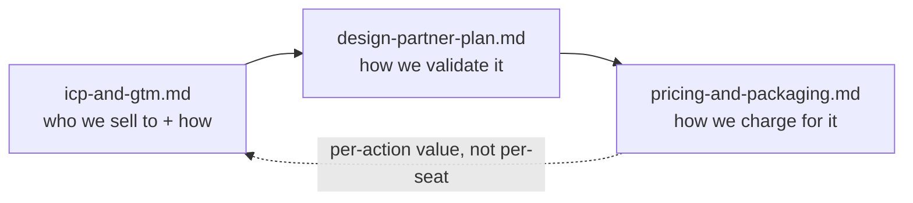

# Business

**Status:** Planning (pre-build)
**Last updated: 2026-06-24**
**Related:** [../positioning.md](../positioning.md), [../architecture/integration-surfaces.md](../architecture/integration-surfaces.md), [../decisions/0012-pricing-metered-governed-action.md](../decisions/0012-pricing-metered-governed-action.md)

The go-to-market case for Provna. Provna does not sell a security tool; it sells **permission to ship** — the gate through which a blocked agent project passes into (limited) production with risk-committee approval. Every document in this cluster is downstream of that one reframing: budget, buyers, pricing, and discovery all change when the thing you sell stops being "another AI-security tool" and becomes "the unblock for a stalled, deadline-bound agent project."

## Documents

- **[icp-and-gtm.md](icp-and-gtm.md)** — The ideal customer profile (EU-exposed bank/payments/fintech/treasury, 1000+ employees, with a *blocked* finance-ops agent project); the three personas (Champion, Economic Buyer, Verifier) who meet at one gate where a single "no" kills the deal; the "permission to ship" budget-pool shift; and the GTM motion (design-partner-led + top-down, with an open-source policy/SDK for credibility and a bottom-up Claude Code wedge for adoption).
- **[design-partner-plan.md](design-partner-plan.md)** — The discovery plan: target 2-3 payment-intent pilots out of 8-10 interviews -> ~5 partners across bank, payments/fintech, and treasury. The discovery question set, the red flags that disqualify, the 90-day pilot single metric, the kill-criteria, and the one assumption every design partner must help us validate: **is compensation genuinely hard enough to be a moat?**
- **[pricing-and-packaging.md](pricing-and-packaging.md)** — The pricing axis (platform fee + compliance-tier paywall + metered governed-action; **avoid per-seat**), the land-and-expand shape (land ~$60-150K -> expand $500K+, ACV $80-250K), and the open-source-vs-proprietary packaging boundary.

## How these connect to the rest of the docs

- **Why the four-way intersection is defensible** lives in [../positioning.md](../positioning.md). Business documents assert the moat; positioning argues it.
- **What the buyer actually integrates** (SDK / MCP hook / proxy, the "govern in two lines" on-ramp) lives in [../architecture/integration-surfaces.md](../architecture/integration-surfaces.md). The bottom-up wedge in GTM is a business framing of that technical surface.
- **The pricing decision-of-record** (why metered governed-action, why not per-seat) lives in [../decisions/0012-pricing-metered-governed-action.md](../decisions/0012-pricing-metered-governed-action.md). The packaging doc here is the operational expansion of that ADR.
