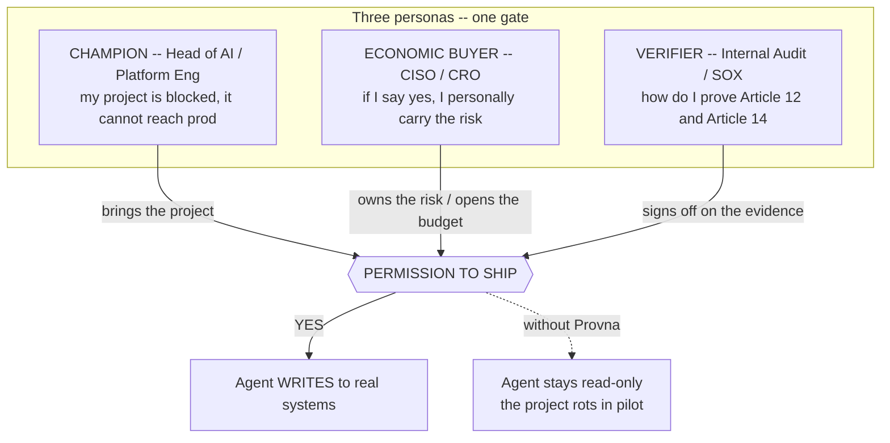

# ICP and Go-To-Market

**Status:** Planning (pre-build)
**Last updated: 2026-06-24**
**Related:** [../positioning.md](../positioning.md), [../architecture/integration-surfaces.md](../architecture/integration-surfaces.md), [design-partner-plan.md](design-partner-plan.md), [pricing-and-packaging.md](pricing-and-packaging.md)

Provna is sold into exactly one situation: an enterprise has a working agent that it is **not allowed to put into production** because it would write to systems where a mistake is irreversible, unauthorized, or unprovable. We do not sell security; we sell the gate that lets that blocked project ship. Everything below is the operational shape of that one sentence.

## 1. Ideal customer profile

**Firmographic:** EU-exposed **bank / payments / fintech / treasury**, **1000+ employees**, regulated, with mature SOX / four-eyes controls already budgeted.

**The qualifying signal (non-negotiable):** there is a **specific, currently-blocked agent project in finance-ops** — accounts-payable / supplier-payment approval, reconciliation-break correction, or close automation — that has a working demo but is stuck in "pilot" because security, risk, or audit said *it cannot write to money or the ledger.*

Why this vertical and not the obvious adjacent ones:

- **Errors are irreversible and pre-budgeted.** A wrong money movement cannot be un-sent, and the organization *already pays* for four-eyes / SOX controls — so the budget pool for "control the irreversible action" exists.
- **It is the most date-stamped regulatory surface.** EU AI Act Article 12 (forensic reproducibility) and Article 14 (human oversight), plus DORA and MiFID II, create a *recurring*, audit-cycle obligation — not a one-time deadline. UNVERIFIED whether any single calendar date is the forcing function; the durable forcing function is the per-audit, per-cycle evidence demand.
- **There is live demand pull.** Banks are deploying reconciliation / AP / close agents now, but there is no safe *write* layer — they sit read-only.
- **Integration is idempotency-native.** Payment rails and ERPs already expose void / reversal / two-phase primitives, so the S2 compensation story has real surfaces to bind to.

**Why not the near-misses:** IT / cloud-ops (the forcing function is weak — a strong #2); healthcare revenue-cycle (regulated but integration is hostile — a strong #2); insurance (slow — a #2/#3). [OPINION]

## 2. The three personas — three different "I cannot," one gate

The defining feature of this sale: three different people each bring a different "I cannot" to the *same* gate, and **a single "no" from any of them kills the deal.** Indispensability is not one person saying "this is nice" — it is all three saying, at once, "without this, it does not ship."

### 2.1 Champion — Head of AI / Platform Engineering

**Job to be done:** get a working, demoed agent out of pilot and into production where it actually writes.

**The pain is permission, not technology.** "I built an agent, the demo is perfect, but security/risk said it cannot write to money, so the project has been rotting under a 'pilot' label for six months."

- **Without Provna:** the agent stays read-only; the answer to "what if it gets prompt-injected?" is a shrug, so the project never ships.
- **With Provna:** real writes (SEPA, ERP posting) plus a concrete answer — "IFC fail-closed, an injected IBAN cannot reach the sink, deterministic" — plus idempotent / two-phase / one-click compensation. The Champion becomes the *internal* seller; this is a career-saving deal-unblocker, not infrastructure. [OPINION]

**The concrete "wow":** after ~2 weeks of shadow-mode, the Champion walks into the risk committee with an evidence pack generated *from the customer's own traffic* — "1,400 actions, 3 blocked, all reversible, Article 12 log." That moment sells harder than the abstract "escrow" metaphor.

### 2.2 Economic Buyer — CISO / CRO

**Job to be done:** approve an irreversible-write agent without personally owning an unbounded, unprovable risk.

**The pain is personal liability.** "If I say no I block innovation; if I say yes I own the irreversible money movement and the regulator penalty — and I have no *architectural* basis to say yes, only 'the developer will be careful,' which fails an audit."

- **Without Provna:** both options put the CISO personally on the hook; a probabilistic "the classifier catches 95%" is weak under audit.
- **With Provna:** "yes, but behind the gate" — risk is transferred to architecture, not trust. Provna is a **risk-transfer instrument**; the escrow metaphor speaks the CISO's language and moves the conversation from "do we trust the agent?" to "do we trust the gate?" [OPINION]

**Critical guardrail:** the S3 authorization market is saturated (CrowdStrike acquired SGNL, ~$740M). If you pitch the CISO "better authz," you get crushed by Okta / Entra / CrowdStrike. **The pitch to the CISO must lead with the S1+S2 fusion** (deterministic information-flow defense + reversible transactional action), which no identity vendor offers.

### 2.3 Verifier — Internal Audit / SOX

**Job to be done:** be able to prove, on demand and months later, *why* an agent action happened, *who* authorized it, *with what data*, and *that the log was not altered.*

**The Verifier does not buy — they veto.** But the veto kills the deal, and the sign-off is a precondition for the CISO's "yes."

- **Without Provna:** weeks of manual evidence assembly from unstructured LLM traces plus app logs, and an operator who *can* alter the log.
- **With Provna:** per-action structured evidence instantly, an external anchor so even the operator cannot rewrite history, and one-click export. The evidence store becomes the **system of record** — leaving Provna means losing the audit history, the strongest switching cost. [OPINION]

**Honesty anchor (sell verbatim):** "We do not guarantee against implicit-flow / side-channel leakage; the evidence is regulator-grade forensic-reproducible, and court-admissibility is case-by-case (UNVERIFIED)." Audit punishes over-claiming and trusts the vendor who draws the boundary honestly.

## 3. The "permission to ship" frame — the budget-pool shift

The framing decides the budget pool, and the budget pool decides whether the deal is fundable.

- The **"new security tool"** frame compares Provna against 20 AI-security vendors and a saturated, deferrable security-tooling budget. Result: "nice to have," postponed.
- The **"permission to ship"** frame compares Provna against the *cancellation cost of the agent project* plus the recurring compliance obligation. Result: "must-have," deadline-bound.

So the money does not come from the "buy another security tool" pool (scarce, saturated). It comes from the **"we must ship the agent + we have a compliance obligation"** pool (prioritized, deadline-bound). Provna competes with the cost of a cancelled agent project, not with a line item in the security-tooling budget. This is the single most important sentence in the GTM, and it propagates straight into [pricing-and-packaging.md](pricing-and-packaging.md).

## 4. The GTM motion

Money comes top-down and slowly; credibility and adoption come bottom-up. The two motions feed each other.

### 4.1 Primary motion: design-partner-led + top-down

Sell into the gate, not into a feature. Run a small set of design partners (see [design-partner-plan.md](design-partner-plan.md)), land a 90-day pilot whose single metric is *a blocked project shipping to limited-prod with risk-committee approval because of Provna*, and expand from there. The buyer is the CISO/CRO; the Champion is the internal seller; the Verifier is the gate. Reach all three or the deal dies.

### 4.2 Open-source policy/SDK for credibility

The policy language and the SDK are open source — this earns developer trust and gets Provna *inside* the org without a procurement cycle. The **IFC engine, the compensation library, and the evidence store stay proprietary** (the boundary is detailed in [pricing-and-packaging.md](pricing-and-packaging.md)). Open enough to be trusted and adopted; closed where the moat lives.

### 4.3 Bottom-up wedge: enterprise-managed Claude Code

The developer-scale on-ramp. When a bank gives employees Claude Code, it can write to the prod DB and to real money. Provna attaches as a real **PreToolUse deny** hook plus an MCP proxy: a risky action (real money, prod migration, destructive command) stops for dry-run + approval; injection is blocked architecturally; everything is signed and anchored. The on-ramp is "govern in two lines" — Layer-0 audit-only but *signed + anchored* (not plain logging), Layer-1 policy (deny + dry-run), Layer-2 compensate; the developer earns trust by *observing* first, then turns on enforcement. The mechanics of these surfaces live in [../architecture/integration-surfaces.md](../architecture/integration-surfaces.md).

**Honest limit of the wedge.** A PreToolUse deny *prevents* an action; compensation is for actions that *already happened*. On the Claude Code surface Provna's real power is **prevention** (S1 deny + risk gate) — some actions are prevented but cannot be undone. **Real compensation (the S2 moat) lives in the FS connectors** (Stripe void, NetSuite reversing-entry), where the inverse is recorded and round-trip-tested. In the wedge we never say "everything is reversible"; we say "risky actions are prevented, connector-backed actions are reversed."

**The wedge is not the customer.** The single-developer coding scenario is a distribution and adoption channel, not a paying account. The money is top-down; the wedge exists to get Provna inside and to prove value where the agent writes to production or financial systems. [OPINION] Whether this bottom-up wedge actually converts into top-down revenue is a hypothesis to be tested, not a proven motion.
