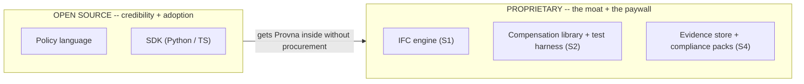

# Pricing and Packaging

**Status:** Planning (pre-build)
**Last updated: 2026-06-24**
**Related:** [../decisions/0012-pricing-metered-governed-action.md](../decisions/0012-pricing-metered-governed-action.md), [icp-and-gtm.md](icp-and-gtm.md), [../positioning.md](../positioning.md)

Pricing follows the value. Provna's value is created **per agent action governed**, not per human seat — so the pricing model is per-action, the packaging gates regulatory evidence behind a paywall, and per-seat is explicitly avoided. The decision-of-record for *why* metered governed-action is the right axis lives in [../decisions/0012-pricing-metered-governed-action.md](../decisions/0012-pricing-metered-governed-action.md); this document is its operational expansion.

## 1. The pricing axis

Three components, composed:

1. **Platform fee.** A base for deployment into the customer VPC / air-gapped environment, the control plane, and the SDK/integration surfaces.
2. **Compliance-tier paywall.** The deal-unblocker dossier sits behind a tier: **EU AI Act Article 12 (forensic reproducibility) + Article 14 (human oversight) evidence packs + DORA + the IFC engine.** This is the part the Verifier and the CISO are actually buying permission with, and it is where willingness-to-pay is highest. None of the torn-down competitors have this regulatory depth.
3. **Metered governed-action.** Usage-based, per side-effecting action that passes through the gate. Value scales with the number of irreversible/sensitive writes Provna makes safe — which is exactly the thing the customer is paying to be allowed to do.

### Why NOT per-seat

The value is created at the **action**, not at the **seat**. A reconciliation agent run by one operator may govern thousands of money-path writes; a per-seat model would price that at ~one seat and capture almost none of the value. Per-seat also re-frames Provna as a productivity tool competing in the saturated per-seat security-tooling budget — the exact "new security tool" framing that [icp-and-gtm.md](icp-and-gtm.md) tells us to avoid. Per-action keeps the value capture aligned with the "permission to ship" frame: you pay in proportion to the risk you are being allowed to take.

## 2. Deal economics

| Metric | Target |
|---|---|
| Land | ~$60-150K (first connector, first action type, shadow-mode -> first enforced contract) |
| Expand | $500K+ (more connectors, more finance-ops surfaces, more governed-action volume, premium IFC tier) |
| ACV | $80-250K (blended average across the base — first lands plus early expansion; sits above Land and trends up toward Expand as accounts mature) |

**The anchor:** Microsoft Agent 365 is priced around ~$15/user/month (a platform, per-seat). UNVERIFIED as a current price point. We anchor *against* it deliberately: Provna is not a per-user platform fee, it is per-governed-action permission. The comparison reframes the buyer away from "how many seats" toward "how many irreversible actions do you need to be allowed to make, and what is the cancellation cost of the project if you cannot?"

Land-and-expand maps onto the roadmap: land in shadow-mode on one connector + one action type, expand as enforcement turns on and the compensation library grows across the customer's finance-ops surface. The switching cost compounds — the evidence store becomes the audit system of record, and leaving means losing the audit history.

## 3. The open-source vs proprietary packaging boundary

Open enough to be trusted and adopted; closed where the moat lives.

- **Open source (policy + SDK):** earns developer trust, enables the bottom-up wedge, and lets Provna land inside an org without a procurement cycle. This is a credibility and distribution play, not a revenue line.
- **Proprietary (the moat + the paywall):**
  - **IFC engine (S1)** — the CaMeL P/Q isolation + runtime-taint fusion; the architectural differentiator.
  - **Compensation library + round-trip test harness (S2)** — the per-connector, API-version-pinned inverse catalog; the real moat (conditional on the flywheel assumption — see [design-partner-plan.md](design-partner-plan.md)).
  - **Evidence store + compliance packs (S4)** — the signed + externally-anchored audit system of record and the Article 12/14 + DORA dossiers behind the compliance-tier paywall.

The boundary is deliberate: the open surfaces drive adoption and trust; the proprietary core is exactly the part competitors cannot assemble (the four-way intersection argued in [../positioning.md](../positioning.md)) and exactly the part the customer is paying for permission with.
