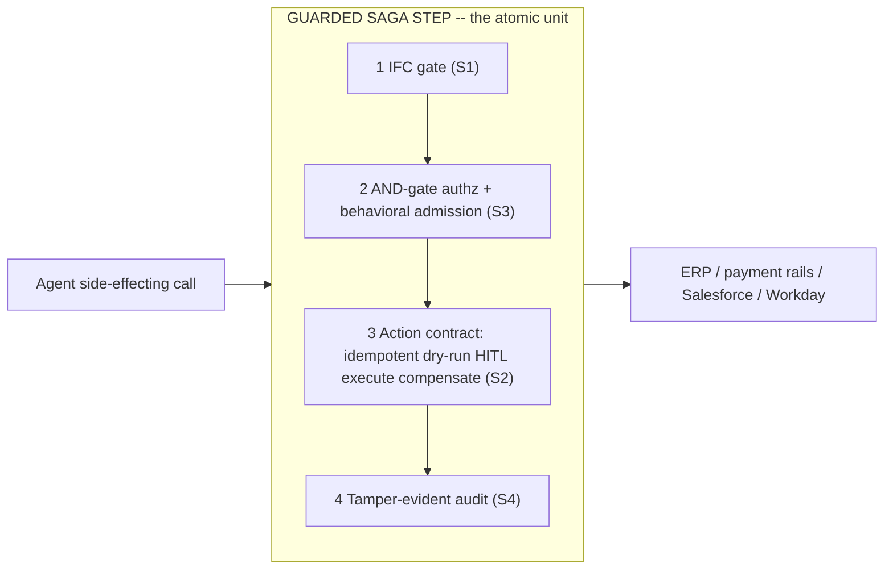

# ADR-0001: The atomic unit is the guarded saga step

**Status:** Accepted
**Last updated: 2026-06-24**
**Related:** [../architecture/action-lifecycle.md](../architecture/action-lifecycle.md), [../architecture/overview.md](../architecture/overview.md), [0003-build-vs-consume-boundary.md](0003-build-vs-consume-boundary.md), [../vision.md](../vision.md)

## Context

Every agent-safety product on the market today picks a single concern and ships it as a standalone box: a prompt-injection inspector, a durable-execution step, a policy decision point, an audit logger. Each box is real and each is, on its own, commoditizing fast. The strategic question that precedes every other Provna decision is: **what is the indivisible thing we sell?** If we get this wrong, we either build a thinner version of a box that already exists, or we build four boxes and dilute the one combination nobody else has.

The market evidence is unambiguous. Inspection tools (Invariant/Snyk) enforce only `BLOCK`/`LOG` and have no notion of undoing an action. Stateful-admission prototypes (the ACP line of work) architecturally exclude rollback - they state outright that there is "no rollback of approved requests." Horizontal substrates (Microsoft's MGAT) touch all four concerns but shallowly: a saga stub, host-dependent flow control, unsigned audit. The concept-twin IFC blueprint (MVAR) closes information-flow and audit but has zero compensation. **No one fuses prevention, authorization, reversal, and proof into one applicable, reversible action contract.** That gap is the whole opportunity, and it only exists at the level of a single side-effecting call.

## Decision

**The product's atomic unit is the guarded saga step: a single side-effecting call wrapped, in one pass and a fixed order, as a reversible action contract that has passed four gates - IFC, AND-gate authorization plus behavioral admission, the idempotent->dry-run->HITL->execute->compensate contract, and tamper-evident audit. The unit is not the single tool call, and it is not any one gate in isolation.**

Considered: **a guardrail / inspection step** (a probabilistic or DSL-driven check that blocks or logs but has no compensation and no authorization context - rejected: it sells "we caught the injection," not "the action is reversible and provable," and it competes directly in a commoditizing inspection market where the incumbent admits its own classifier is "just a heuristic"); **a durable-execution step** (a resumable, exactly-once workflow step from a Temporal/DBOS-style substrate - rejected: it replays forward and has no information-flow control and no per-action authorization; it solves "the step ran once" but not "the step was allowed to run and can be unwound"); **the four-gate fusion (chosen)** because the defensible white space lives only at the intersection - prevention without reversal is a guardrail, reversal without prevention is durable-execution, and the fusion is the only configuration that turns "do we trust the agent?" into "do we trust the gate?" for all three enterprise buyers at once.

The ordering matters and is part of the unit: a flow that an untrusted source could poison is stopped at gate 1 before authorization is even evaluated; authorization (gate 2) gates before any effect is computed; the action contract (gate 3) is where idempotency, dry-run, risk-tiered human approval, execution, and the recorded inverse live; audit (gate 4) captures every outcome including the blocks. Splitting the unit across separate products - the way every competitor does - is precisely what dilutes the moat. The fusion is the product.

## Consequences

### Positive

- One coherent claim to sell: every agent write becomes a contract that is reversible, authorized, information-flow-controlled, and regulator-grade provable. This is restated once, here, and inherited everywhere.
- The unit defines the integration seam cleanly - a `decide()` / `commit()` / `compensate()` protocol maps one-to-one onto gates 1+2 / 3+4 / 3, which keeps the host-injection surface small (see [0009-action-guard-seam-vendor-neutral.md](0009-action-guard-seam-vendor-neutral.md)).
- It is the load-bearing reason the build-vs-consume split (see [0003-build-vs-consume-boundary.md](0003-build-vs-consume-boundary.md)) is coherent: we build the two gates that fuse the unit (IFC + compensation) and consume the rest.
- It gives a single scope test for every future feature request: does this make one guarded saga step safer / more reversible / more provable, or does it turn us into an agent platform? The latter is rejected or consumed.

### Negative

- Higher per-action engineering cost than any single-box competitor: every gate must hold for the unit to hold, so we inherit the hardest part of all four concerns rather than one.
- The unit is only as strong as its weakest gate; a fail-open anywhere (a downgrade path, an unlabeled value treated as trusted) breaks the whole contract, which forces the fail-closed discipline of [0010-fail-closed-everywhere.md](0010-fail-closed-everywhere.md) as a hard constraint rather than a preference.
- Demos are heavier: showing the value requires a real side-effecting path (a payment, an ERP posting) and its reversal, not a one-line block.
