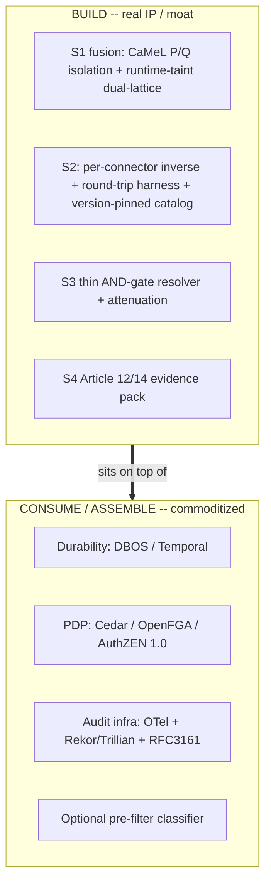

# ADR-0003: Build-vs-consume boundary

**Status:** Accepted
**Last updated: 2026-06-24**
**Related:** [../architecture/build-vs-consume.md](../architecture/build-vs-consume.md), [0001-atomic-unit-guarded-saga-step.md](0001-atomic-unit-guarded-saga-step.md), [0004-s1-camel-pq-isolation-runtime-taint-fusion.md](0004-s1-camel-pq-isolation-runtime-taint-fusion.md), [0005-s2-dbos-substrate-compensation-library.md](0005-s2-dbos-substrate-compensation-library.md), [../tech-stack.md](../tech-stack.md)

## Context

The guarded saga step (see [0001-atomic-unit-guarded-saga-step.md](0001-atomic-unit-guarded-saga-step.md)) requires four gates, but it does not follow that we should build all four. Two of the four sit in saturated, commoditizing markets: runtime authorization (the PDP layer - Cedar, OpenFGA, AuthZEN; with identity giants consolidating, evidenced by a ~$740M acquisition in that space) and tamper-evident audit infrastructure (OpenTelemetry, Rekor/Trillian, RFC3161 - the format is open, the mechanism is a commodity). Durable execution is likewise commoditized substrate (DBOS, Temporal). The other two are genuine white space: there is no vendor-neutral production information-flow-control plane, and no security vendor ships verified per-connector compensation - everyone treats reversal as "a developer problem."

If we build everything we become horizontally bloated, slow, and we re-implement primitives that giants give away. If we consume everything we have no moat and become an assembler. The boundary has to be drawn exactly where defensibility lives.

## Decision

**BUILD only the genuinely defensible core - the S1 information-flow-control fusion and the S2 per-connector compensation library (plus a thin S3 AND-gate resolver and the S4 Article 12/14 evidence pack). CONSUME the S3 PDP, the S4 audit infrastructure, the optional pre-filter classifier, and the durability substrate.**

Considered: **build everything** (own all four gates end to end - rejected: horizontally bloated, slow to ship, and forces us to re-implement a saturated PDP market and commoditized audit/durability infrastructure where we have no differentiation and would be crushed by identity and hyperscaler incumbents); **consume everything** (assemble all four gates from off-the-shelf parts - rejected: there is no moat in assembly; the two white-space concerns - vendor-neutral runtime IFC and verified per-connector compensation - simply do not exist to be consumed, so an assembler ships a product anyone can clone in a sprint); chose the **bounded build** because the only durable IP is the fusion the market leaves empty (S1 isolation that three named competitors lack) and the compensation content that requires multi-year domain accumulation (S2), while everything else is mechanism that is genuinely cheaper to buy than to build.

The scope test that enforces this boundary: a capability is BUILT only if it falls in the white space the fusion does not already cover (S2 compensation + S1 capability-IFC); everything else - PDP, durability, audit infrastructure, evaluation harness - is consumed or assembled. The build is the moat; the consume is the substrate the moat sits on. The per-pillar build/consume detail lives in [0004-s1-camel-pq-isolation-runtime-taint-fusion.md](0004-s1-camel-pq-isolation-runtime-taint-fusion.md) and [0005-s2-dbos-substrate-compensation-library.md](0005-s2-dbos-substrate-compensation-library.md); this record fixes the boundary itself.

## Consequences

### Positive

- Engineering effort concentrates on the two concerns nobody else solves, maximizing the moat per unit of work.
- We inherit hardened, audited substrate for the commodity gates (PDP, durability, audit anchoring) instead of carrying their maintenance and security burden.
- The boundary makes the "why not just OPA?" objection answerable: OPA is the PDP we consume; the moat is the compensation content and IFC fusion OPA does not touch.

### Negative

- We take a hard dependency on consumed substrates (DBOS/Temporal, Cedar/OpenFGA, Rekor/Trillian); their roadmaps, licensing, and breaking changes become our risk surface.
- The boundary requires constant discipline: every feature request must be tested against the build/consume line, and the temptation to "just build a bit of the PDP" to close a deal is a standing threat to focus.
- Differentiation in the consumed gates (S3/S4) is assembly plus FS mapping, not breakthrough - meaning our position there is defensible in substance but not in position, which sets the ~12-24 month clock the strategy runs against.
