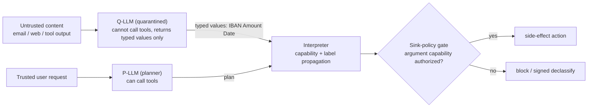

# ADR-0004: S1 - CaMeL P/Q isolation + runtime-taint fusion

**Status:** Accepted
**Last updated: 2026-06-24**
**Related:** [../architecture/pillar-1-information-flow-control.md](../architecture/pillar-1-information-flow-control.md), [0001-atomic-unit-guarded-saga-step.md](0001-atomic-unit-guarded-saga-step.md), [0003-build-vs-consume-boundary.md](0003-build-vs-consume-boundary.md), [0010-fail-closed-everywhere.md](0010-fail-closed-everywhere.md)

## Context

The lethal trifecta - private data plus untrusted content plus external communication - makes any such agent unconditionally exploitable, and the model vendors have conceded this is not patchable inside the model. Only an architectural defense gives a guarantee. So gate 1 of the guarded saga step (see [0001-atomic-unit-guarded-saga-step.md](0001-atomic-unit-guarded-saga-step.md)) is a BUILD concern (see [0003-build-vs-consume-boundary.md](0003-build-vs-consume-boundary.md)), and the question is which architecture.

The field offers three reference points, each correct in one mechanism and wrong in an adjacent one. A dataflow-DSL inspector (Invariant) has readable `->`/`~>` operator ergonomics, but its backend treats "flow" as chronology - it draws an edge from every prior message to every later one, so `1->3` fires on temporal reachability whether or not data actually flows; and its own source admits the injection classifier is "just a heuristic." A mature runtime-taint engine (MVAR) ships a real integrity x confidentiality dual-lattice with a two-layer fail-closed sink-gate (untrusted+critical is blocked first), but its provenance node is not frozen - it can be relabeled by in-process mutation - and, critically, it has no P/Q isolation: LLM output flows back into the same graph through a derived-node call. A pure-classifier approach is probabilistic and cannot give an architectural guarantee at all.

## Decision

**Keep the architecture - CaMeL P/Q-LLM isolation at the core, complemented by a runtime-taint dual-lattice sink-gate; typed, fail-closed (unlabeled => untrusted), and node-immutable - but sharpen the build-vs-consume seam. CONSUME Microsoft FIDES (in microsoft/agent-framework, MIT, Python, provider-agnostic) as the Q-LLM-isolation + label-propagation reference and prototype substrate for the MVP PoC and AgentDojo eval, and microsoft/dromedary (MIT, a CaMeL implementation: privileged LLM + quarantined query_ai_assistant + custom interpreter + OPA policy) as the interpreter/capability reference. BUILD the real, sharpened moat: the inline, fail-closed Go reference-monitor on the synchronous money-path; the immutable server-side label store; the signed, principal-bound declassification node; the per-connector sink-policy catalog; and the S1<->S4 forensic declassification bridge. Borrow the dataflow-DSL ergonomics for the surface, but back them with capability / label propagation, not chronology. See [../architecture/tech-stack-analysis.md](../architecture/tech-stack-analysis.md) for the full evaluation.**

The core is the P/Q split: a privileged planner (P-LLM) that may call tools, and a quarantined processor (Q-LLM) that processes untrusted data, cannot call tools, and returns only typed values. This is the architectural differential all three reference competitors lack. The premise that "no production IFC plane exists / CaMeL+FIDES are only research blueprints" is now outdated, so we no longer reimplement P/Q isolation and label-propagation from scratch: FIDES and dromedary are consumed as the reference and prototype substrate, while the inline fail-closed enforcement on the money-path stays BUILD because that is where the guarantee and the moat live. The default declassification channel is FIDES-style typed constrained-decoding of low-capacity output types (bool / enum / small dict) from the Q-LLM; the signed, principal-bound, audit-visible trust_boundary node is reserved for high-capacity declassification. We adopt the 2026 CaMeL side-channel hardening (loop clamping, structured/constant-time error handling) into the interpreter. The deterministic guarantee is anchored only in the lattice plus the sink-policy; ML classifiers are an optional pre-filter, never sold as the architectural guarantee. The pre-filter is a self-hosted Llama Prompt Guard 2 (86M multilingual / 22M low-latency), explicitly OFF the deterministic guarantee path - not Lakera (proprietary, acquired by Check Point) or any SaaS detector. Labels are frozen, immutable value-objects held in a server-side store.

Considered: **pattern-matching dataflow** (the chronology-as-flow DSL backend - rejected: temporal reachability is not data dependency, so it both over- and under-reports flows, and the same lineage admits its classifier is heuristic); **classifier-only** (a probabilistic injection detector - rejected: heuristic, gives no architectural guarantee, and selling a probability as a guarantee is punished by the audit persona); **lattice-only** (a runtime-taint dual-lattice with no P/Q isolation - rejected: the most mature S1 reference, but without P/Q isolation untrusted LLM output re-enters the planning graph, and a non-frozen label can be relabeled in-process); chose the **fusion** because P/Q isolation closes the channel the lattice cannot (planner-side contamination) while the immutable dual-lattice sink-gate closes the channel isolation cannot (untrusted derived values reaching a sink), and the two together are what no competitor holds. On build-vs-consume we also rejected **reimplement-everything** (rebuild P/Q isolation and label-propagation from scratch - rejected: now wasteful given MIT-licensed FIDES and dromedary, and it diverts effort from the inline money-path enforcement that is the actual moat) and **consume-everything** (depend on FIDES end-to-end including enforcement - rejected: FIDES is a Python provider-agnostic reference, not an inline fail-closed reference-monitor on a synchronous money-path, so the guarantee surface must be BUILT in Go).

## Consequences

### Positive

- An honest, defensible guarantee we can sell verbatim: untrusted data cannot reach a sensitive sink unless an explicitly-typed policy authorizes the flow; all flows are deterministically enforced pre-execution and tamper-evidently logged.
- The guarantee rests on the lattice plus sink-policy, not on classifier luck, so the measured AgentDojo attack-success-rate is an architectural number, not a probabilistic one (we publish ASR and the utility tax together - see [../architecture/pillar-1-information-flow-control.md](../architecture/pillar-1-information-flow-control.md)). The self-hosted Llama Prompt Guard 2 pre-filter stays off this path, so it cannot weaken the guarantee and carries no SaaS-detector dependency.
- Immutable labels plus signed declassification close the in-process relabeling weakness the mature reference engine left open; reserving the signed principal-bound node for high-capacity declassification and using FIDES-style typed constrained-decoding for the common low-capacity case keeps the latency and audit cost proportionate to the leak risk.
- Consuming FIDES (microsoft/agent-framework) and dromedary as the prototype substrate cuts MVP PoC and AgentDojo-eval time, while the inline Go reference-monitor, immutable server-side label store, signed declassification, per-connector sink-policy catalog, and S1<->S4 bridge remain BUILD - so the moat stays where the guarantee is enforced (see [../architecture/tech-stack-analysis.md](../architecture/tech-stack-analysis.md)).
- Adopting the 2026 CaMeL side-channel hardening (loop clamping, structured/constant-time error handling) narrows the side-channel surface the boundary statement still excludes.

### Negative

- We must state the guarantee's boundary plainly: implicit-flow and side-channel leakage are NOT guaranteed. Overstating this is a credibility loss with the verifier.
- The P/Q split imposes a utility tax (an indicative ~7-point reference, to be validated with design partners) and added orchestration cost, since untrusted data must round-trip through a tool-less Q-LLM into typed values.
- The fail-closed default (unlabeled => untrusted, error => block) means coverage gaps surface as blocked legitimate work rather than silent leaks - correct, but it makes annotation coverage a first-class operational concern (see [0010-fail-closed-everywhere.md](0010-fail-closed-everywhere.md)).
- Patent caution: the runtime-taint and witness-binding primitives in the reference engine carry combination claims; we re-implement from prior art (Jif/FlowCaml/Capsicum-class lineage) independently and avoid the competitor's marks.
