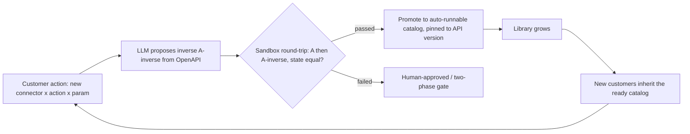

# ADR-0005: S2 - DBOS substrate, BUILD the compensation library

**Status:** Accepted
**Last updated: 2026-06-24**
**Related:** [../architecture/pillar-2-transactional-compensation.md](../architecture/pillar-2-transactional-compensation.md), [0001-atomic-unit-guarded-saga-step.md](0001-atomic-unit-guarded-saga-step.md), [0003-build-vs-consume-boundary.md](0003-build-vs-consume-boundary.md), [../tech-stack.md](../tech-stack.md), [../risks/risk-register.md](../risks/risk-register.md)

## Context

Gate 3 of the guarded saga step (see [0001-atomic-unit-guarded-saga-step.md](0001-atomic-unit-guarded-saga-step.md)) is the action contract - idempotent, dry-run-able, HITL-gated, executed, and compensable - and S2 is the real moat (see [0003-build-vs-consume-boundary.md](0003-build-vs-consume-boundary.md)). The greenfield is confirmed from four independent directions: the mature IFC reference engine has zero compensation/rollback/saga code outside tests; the inspection tool's enum is only BLOCK/LOG; the stateful-admission prototype architecturally excludes rollback of approved requests; and the horizontal substrate's saga is a self-declared stub.

The decisive distinction is between the saga **mechanism** and the compensation **content**. The mechanism - durable orchestration, exactly-once, resumable steps - is commodity: a durable-execution substrate gives it away, and you can stand it up in a weekend. The content - a verified per-connector inverse (Stripe void/refund, NetSuite reversing entry), pinned to the connector's API version, proven by a round-trip harness, confirmed by an observe-probe, previewed by dry-run - is what takes multi-year domain accumulation and what no horizontal, durability, or security vendor builds, because they all classify reversal as a developer problem.

## Decision

**CONSUME the saga mechanism from DBOS Transact (Postgres-backed, MVP-fast). BUILD the moat: a per-connector inverse (A^-1) catalog, an A->A^-1 round-trip test harness, an observe-probe, dry-run, and an API-version-pinned auto-runnable catalog.**

We never sell "undo everything" - compensation is semantic and sometimes impossible. For irreversible actions we prefer a two-phase pattern (auth->capture->void) so that money never leaves before a confirmation. The flywheel is the moat-builder: an LLM proposes the inverse from the connector's OpenAPI, a sandbox round-trip verifies that A then A^-1 returns the system to its prior state, passing inverses are promoted to the version-pinned auto-runnable catalog, and each new customer inherits the accumulated library.

Considered: **Temporal as the substrate** (a $5B durable-execution platform - deferred to the scale phase, not the MVP: heavier operationally than needed at 0-3 months, and its compensation is a manual pattern rather than a library, so consuming it early buys mechanism we already get more cheaply from a Postgres-native substrate); **a hand-rolled saga pattern** (write our own orchestration - rejected: re-implementing durable, exactly-once, resumable execution is exactly the commodity mechanism a substrate gives away, and our IP is the content, not the plumbing); chose **DBOS Transact for the mechanism plus a built compensation library** because it stands up the saga in a weekend and lets every engineering hour go to the version-pinned, FS-verified inverse catalog that is the actual moat.

The moat is explicitly **conditional**: it holds only if compensation content genuinely requires multi-year accumulation ("buy < build"). This is the single most critical assumption in the entire strategy and is flagged for validation with design partners (see [../risks/risk-register.md](../risks/risk-register.md)); we do not sell it as certainty.

## Consequences

### Positive

- The MVP saga ships fast on a Postgres-native substrate, freeing all build effort for the verified inverse catalog - the actual differentiation.
- A compounding flywheel: each customer's validated inverses enlarge a library the next customer inherits, which is the structural counter to a $5B durability incumbent moving up (they have the mechanism, not the FS-verified content plus IFC-aware compensation plus signed regulator-grade reversal proof).
- Two-phase preference for irreversible actions keeps the product honest - we never claim to un-send what cannot be un-sent.

### Negative

- The moat is conditional on an unproven assumption; if inverses turn out cheap to author per-connector, the flywheel weakens and the defensibility thesis softens. This is the top design-partner validation item.
- Compensation is semantic and can itself fail; "did the side effect actually happen" requires an observe-probe, and API-version drift constantly threatens to invalidate pinned inverses, imposing ongoing catalog-maintenance cost.
- We carry a substrate dependency on DBOS for the mechanism, with a planned migration path to Temporal at the scale phase (see [../tech-stack.md](../tech-stack.md)), which is a deliberate but non-trivial future re-platforming.
- Early-warning watch: if `rollback|compensat|saga|inverse|undo` first appears in a competitor's repository, it signals a direct attack on the moat.
