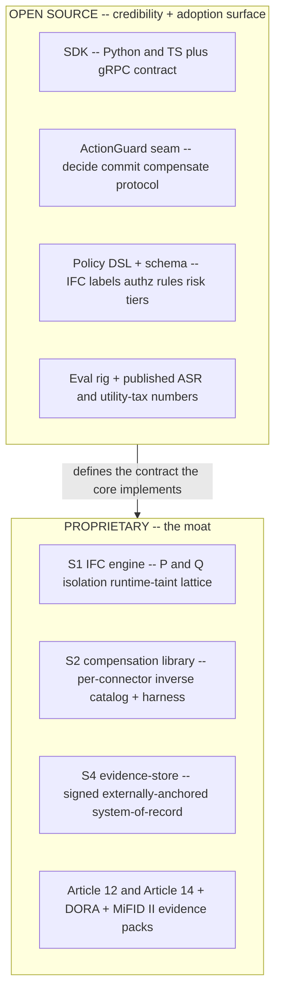

# ADR-0011: Open-Source Boundary - Open Policy/SDK, Proprietary Core

**Status:** Accepted
**Last updated: 2026-06-24**
**Related:** [README.md](README.md), [0003-build-vs-consume-boundary.md](0003-build-vs-consume-boundary.md), [0005-s2-dbos-substrate-compensation-library.md](0005-s2-dbos-substrate-compensation-library.md), [0012-pricing-metered-governed-action.md](0012-pricing-metered-governed-action.md), [../business/pricing-and-packaging.md](../business/pricing-and-packaging.md), [../positioning.md](../positioning.md)

## Context

Provna sells *permission to ship* into regulated financial-services back-office. Two structural facts shape the open-source decision:

1. **Credibility is a precondition for adoption.** The buyer is a CISO/CRO plus an Internal-Audit/SOX verifier. They will not place an inline-on-money-path control plane in front of irreversible payments on faith. They must be able to *read* the integration surface, audit how an action is intercepted, and reproduce the verdict logic. A closed black box on the money path is a non-starter for this persona. Open code is also the cheapest distribution channel into the champion (Head of AI / Platform Eng), who adopts bottom-up before the top-down deal closes.

2. **The moat is content, not mechanism.** Per [0003](0003-build-vs-consume-boundary.md), the defensible IP is the fusion of the S2 compensation library (per-connector inverse + round-trip harness, multi-year accumulation), the S1 IFC engine (CaMeL P/Q isolation + runtime-taint dual-lattice), and the S4 evidence-store (signed + externally-anchored, the customer's system-of-record). The saga mechanism, the PDP, and the audit infrastructure are commodities we consume. Therefore the parts whose *source disclosure would erode the moat* are a small, well-bounded set; everything else can be open without cost.

The question is where to draw the line so that we maximize credibility/adoption without giving away the accumulated content that is the entire reason a buyer chooses *buy < build*.

## Decision

Draw the boundary so that the **interface and policy surface are open-source** and the **accumulated-content core is proprietary**.

**Open (Apache-2.0-style permissive):**

- The **SDK** (Python + TS) and the **gRPC contract** the host integrates against.
- The **ActionGuard seam** (`decide() -> commit() -> compensate()` protocol; see [0009](0009-action-guard-seam-vendor-neutral.md)). The integration point must be readable and forkable so a buyer can verify how Provna sits on the money path and so the vendor-neutrality thesis is demonstrable, not asserted.
- The **policy DSL and schema** - IFC source/sink label syntax, the AND-gate authz rule format, risk-tier definitions. Customers author and review their own policy; that surface must be inspectable.
- The **eval rig** and the published AgentDojo ASR + utility-tax numbers (proving we did not fall into the block-everything trap).

**Proprietary (commercial license, source closed):**

- The **S1 IFC engine** - the P/Q-LLM isolation runtime, the dual-lattice label-propagation + fail-closed sink-gate. The DSL is open; the engine that enforces it is not.
- The **S2 compensation library** - the per-connector inverse (A^-1) catalog, the round-trip test harness, the observe-probe, the API-version-pinned auto-runnable definitions. This is the real moat ([0005](0005-s2-dbos-substrate-compensation-library.md)); its value is the accumulated, validated content, and open-sourcing it would directly hand a horizontal absorber (Temporal moving up, Snyk moving down) the one thing they cannot quickly build.
- The **S4 evidence-store** - the signed + externally-anchored ledger that becomes the customer's audit system-of-record, plus the Article 12/14 + DORA + MiFID II evidence packs that are the deal-unblocker dossier.

**Considered:**

- **Fully open-source everything** (rejected: gives away the moat. If the compensation catalog and IFC engine are public, *buy < build* collapses - a well-funded absorber forks the content and the only durable advantage is gone. We would be left competing on position, where we are not defensible per [../positioning.md](../positioning.md)).
- **Fully closed** (rejected: kills credibility and bottom-up adoption. The audit/CISO persona will not trust an opaque box inline on the money path, and the champion cannot evaluate or socialize it without reading the interception surface. We would lose the cheapest path into the account and the vendor-neutrality proof).
- **Open-core with a copyleft (AGPL) policy/SDK** (rejected for the *open* portion: the open layer exists to drive frictionless adoption and forkability; copyleft on the integration surface deters exactly the enterprise platform teams we want embedding it. Permissive on the open surface, fully closed-commercial on the core, is the cleaner split).

## Consequences

### Positive

- The CISO/audit persona can read and reproduce the verdict and interception surface, satisfying the credibility precondition for an inline money-path control plane.
- Bottom-up adoption via the open SDK/seam seeds accounts ahead of the top-down deal; the champion can run it before procurement.
- The vendor-neutrality thesis becomes *demonstrable* - anyone can read the seam and integrate a non-reference runtime.
- The moat (compensation content + IFC engine + evidence-store) stays behind the commercial license, so the *buy < build* economics that justify the price hold.

### Negative

- The open/closed line must be policed continuously; pressure will recur to open just one more connector or just the engine internals to win a deal. The discipline rule: never open anything whose disclosure shortens an absorber's build of S1 or S2.
- An open SDK and seam let competitors study our exact integration contract and design around it; mitigated because the contract is not the moat - the content is.
- Dual-licensing adds packaging and contribution-management overhead (CLA, license headers, clear module boundaries in the repo so closed code never leaks into the open tree).
- The moat-conditionality from [0005](0005-s2-dbos-substrate-compensation-library.md) carries over: if design-partner validation shows compensation content does *not* require multi-year accumulation, the proprietary S2 boundary protects less than assumed and this split must be revisited.
