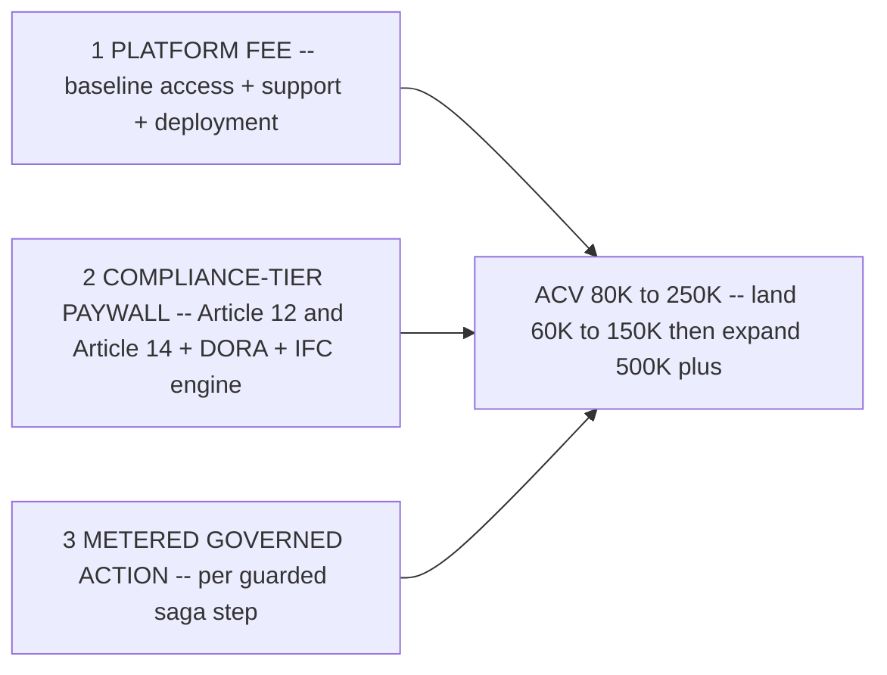

# ADR-0012: Pricing - Platform Fee + Compliance-Tier Paywall + Metered Governed Action

**Status:** Accepted
**Last updated: 2026-06-24**
**Related:** [README.md](README.md), [../business/pricing-and-packaging.md](../business/pricing-and-packaging.md), [../business/icp-and-gtm.md](../business/icp-and-gtm.md), [0011-open-source-boundary-proprietary-core.md](0011-open-source-boundary-proprietary-core.md), [../compliance/regulatory-mapping.md](../compliance/regulatory-mapping.md)

## Context

Provna's frame is *permission to ship*, not *a security tool* (see [../positioning.md](../positioning.md)). That reframing is also a pricing decision: budget comes from the *we-must-ship-this-agent + compliance-deadline* pool (prioritized, deadline-bound), not from the *new security tool* pool (scarce, saturated). Pricing must (a) attach to the unit that carries value, (b) capture the compliance value that is the actual deal-unblocker, and (c) not penalize the buyer for the thing they want more of.

The value-bearing unit is **the guarded saga step** - one side-effecting agent action passed through the four gates (see [0001](0001-atomic-unit-guarded-saga-step.md)). Value is *per governed action*, not per human seat: the customer's whole point is to run agents that act *without* a human per action. Pricing per seat would invert the value proposition (charge more when fewer humans are involved, i.e. exactly when Provna is working best) and would anchor us against per-seat platform tools (Microsoft Agent 365 ~$15/user/month, UNVERIFIED) in a comparison we lose.

Separately, the compliance value (the Article 12/14 + DORA + MiFID II evidence pack, the IFC guarantee) is what unblocks the deal and is what the audit/CRO persona will pay a premium for - but it is *not* proportional to action volume. A flat platform fee would under-capture it.

## Decision

Price on three components, and explicitly **avoid per-seat**:

1. **Platform fee** - baseline access to the control plane, deployment, and support. Captures the fixed value of having the gate in place regardless of volume.
2. **Compliance-tier paywall** - the regulator-grade capabilities are gated behind a paid tier: the Article 12 (forensic-reproducibility) and Article 14 (human-oversight) evidence packs, DORA-aligned retention, and the S1 IFC engine. This is the deal-unblocker; the audit/CRO persona pays for it because it is what converts a *no* into a risk-committee *yes*. It is priced as a tier, not metered, because compliance value does not scale with action count.
3. **Metered governed action** - usage priced per guarded saga step (per side-effecting action governed through the four gates). This tracks the unit that actually carries value and grows naturally as the customer expands from one connector/action-type to finance-ops broadly.

**Land-and-expand shape:** land at **~$60-150K** (one connector, one action type, shadow-mode-to-enforcement pilot) and expand to **$500K+** as governed-action volume and connector coverage grow; target **ACV $80-250K**. Detailed packaging, tier contents, and the metering definition live in [../business/pricing-and-packaging.md](../business/pricing-and-packaging.md) (canonical).

**Considered:**

- **Per-seat** (rejected: value is per-action, not per-seat. Agents act without a human per action, so per-seat charges *less* exactly as Provna delivers *more*, and anchors us against commodity per-user platform pricing we cannot win on).
- **Platform-flat only** (rejected: does not capture the compliance value. The Article 12/14 + DORA + IFC evidence is the single most valuable, deal-unblocking deliverable; folding it into a flat fee leaves the premium that the audit/CRO persona will gladly pay on the table, and fails to grow with the customer's expanding agent footprint).
- **Pure consumption / metered-only** (rejected: under-prices the fixed compliance and platform value, makes ACV volatile and hard for the buyer to budget against a compliance program, and invites a *we will just run fewer actions* race to the bottom on exactly the metric we want to grow).

## Consequences

### Positive

- Pricing tracks the value-bearing unit (governed action) and the deal-unblocker (compliance tier) independently, so each is captured where it actually lives.
- The compliance-tier paywall aligns revenue with the *permission-to-ship* frame and the budget pool that funds it.
- Land-and-expand is natural: a single-connector pilot lands small, then metered governed-action plus connector coverage grows the account toward $500K+.
- Avoiding per-seat removes a structural mis-incentive and an unwinnable anchor against commodity platform pricing.

### Negative

- Metering per governed action requires the action-counting and billing instrumentation to be trustworthy and tamper-evident itself - the meter sits next to the evidence ledger and must be as defensible.
- Three-component pricing is more complex to quote and negotiate than a single flat fee; sales needs a clear default packaging (see [../business/pricing-and-packaging.md](../business/pricing-and-packaging.md)).
- A kill-criterion risk applies: if a prospect treats the metered action as *we will just build it with OPA in one sprint*, the platform + compliance value must be made concrete fast or the deal is dead (per [../business/icp-and-gtm.md](../business/icp-and-gtm.md)).
- Compliance-tier gating must not undermine the open-source credibility play ([0011](0011-open-source-boundary-proprietary-core.md)): the open SDK/seam stay free; only the proprietary core capabilities sit behind the paywall.
