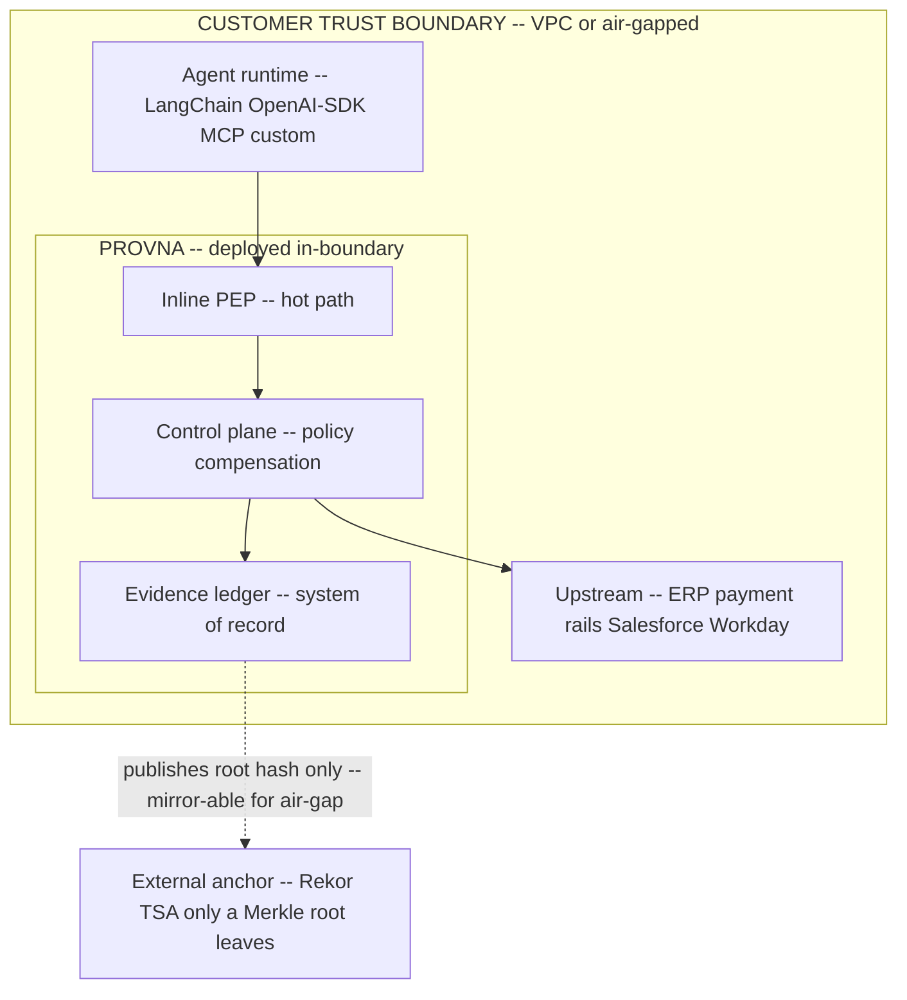

# ADR-0013: Deployment - Customer-VPC / Air-Gapped, K8s/Helm + Terraform

**Status:** Accepted
**Last updated: 2026-06-24**
**Related:** [README.md](README.md), [../tech-stack.md](../tech-stack.md), [0008-polyglot-data-plane-control-plane.md](0008-polyglot-data-plane-control-plane.md), [0010-fail-closed-everywhere.md](0010-fail-closed-everywhere.md), [../business/icp-and-gtm.md](../business/icp-and-gtm.md)

## Context

Provna sits **inline on the money path**: every side-effecting agent action - invoice data, IBANs, ERP postings, reconciliation breaks, PHI - passes through the control plane before it reaches the upstream system. The data flowing through the gate is the customer's most sensitive operational and regulated data.

The ICP is an EU-exposed bank / payments / fintech / treasury org (1000+ employees) with a blocked agent project in finance-ops (see [../business/icp-and-gtm.md](../business/icp-and-gtm.md)). For this buyer, the data-residency and control posture is not a preference - it is a hard procurement gate. A financial-services buyer will not route inline-on-money-path data to a third-party multi-tenant service; the very act that creates Provna's value (intercepting real payment data) is the act they are least willing to externalize. The audit/CRO persona must be able to attest that the data never leaves the customer's trust boundary.

Deployment must therefore keep all governed data, the evidence ledger, and the policy decision inside the customer's boundary, while still being operable - installable, upgradeable, and reproducible - by a regulated enterprise platform team, including in air-gapped environments where no outbound connectivity is permitted.

## Decision

Deploy **entirely within the customer's boundary**: customer-VPC or air-gapped, packaged as Docker/OCI images, orchestrated with **K8s/Helm**, provisioned with **Terraform**. **Data stays at the customer boundary** - governed action data, the evidence ledger, and policy decisions never leave the customer's trust zone.

Concretely:

- **Packaging:** Docker/OCI images; **Helm** charts for K8s install and upgrade; **Terraform** modules for the surrounding infrastructure. Pinned versions live in [../tech-stack.md](../tech-stack.md) and are not repeated here.
- **Data residency:** all governed data, the policy decision, and the tamper-evident evidence ledger stay inside the customer VPC. The ledger is the customer's audit system-of-record and never leaves.
- **Air-gapped support:** the system must install and run with no outbound connectivity. The one outbound primitive - the S4 external anchor (Rekor/Trillian + RFC3161 TSA, see [0007](0007-s4-merkle-external-anchor-jcs.md)) - publishes only a Merkle *root hash*, never content, and for air-gapped sites can be mirrored to a customer-operated witness so no raw data ever crosses the boundary. Fail-closed ([0010](0010-fail-closed-everywhere.md)) holds in-boundary regardless of anchor reachability.

**Considered:**

- **Multi-tenant SaaS** (rejected: an FS buyer will not send inline-on-money-path data out of its trust boundary. Multi-tenant residency, blast-radius, and third-party-processor concerns make this an automatic procurement no for the exact accounts in the ICP. The value act - intercepting real payment data - is precisely what they will not externalize).
- **On-prem single-binary only** (rejected: heavy operations. A bare binary shifts all install, upgrade, HA, secret-management, and reproducibility burden onto the customer and onto our support, does not fit how regulated platform teams operate their estate (GitOps, Helm, IaC), and scales the support cost linearly with every deployment. K8s/Helm + Terraform meets the buyer where their platform already is).
- **Hybrid - control plane in our cloud, PEP in the VPC** (rejected: still routes policy decisions and metadata out of the boundary, reintroduces the residency objection for the audit persona, and creates a cross-boundary dependency on the money path that breaks the fail-closed and air-gap requirements).

## Consequences

### Positive

- Removes the single hardest procurement objection for the ICP: no inline-on-money-path data leaves the customer boundary, and the audit/CRO persona can attest to it.
- Air-gapped support opens the most regulated, highest-value accounts that a SaaS competitor cannot serve at all.
- K8s/Helm + Terraform matches how regulated enterprise platform teams already run their estate, lowering integration friction versus a bespoke binary.
- The evidence ledger as an in-boundary system-of-record strengthens switching cost: leaving Provna means losing the audit history.

### Negative

- We do not operate the runtime, so we have weaker telemetry into production behavior; debugging and incident response depend on customer-shared diagnostics, and upgrades roll out on the customer's cadence (version fragmentation across the install base).
- Per-customer deployment topologies multiply support and qualification matrices (K8s distributions, network policies, air-gap variants); the Helm/Terraform packaging must be hardened to keep this from scaling cost linearly.
- No central control plane means no shared learning across tenants by default; any cross-customer signal (e.g. compensation-catalog improvements) must be delivered as released artifacts, not as live telemetry.
- Air-gapped external anchoring requires a customer-operated witness/mirror, adding an operational component that must be documented and supported.
