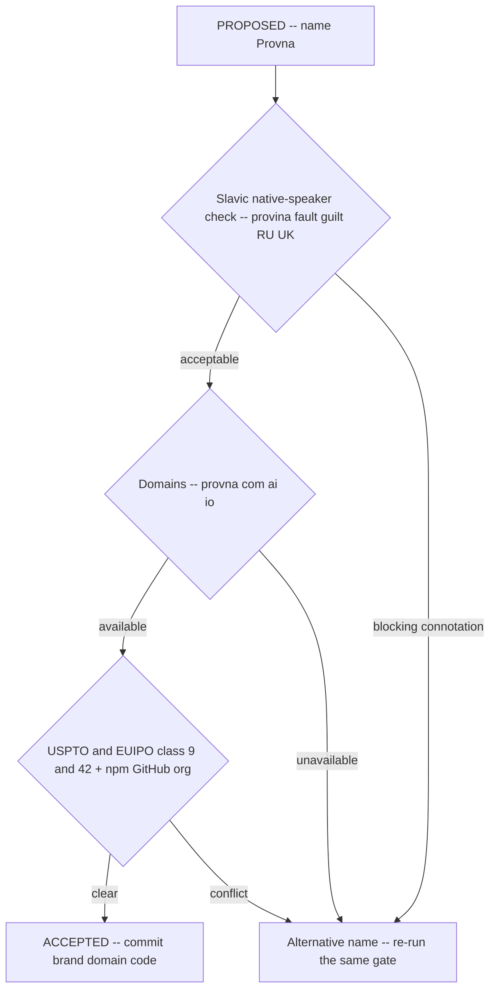

# ADR-0014: Product Name Provna - Pending Trademark/Domain Clearance

**Status:** Proposed (open - blocked on clearance)
**Last updated: 2026-06-24**
**Related:** [README.md](README.md), [../vision.md](../vision.md), [../roadmap/current.md](../roadmap/current.md), [../risks/risk-register.md](../risks/risk-register.md)

## Context

The product is provisionally named **Provna**. The name is strong on the merits: the *prov-* root binds all four pillars in one word - **prove** (S1 IFC + S4 audit), **provenance** (S4 tamper-evident trail), **provision** (S3 authorization), **approve** (HITL / Article 14 human oversight). It is short (6 letters, 2 syllables), brandable, CISO-serious, and the tagline writes itself: *Provna - every agent action, proven.*

The name is **not yet cleared**, and clearance is on the critical path before any irreversible commitment (brand assets, domains, repo/package namespaces, code identifiers). Two concrete risks must be resolved:

1. **Slavic connotation.** In Russian/Ukrainian, *provina* roughly means *fault / guilt*. For a product sold into EU financial services - where some buyers and staff are native or fluent speakers - a name that reads as *guilt* is a real brand liability and must be checked by native speakers before committing. UNVERIFIED until that check is done.
2. **Availability.** provna.com / .ai / .io domains; USPTO and EUIPO trademark in classes 9 (software) and 42 (SaaS); plus npm / GitHub org availability. None confirmed yet.

This ADR is filed as **Proposed** precisely because the name is load-bearing across docs, code, and GTM, and we must not let it harden through use before clearance resolves.

## Decision

**(Proposed)** Adopt **Provna** as the product name, conditional on clearance.

**Condition for promotion to Accepted - all of:**

- Native-speaker review confirms the *provina* (fault/guilt) connotation is not a blocking liability for EU-FS go-to-market.
- provna.com / .ai / .io are available (or an acceptable subset is secured).
- USPTO and EUIPO clear in classes 9 and 42; npm and GitHub org names are available.

Until all conditions resolve, **do not commit** to brand assets, primary domain, package/namespace identifiers, or code symbols that would be expensive to rename. Keep the name swappable behind a single canonical reference.

**Considered:**

- **An alternative name** (held in reserve: if any clearance condition fails - a blocking Slavic connotation, an unavailable trademark in class 9/42, or no acceptable domain - select an alternative carrying the same *prov-* semantics where possible and re-run this identical clearance gate before committing).

## Consequences

### Positive

- The four-pillar story is encoded in the name itself (prove / provenance / provision / approve), reinforcing positioning at every mention.
- Filing as Proposed forces clearance onto the critical path and prevents the name from hardening through casual use before it is verified.
- A reserved alternative plus a documented clearance gate means a clearance failure is a swap, not a crisis.

### Negative

- Downstream commitments that depend on a final name (primary domain, package namespaces, public repo, marketing site, trademark filing) are blocked until this ADR is Accepted, which can gate launch-adjacent work.
- An undiscovered trademark conflict or a blocking native-speaker verdict late in the process forces a rename with sunk-cost across docs and any early code; mitigated by keeping the name behind one canonical reference and not threading it into hard-to-change identifiers prematurely.
- The *provina = fault/guilt* connotation remains UNVERIFIED until the native-speaker check completes; treat the name as provisional in all external-facing material until then.
