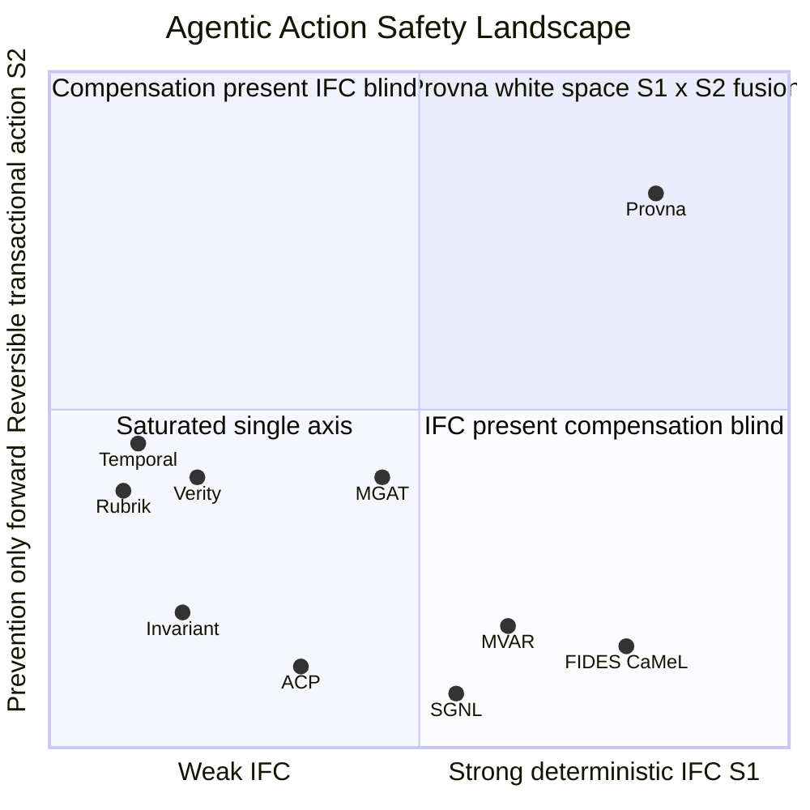

# Positioning

**Status:** Strategic positioning (founding reference)
**Last updated: 2026-06-24**
**Related:** [product-scope.md](product-scope.md), [architecture/build-vs-consume.md](architecture/build-vs-consume.md), [risks/risk-register.md](risks/risk-register.md), [vision.md](vision.md)

Why Provna over the alternatives. This is a strategic argument - naming competitors and their gaps is fine; the details live in [product-scope.md](product-scope.md) and [architecture/build-vs-consume.md](architecture/build-vs-consume.md).

## The four-way white space

Provna does not own a single pillar. It owns the **intersection of four axes**: *vertical-FS x S2-compensation x S1-IFC-fusion x S4-signed-anchored-evidence*. In a scan of 60+ candidates as of mid-2026, none closes this intersection - each deepens in one or two axes and leaves the rest architecturally empty. And **all of them leave S2 empty**, which confirms the moat with several independent negative proofs.

The white space has three fusion components: (a) **IFC-aware compensation** - the S1 preventive side and the transactional side are taint-blind in everyone else, and no one joins them; (b) a **ready per-connector inverse library** - the "library vs pattern" gap; (c) **action-bound signed-anchored FS evidence** - not logging.

## Competitor contrast

| Competitor | Pillar(s) | Why it does NOT close the white space |
|---|---|---|
| **MGAT** (Microsoft, horizontal) | S1 partial + S3 + S4 | Horizontal breadth kills the horizontal dream, but S2 is a stub, IFC is host-dependent, audit is unsigned, and compliance is not EU-focused -> it validates the vertical-depth thesis. A substrate, not a rival. |
| **MVAR** (solo, Apache-2.0) | S1 + S4 | An S1+S4 concept-twin (the most mature S1 reference) but S2 is absent, S3 is single-axis, there is no anchor, the node is mutable, and it embeds no kid -> a blueprint, not a threat (patent caution). |
| **Invariant** (Snyk) | S1 | Treats "flow" as chronology, and the source admits its injection classifier is just a heuristic; the verdict enum is only BLOCK/LOG; the trace is unsigned -> a DSL-ergonomics reference plus a secondary marketing threat. |
| **ACP** (solo) | S3 + S4 | Architecturally excludes S1 and S2 (states there is no rollback of approved requests) -> it brings stateful-admission prior-art to S3 and confirms the moat choice; attenuation / Merkle / anchor are absent. |
| **Verity** | S2 | Exactly-once-forward only; no compensation, no dry-run, unsigned -> solves "do not double-execute," explicitly does not solve undo. |
| **Rubrik** (Agent Rewind) | S2 | Snapshot-restore, not per-action inverse - cannot rewind a sent email or a triggered payment; a perception threat with no mechanism. |
| **Temporal** ($5B) | S2 | Strong durable execution, but compensation is a manual pattern (not a library); no inverse, no dry-run, unsigned -> a substrate to consume. |
| **SGNL via CrowdStrike** (~$740M) | S3 | Very strong per-action authz + CAEP + transaction tokens, but no S1/S2 and weak S4 -> it owns S3; Provna aligns and consumes here. |

## Competition quadrant

The axes measure the two BUILD pillars: X is deterministic IFC (S1) strength, Y is reversible transactional action (S2) strength. *[OPINION] - coordinates are reasoned estimates, not measured data.*

**Reading:** MVAR sits high on X (the most mature S1 reference) but low on Y because its S2 is absent; FIDES/CaMeL is the same - strong IFC, compensation-blind. SGNL and ACP cluster in the low-S1/low-S2 band because this map does not make S3 an axis. Several players hold each axis *separately*; no one holds the cross-intersection in the top-right.

## Defensibility and absorption

**Thesis: defensible in substance (S1+S2), not in position (S3+S4) - a ~12-24 month clock [OPINION].**

- **Defensible (conditional).** The S2 compensation library is the hardest moat *candidate* because compensation is semantic (per-connector, API-version-bound, needs observe-probe + a round-trip harness). No horizontal / durable-execution / security vendor builds it (they treat it as a "developer problem"). But moat-hood is explicitly conditional: *if* compensation content genuinely requires multi-year accumulation, then "buy < build" holds and the flywheel turns; *if not*, the flywheel weakens. This is the single most critical assumption and is sold here as an assumption, not a certainty - it is the first item to validate with design partners (see [risks/risk-register.md](risks/risk-register.md)). The S1 fusion (P/Q isolation) is an architectural differentiator absent in all three torn-down competitors.
- **Not defensible:** S3 is saturated (CrowdStrike / Cisco / Microsoft); S4 mechanism is commodity (OTel / Rekor / RFC3161). Provna's difference there is assembly + FS mapping, not a breakthrough -> consume it.
- **First-mover advantage is in content accumulation, not architecture** (the saga mechanism is commodity).

| Absorber | How | Counter-move |
|---|---|---|
| **Snyk (moves down)** | S1 via Invariant; if it expands into S2/S4 | Nail the S2 catalog to vertical-FS connectors (NetSuite/Stripe/SWIFT/ledger); integrate Article 12/14 regulator evidence - domain depth a horizontal S1 firm cannot reach. |
| **Temporal (moves up)** | Adds a compensation library with a $5B war chest | Pool value where Temporal does not / cannot: IFC-aware compensation + signed/anchored regulator-grade compensation evidence + vertical-FS connector content. EU-FS forensic evidence + IFC fusion is not its category. |
| **Rubrik (perception)** | "Snapshot is enough" narrative | Counter-position: "a snapshot cannot rewind SaaS side effects"; demo the sent-email / triggered-payment case. |
| **Microsoft (organic)** | MGAT horizontal governance for free | Do not race horizontally; narrow the build to S2 + S1-runtime-IFC + Article 12/14; consume the ACS PDP as a substrate; lead with DORA/MiFID depth. |

## Why not horizontal - the MGAT lesson

MGAT (Microsoft, horizontal, multi-workflow CI, multi-language) touched all four pillars horizontally and shallowly: S2 stub, IFC stateless/host-dependent ("host owns propagation," uninstrumented paths out of guarantee), unsigned audit, compliance not EU-focused. Two consequences: (a) Provna's **horizontal positioning is dead** - Microsoft is burying horizontal governance as free open source; (b) the same weaknesses **validate Provna's vertical-depth thesis**. MGAT is therefore not a rival but a PDP/audit-pattern substrate and a narrow-the-vertical signal. Not a generic "agent governance control plane" - a deep, thin layer for EU-FS back-office. This is consistent with the category framing in [vision.md](vision.md): Provna falls under the broad umbrella only on an analyst map; the sub-class it owns is narrow.

## The ACS/ACP triple confusion

Three different "ACS/ACP" must be kept distinct in all Provna materials, or Provna gets mistaken for an "MGAT-ACS clone."

| Abbreviation | Full name | Effect on Provna |
|---|---|---|
| **ACS = Agent Control Standard** (businesswire, mid-2026) | an external "standard" | Zero corpus footprint -> standard adoption UNVERIFIED. |
| **ACS = Agent Control Specification** (Microsoft MGAT Rust PDP) | shipped, multi-language bindings | A PDP substrate candidate but no delegation/attenuation; brand-collision risk. |
| **ACP = Agent Control Protocol** (solo, Go) | stateful-admission prior-art | S3 prior-art; excludes S1/S2 -> patent / prior-art caution. |

*[OPINION]* In marketing material, always spell out the Standard vs Specification distinction. Also: the AuthZEN opportunity is real - MGAT does not implement AuthZEN, so Provna's AuthZEN 1.0 alignment is a genuine differentiator.

## The vertical-FS beachhead

The first market is the **EU-exposed financial-services back/middle office**. The wedge: payment / supplier-payment approval, OR reconciliation-break correction email. The reasons: (R1) errors are irreversible and pre-budgeted - a SOX / four-eyes budget already exists; (R2) the most date-stamped regulation - EU AI Act Article 12/14 + DORA + MiFID; (R3) live business pull - banks are deploying recon/AP/close agents but have no write layer; (R4) integrations are idempotency-native - payment rails / ERP already offer void/reversal; (R5) highest founder-fit (saga + compliance + eval). The others are strong #2s, not the beachhead: IT/cloud-ops (weak forcing function), healthcare RCM (hostile integration), insurance (slow).

**Deadline realism [OPINION].** A specific regulatory date is not the *only* forcing function and Provna is pre-build, so it will not be a product that meets that single date. The real, *continuous* sales engine is DORA's ongoing operational-resilience obligations + the evidence demand that recurs every audit cycle + the permanent risk appetite around irreversible money movement. To a sophisticated buyer Provna does not say "we make the deadline"; it says "after the deadline passes you must still produce the same evidence at every audit, and we solve that permanent obligation."
