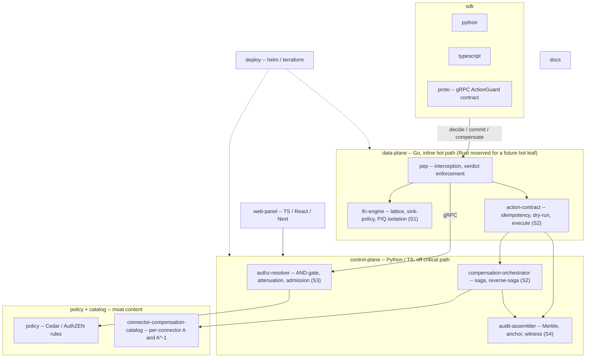

# Project Structure

**Status:** Planned skeleton [OPINION, pre-build]
**Last updated: 2026-06-24**
**Related:** [tech-stack.md](tech-stack.md), [architecture/build-vs-consume.md](architecture/build-vs-consume.md), [architecture/integration-surfaces.md](architecture/integration-surfaces.md), [architecture/action-lifecycle.md](architecture/action-lifecycle.md)

## Where does code live?

Provna is planned as a **polyglot monorepo**: a Go data-plane (the inline hot path; Rust reserved for a future hot leaf with a proven trigger), a Python/TS control-plane (orchestration off the critical path), language SDKs, a web panel, the policy + connector-compensation catalog (the moat content), and deploy/docs. The split follows the language strategy in [tech-stack.md](tech-stack.md): inline and fail-closed in Go (Rust reserved for a future hot leaf with a proven trigger); fast-moving orchestration in Python/TS. This is a pre-build proposal, not a frozen layout.

## Package graph



## Directory tree

```text
provna/
  data-plane/                 # Go -- inline, hot path, fail-closed (Rust reserved for a future hot leaf)
    pep/                      # interception + verdict enforcement (allow/block/dry-run/reverse)
    ifc-engine/               # S1: lattice, sink-policy, P/Q isolation, taint propagation
    action-contract/          # S2 inline: semantic effect key (idempotency), dry-run, execute
  control-plane/              # Python/TS -- orchestration, off the critical path
    authz-resolver/           # S3: AND-gate, caveat-attenuation, transitive revocation,
                              #     behavioral/temporal admission (wraps Cedar PDP; OpenFGA deferred
                              #     behind a relationship-resolver interface until a partner is provably ReBAC)
    compensation-orchestrator/# S2: saga + reverse-saga driver, observe-probe (over DBOS; Temporal kept
                              #     as a seam-isolated contingency, not a scheduled migration)
    audit-assembler/          # S4: hash-chain -> Merkle -> self-hosted transparency log (Tessera) +
                              #     internal HSM-backed RFC3161 TSA + cross-org witness cosignature + JCS witness
  sdk/
    python/                   # host-runtime SDK
    typescript/               # host-runtime SDK
    proto/                    # gRPC ActionGuard contract (decide/commit/compensate)
  web-panel/                  # TS/React/Next -- operator + auditor console
  policy/                     # Cedar / AuthZEN policy sources (open-source boundary)
  connector-compensation-catalog/  # per-connector A and A^-1, round-trip tests (proprietary moat)
    stripe/
    netsuite/
    ...
  deploy/
    helm/                     # K8s charts (customer VPC / air-gapped)
    terraform/                # infra provisioning
  docs/                       # this documentation set
```

## Surface boundaries

- **data-plane vs control-plane.** The data-plane is the only inline, latency-sensitive code and is the only place a fail-closed decision is enforced; the control-plane holds anything that can run off the synchronous path. They talk over the gRPC ActionGuard contract in `sdk/proto`, mapped one-to-one onto `decide` / `commit` / `compensate` (see [architecture/action-lifecycle.md](architecture/action-lifecycle.md)).
- **Build vs consume inside the tree.** `ifc-engine` (S1) and `connector-compensation-catalog` (S2) are the real IP. `authz-resolver` wraps a consumed PDP (Cedar, with OpenFGA deferred behind a relationship-resolver interface until a partner is provably ReBAC), `compensation-orchestrator` drives a consumed saga substrate (DBOS, with Temporal kept as a seam-isolated contingency rather than a scheduled migration), and `audit-assembler` assembles consumed primitives (OTel + a self-hosted transparency log (Tessera) + an internal HSM-backed RFC3161 TSA + a cross-organization witness cosignature, with Rekor v2 as the reference design). The canonical boundary is [architecture/build-vs-consume.md](architecture/build-vs-consume.md).
- **Open-source vs proprietary.** `policy/` and `sdk/` are intended to be open (credibility); `ifc-engine/`, `connector-compensation-catalog/`, and the evidence store stay proprietary.
- **Vendor-neutral surfaces.** The SDK, an MCP hook, and a proxy all feed the same PEP, so host runtimes (the first reference integration, plus LangChain / OpenAI-SDK / custom on the roadmap) plug into one seam. See [architecture/integration-surfaces.md](architecture/integration-surfaces.md).

## Build order (indicative, pre-build)

1. **proto + sdk + pep** — establish the ActionGuard seam and a thin interception path first; everything else attaches to it.
2. **action-contract + compensation-orchestrator + one connector** — idempotency + one-click compensation on a single connector (Stripe or NetSuite), over DBOS (Temporal kept as a seam-isolated contingency, not a scheduled migration). This is the S2 moat flywheel's first turn.
3. **authz-resolver + policy** — AND-gate over Cedar/AuthZEN, with dry-run + HITL.
4. **audit-assembler** — hash-chain -> a self-hosted transparency log (Tessera) + an internal HSM-backed RFC3161 TSA + a cross-organization witness cosignature (Rekor v2 as the reference design) + the EU AI Act Article 12/14 evidence pack v1.
5. **ifc-engine** — P/Q isolation + runtime-taint sink-gate, evaluated on AgentDojo (ASR + utility-tax).
6. **web-panel + deploy** — operator/auditor console and Helm/Terraform packaging for in-VPC deployment.

This order matches the Phase-0 MVP scope; see [tech-stack.md](tech-stack.md) for the MVP-vs-production stack distinction.
