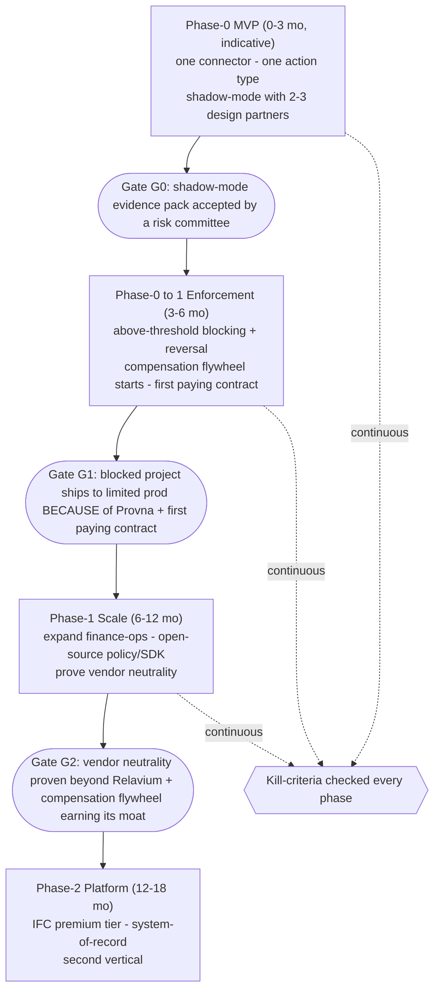

# Roadmap Map

**Status:** Pre-build planning
**Last updated: 2026-06-24**
**Related:** [current.md](current.md), [phase-0-mvp.md](phase-0-mvp.md), [phase-0-1-enforcement.md](phase-0-1-enforcement.md), [phase-1-scale.md](phase-1-scale.md), [phase-2-platform.md](phase-2-platform.md), [../risks/risk-register.md](../risks/risk-register.md), [../business/design-partner-plan.md](../business/design-partner-plan.md)

This file is the MAP. It routes; it does not duplicate detail. Each phase file owns its own milestones, deliverables, and exit criteria. Read [current.md](current.md) first to see what is active right now.

## A clarity note: do not conflate the two senses of "phase"

The word "phase" is used in two distinct ways in Provna docs. Keep them separate or you will misread every roadmap conversation.

1. **Lifecycle phases of a single guarded saga step** (the runtime atomic unit): IFC gate -> AND-gate authorization + behavioral admission -> action contract (idempotent -> dry-run -> HITL -> execute -> compensate) -> audit. This is the per-action machinery; it is canonical in [../architecture/action-lifecycle.md](../architecture/action-lifecycle.md).
2. **Roadmap phases of the company / product** (Phase-0, Phase-0->1, Phase-1, Phase-2): the build-out timeline. This is what this directory is about.

When this file says "phase" it means sense (2). When a phase file references the four gates, that is sense (1). They are orthogonal: Phase-0 already ships a thin version of all four lifecycle gates; later roadmap phases deepen each gate.

## Phase dependency graph

The arrows are hard dependencies: each phase opens only when the prior go/no-go gate passes. The kill-criteria run continuously across every phase, not only at gate boundaries.

## Phase index

| Phase | One-line goal | File |
|---|---|---|
| **Phase-0 MVP** | Prove all four gates end-to-end on one connector + one action type in shadow-mode with 2-3 design partners; produce a real evidence pack from their own traffic. | [phase-0-mvp.md](phase-0-mvp.md) |
| **Phase-0 to 1 Enforcement** | Turn shadow-mode into real blocking + reversal; start the compensation test-harness flywheel; land the first paying contract; start SOC2. | [phase-0-1-enforcement.md](phase-0-1-enforcement.md) |
| **Phase-1 Scale** | Expand across finance-ops; open-source policy/SDK; walk the ISO 42001 + EU AI Act path; PROVE vendor neutrality beyond Relavium. | [phase-1-scale.md](phase-1-scale.md) |
| **Phase-2 Platform** | Ship the IFC premium tier; become the agent-action system-of-record; open a second vertical (healthcare/insurance). | [phase-2-platform.md](phase-2-platform.md) |

All durations are indicative (pre-build). Milestones below are phase-relative; there are no calendar dates anywhere in the roadmap.

## Global milestone spine (M0..M9)

The spine is the single ordered backbone across all phases. Each milestone is owned in detail by the phase file in its column.

```mermaid
flowchart LR
    M0["M0 name + trademark cleared"] --> M1["M1 S2 harness PoC: A to A-inverse round-trip green"]
    M1 --> M2["M2 S1 fusion PoC + AgentDojo ASR and utility-tax"]
    M2 --> M3["M3 S4 signed + anchored evidence pack v1"]
    M3 --> M4["M4 shadow-mode live with 2-3 partners"]
    M4 --> M5["M5 above-threshold blocking + adversarial reversal"]
    M5 --> M6["M6 first paying contract + SOC2 started"]
    M6 --> M7["M7 finance-ops expansion + OSS policy/SDK"]
    M7 --> M8["M8 vendor neutrality proven beyond Relavium"]
    M8 --> M9["M9 IFC premium tier + second vertical"]
```

| Milestone | Meaning | Owned by |
|---|---|---|
| **M0** | Name/trademark cleared (Slavic connotation + domains + USPTO/EUIPO class 9/42). Critical path; gates committing to brand/domain/code. | [current.md](current.md) |
| **M1** | S2 compensation test-harness PoC: one connector (Stripe/NetSuite), A -> A^-1 round-trip verified, live void log captured. First moat proof AND first measurement of "is compensation actually hard". | [current.md](current.md) / [phase-0-mvp.md](phase-0-mvp.md) |
| **M2** | S1 fusion PoC (CaMeL P/Q isolation + dual-lattice sink-gate, node-immutable) evaluated on AgentDojo with ASR and utility-tax reported together. | [current.md](current.md) / [phase-0-mvp.md](phase-0-mvp.md) |
| **M3** | S4 signed + anchored evidence-pack prototype: JCS (RFC8785) + Ed25519 + a self-hosted transparency log (Tessera) + an internal HSM-backed RFC3161 TSA + a cross-organization witness cosignature (Rekor v2 as the reference design) + kid-embedded + BAR-signal persistence. | [current.md](current.md) / [phase-0-mvp.md](phase-0-mvp.md) |
| **M4** | Shadow-mode running with 2-3 design partners; audit-only but signed + anchored (not plain logging). | [phase-0-mvp.md](phase-0-mvp.md) |
| **M5** | Above-threshold blocking turned on; an adversarial action blocked and then reversed in a partner environment. | [phase-0-1-enforcement.md](phase-0-1-enforcement.md) |
| **M6** | First paying contract signed; SOC2 process started. | [phase-0-1-enforcement.md](phase-0-1-enforcement.md) |
| **M7** | Finance-ops footprint expanded; policy/SDK open-sourced; ISO 42001 + EU AI Act path begun. | [phase-1-scale.md](phase-1-scale.md) |
| **M8** | Vendor neutrality proven on a runtime beyond Relavium (LangChain / OpenAI-SDK / custom). | [phase-1-scale.md](phase-1-scale.md) |
| **M9** | IFC premium tier live; agent-action system-of-record established; second vertical opened. | [phase-2-platform.md](phase-2-platform.md) |

## Critical path

The critical path is the shortest chain of milestones that must hold for Provna to become a defensible, paid product. Everything else is parallelizable around it.

**M0 (name) -> M1 (compensation works AND is hard) -> M4 (a partner runs us in shadow) -> M5/M6 (we block, reverse, and get paid) -> M8 (we are not locked to one runtime).**

- **M0 is a true blocker**, not parallel work: do not pour brand, domain, or code identity into a name with an unresolved Slavic connotation. See [current.md](current.md).
- **M1 is load-bearing twice**: it is the first moat proof and the first read on the single most critical assumption (is compensation hard enough to be a moat). A weak M1 reading reshapes the whole plan toward leaning harder on vertical-FS depth + S1 fusion.
- **M8 protects against absorption**: if vendor neutrality is never proven, the defensibility thesis (not horizontal, owns the hard pillars) collapses into "Relavium plus a little governance", which is fatal.

## Cross-phase invariants

These hold in every phase, in every gate, on every surface. They are not roadmap items; they are constraints the roadmap is never allowed to violate. Each is the antidote to an observed competitor failure.

1. **Fail-closed everywhere.** Unlabeled => untrusted; error => BLOCK with no downgrade path; revocation/CRL fail-closed; for Claude Code a real PreToolUse deny (exit-2 / permissionDecision deny), never observe-only. Antidote to fail-open policy checks, HMAC-downgrade, and CRL-fail-open seen in competitors.
2. **Deterministic-guarantee honesty.** The architectural guarantee is anchored ONLY in the lattice + sink-policy; ML classifiers are an optional pre-filter and are never sold as "the guarantee". The honest boundary is stated openly: untrusted data cannot reach a sensitive sink unless an explicitly-typed policy authorizes the flow; implicit-flow and side-channel leakage are NOT guaranteed.
3. **Honest-guarantee / evidence boundary.** Evidence is regulator-grade forensic-reproducible. "Court-admissible" is case-by-case and jurisdiction-dependent (UNVERIFIED); the two are never conflated. Market statistics are sourced or softened to "the large majority"; no fake precision.
4. **Signed + anchored evidence = system-of-record.** Even Layer-0 audit-only output is signed + Merkle + externally anchored (a self-hosted transparency log (Tessera) + an internal HSM-backed RFC3161 TSA + a cross-organization witness cosignature, with Rekor v2 as the reference design) + JCS-canonical + kid-embedded - not plain logging. An insider or key-holder cannot rewrite history.
5. **Vendor neutrality (goal/principle).** The same ActionGuard decide/commit/compensate logic is offered via SDK, MCP hook, and proxy. Relavium is the FIRST reference integration, not the only one. Becoming "enterprise Relavium" is a red line.
6. **Never sell "undo everything".** Compensation is semantic and sometimes impossible; for irreversible actions prefer two-phase (auth -> capture -> void) and HITL. We say "risky actions are prevented; connector-backed actions are reversed", never "everything is reversible".

## KPIs / metrics

| Metric | Definition | Target / role | Phase introduced |
|---|---|---|---|
| **90-day pilot single metric** | A blocked agent project ships to (limited) production with risk-committee approval BECAUSE of Provna. | The one pilot-success metric; binary. | Phase-0 -> 0->1 |
| **ASR (attack success rate)** | AgentDojo prompt-injection success rate against the IFC gate. | Driven to ~0 by the lattice + sink-policy (not classifier luck); reported WITH utility-tax. | Phase-0 (M2) |
| **Utility-tax** | Drop in task-completion utility caused by the IFC gate, measured alongside ASR. | Kept low; the known IFC-tax reference is ~7 points [OPINION], to be validated with design partners. Reporting ASR and utility-tax together proves we did not fall into the "block everything" trap. | Phase-0 (M2) |
| **Compensation round-trip pass-rate** | Share of connector actions whose A -> A^-1 round-trip passes the harness (state-equality verified). | Drives promotion into the auto-runnable catalog; the flywheel's health metric. | Phase-0 (M1), flywheel from Phase-0->1 |
| **FS-domain ground-truth correctness** | Did the agent actually close the reconciliation correctly (provable correctness), not just "was it blocked". | Indispensability comes from "proved it worked", not only "I blocked it". | Phase-0 onward |

## Go/no-go gate summary

| Gate | Opens which phase | Pass condition |
|---|---|---|
| **G0** | Phase-0 -> 1 | A risk committee accepts a shadow-mode evidence pack generated from a partner's own traffic (M4). |
| **G1** | Phase-1 | A blocked agent project ships to limited prod BECAUSE of Provna AND a first paying contract is signed (M5 + M6). |
| **G2** | Phase-2 | Vendor neutrality proven beyond Relavium (M8) AND the compensation flywheel is demonstrably earning its moat (the M1 "is it hard" reading came back positive across multiple connectors). |

A gate that does not pass does not slip into the next phase; it triggers a kill-criteria review.

## Kill-criteria summary

Checked continuously, not only at gates. Hitting any one is a stop-and-reassess signal, not a comfort.

- **No path to a paying contract within 90 days** of a pilot starting.
- **"We can build it with OPA in one sprint"** - the buyer does not see the hard pillars (S1+S2) as hard.
- **Money-path latency cannot be fixed** to within the buyer's SLO.
- **The champion lacks budget + urgency** (no real forcing function behind them).
- Discovery red flags: "we will keep humans in the loop forever" / "no agent will touch money for two years".
- **Flywheel assumption falsified**: if compensation content is NOT hard enough to require multi-year accumulation, the hardest moat candidate weakens - validate this FIRST (M1) and keep the moat framed as conditional until proven.
