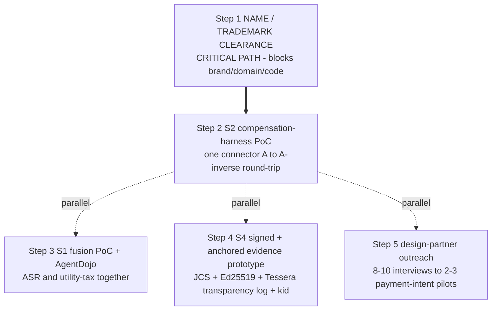

# What Is Active Now

**Status:** Pre-build - first 5 concrete steps in flight
**Last updated: 2026-06-24**
**Related:** [README.md](README.md), [phase-0-mvp.md](phase-0-mvp.md), [../risks/risk-register.md](../risks/risk-register.md), [../business/design-partner-plan.md](../business/design-partner-plan.md)

Read this first. This is the live status page: where Provna actually is today and the next five concrete moves. For the full timeline see [README.md](README.md); for the first roadmap phase see [phase-0-mvp.md](phase-0-mvp.md).

## Pre-build status

Provna is **pre-build**. There is no shipped product, no inline PEP, no compensation library, no evidence store yet. What exists is a settled framing: the definition (a vendor-neutral runtime control plane turning every write into a reversible + authorized + information-flow-controlled + regulator-grade-provable contract), the atomic unit (the guarded saga step), the four-pillar build-vs-consume boundary, the vertical-FS beachhead, and the GTM thesis (permission to ship, not security tooling).

The immediate job is not to build the whole platform. It is to (a) de-risk the brand, (b) produce three small proofs that the hard parts work (compensation, IFC fusion, signed-anchored evidence), and (c) get in front of design partners. These map directly to the global milestones M0..M4 in [README.md](README.md).

A note on dates: the EU AI Act Article 12/14 milestone is close on the calendar, but Provna is pre-build and will not be a product by then. That date is an urgency signal that starts the conversation today, not the forcing function. The real, durable forcing function is continuous: DORA operational-resilience obligations + the recurring evidence demand of every audit cycle + the standing risk appetite around irreversible money movement. We sell the permanent obligation, never "we make the deadline".

## The first 5 concrete steps

Step 1 is a hard blocker. Steps 2-5 run in parallel once Step 1 is underway; Step 2 feeds Step 5 (a live void log is the strongest answer to "does it actually work?" in a pre-build pitch).

### Step 1 - Name / trademark clearance (CRITICAL PATH)

Resolve before committing brand, domain, or code identity. Three parts: (a) Slavic-language connotation check with a native speaker - RU/UK "provina" is approximately "fault / guilt", which could be fatal for EU-FS sales; (b) provna.com / .ai / .io availability; (c) USPTO/EUIPO class 9/42 + npm/GitHub org availability. Provna is meant to read as prove (S1+S4) / provenance (S4) / provision (S3) / approve (HITL, Article 14); the connotation risk must be closed before that story is locked. Status: pending, [UNVERIFIED]. Nothing brand-committing proceeds until this clears - this is milestone M0.

### Step 2 - S2 compensation test-harness PoC

One connector (Stripe or NetSuite), one action type: implement A and its inverse A^-1, run an automatic round-trip in a sandbox, and verify state-equality after A then A^-1. Capture a live void/reverse log for the developer-wow demo. This is the four-times-verified greenfield, so it is both the first-day moat proof AND the first measurement of the most critical open assumption (is compensation genuinely hard - see below). This is milestone M1. Consume the saga mechanism from DBOS; build only the per-connector inverse + round-trip harness + observe-probe.

### Step 3 - S1 fusion PoC + AgentDojo

Stand up the CaMeL P/Q-LLM isolation skeleton (the Q-LLM cannot call tools; it returns only typed values) plus an MVAR-style dual-lattice sink-gate hardened with node-immutability (frozen value-object + server-side store; declassification only via a signed, principal-bound trust_boundary node). Evaluate on AgentDojo and report ASR and utility-tax TOGETHER, plus FS-domain ground-truth. The measured ASR must come from the lattice + sink-policy guarantee, not classifier luck; declare the guarantee boundary openly (implicit-flow / side-channel not guaranteed). This is milestone M2.

### Step 4 - S4 signed + anchored evidence-pack prototype

Build the evidence pack: JCS (RFC8785) canonicalization + Ed25519 signature + a self-hosted transparency log (Tessera) + an internal HSM-backed RFC3161 TSA + a cross-organization witness cosignature (with Rekor v2 as the reference design) + kid-embedded portable witness + persist the BAR-style governance-failure signal as a signed audit event + policy_snapshot_ref on every decision. Show the external-anchor difference as the differentiator versus competitors that self-clock and cannot stop an insider rewrite. This is milestone M3. Keep the honesty anchor: regulator-grade forensic-reproducible, not a court-admissibility claim.

### Step 5 - Design-partner outreach

8-10 interviews -> 2-3 payment-intent pilots. ICP: EU-exposed bank / payments / fintech / treasury, 1000+ employees, with a BLOCKED agent project in finance-ops. Hook is the permanent compliance obligation + the blocked project, not a single date. The 90-day pilot single metric: a blocked agent project ships to (limited) prod with risk-committee approval BECAUSE of Provna. The S3 AND-gate + behavioral-admission design firms up during this phase (real caveat-attenuation + recursive transitive-revocation + context-scoped ESCALATE-default admission). Full discovery script and red flags live in [../business/design-partner-plan.md](../business/design-partner-plan.md).

## Most critical open validations

These are the assumptions that, if wrong, reshape or end the plan. They are tracked in full in [../risks/risk-register.md](../risks/risk-register.md); here is what we are actively trying to learn right now.

| Open validation | Why it matters | How / when we learn |
|---|---|---|
| **Is compensation actually hard?** (the flywheel / "buy < build" assumption) | The single most critical uncertainty. The S2 compensation library is the hardest moat candidate ONLY IF its content genuinely requires multi-year accumulation. If it does not, the flywheel is a weak moat and we must lean harder on vertical-FS depth + S1 fusion. Keep the moat framed as conditional until proven. | First read from Step 2 (M1); confirmed across more connectors with design partners. Validate FIRST. |
| **Will an FS buyer grant a 12-month write permission?** | Provna's entire value depends on agents being allowed to WRITE to real systems. If buyers will not grant write access on a meaningful horizon, the wedge does not open. | Tested directly with design partners (Step 5); a 90-day pilot reaching limited prod is the proof. |
| **Vendor-neutrality proof beyond Relavium** | The defensibility thesis (not horizontal; owns the hard pillars) requires the same govern()/ActionGuard logic to run on LangChain / OpenAI-SDK / custom. Today the only concrete integration is Relavium (the first reference, not the only one). Unproven beyond it = the "enterprise Relavium" trap, which collapses defensibility. | Roadmap item maturing toward M8 (Phase-1); currently [OPINION] / roadmap, not yet proven. |
| **Name connotation** | RU/UK "provina" approximately "fault / guilt" could be fatal for EU-FS sales. The brand cannot be finalized with an open connotation risk. | Step 1 native-speaker check; [UNVERIFIED] until closed. |
