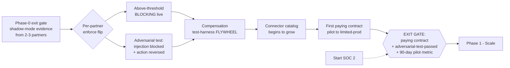
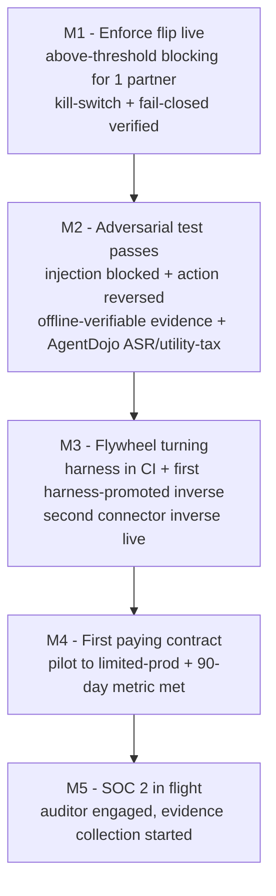

# Phase 0->1 - Enforcement

**Status:** Planned - indicative 3-6 months (pre-build; phase-relative, not calendar-bound)
**Last updated: 2026-06-24**
**Related:** [phase-0-mvp.md](phase-0-mvp.md), [phase-1-scale.md](phase-1-scale.md), [current.md](current.md), [README.md](README.md), [../architecture/pillar-2-transactional-compensation.md](../architecture/pillar-2-transactional-compensation.md), [../architecture/action-lifecycle.md](../architecture/action-lifecycle.md), [../business/design-partner-plan.md](../business/design-partner-plan.md), [../risks/risk-register.md](../risks/risk-register.md)

---

Phase 0->1 is the phase where Provna stops watching and starts saying no. Phase-0 shipped a system that observes every guarded saga step in shadow mode and produces signed evidence from real partner traffic, but never blocks. This phase flips a single bit per partner - shadow to enforce - and earns the right to do so by proving, on an adversarial test, that a real prompt-injection is blocked and a real side effect is reversed, with portable evidence for both. It ends with the first paying contract and the first blocked agent project shipping to limited production because of Provna.

The single most important thing that must become true in this phase is not a feature - it is a validation: that the per-connector compensation content (the S2 moat) genuinely requires multi-year accumulation. The compensation test-harness flywheel starts here, and it is the instrument that either confirms or refutes the central "buy < build" assumption. Treat that validation as the real deliverable; everything else is in service of it.

## Goal

Move from shadow (observe-only, signed) to enforce (deny + dry-run + compensate on the hot path), and convert one design partner into the first paying customer by shipping their blocked agent project to limited production.

Concretely:

- **Shadow -> enforce.** Turn on above-threshold blocking for at least one partner, with a controlled, reversible rollout (per-action-type, per-connector, with a kill-switch back to shadow). Fail-closed remains absolute: error => BLOCK, no downgrade path.
- **Prove the fusion adversarially.** Demonstrate on a real adversarial scenario that an injected value cannot reach a sensitive sink (S1) AND that a committed side effect is reversed via the inverse (S2), both producing portable, externally-anchored evidence (S4) and gated by the AND-gate (S3). The demo is the product: split the unit and the proof collapses.
- **Start the flywheel.** Stand up the compensation test-harness (A -> A^-1 round-trip, observe-probe) so the per-connector inverse catalog begins to grow from partner traffic rather than from hand-authored one-offs.
- **First paying contract.** Land a design-partner -> pilot -> limited-prod conversion. Land ~60-150K; the target ACV (80-250K) is a Phase-1 expansion outcome.
- **Begin SOC 2.** Kick off the SOC 2 process (Type I scoping, control mapping) so the audit clock starts running well before enterprise procurement demands it.

## Definition of Done

Phase 0->1 is done when all of the following hold:

1. **Enforcement is live for >=1 partner.** Above-threshold actions are actually blocked in production traffic (not shadow), with documented rollback to shadow available and never exercised as a silent downgrade.
2. **The adversarial test passes end-to-end with evidence.** A scripted prompt-injection attempt is blocked at the IFC gate, and a separately-triggered committed action is reversed by its inverse and confirmed by observe-probe. Both events emit signed, anchored evidence (JCS + Ed25519 + external anchor + kid) that an independent verifier can validate offline.
3. **The compensation flywheel is turning.** The round-trip test-harness runs in CI; at least one new connector or action-type inverse has been promoted to the auto-runnable catalog via the harness (not hand-written), proving the loop closes.
4. **First paying contract is signed.** A design partner has a signed, paid agreement (not an LOI), with a defined limited-prod scope.
5. **The 90-day pilot metric is met for that partner.** A previously-blocked agent project ships to limited production with risk-committee approval BECAUSE of Provna - the single pilot metric.
6. **SOC 2 is in flight.** Auditor engaged, control scope defined, evidence collection started.

## Scope

### In scope

- Per-partner shadow -> enforce transition machinery: threshold configuration, per-action-type / per-connector enforcement toggles, kill-switch back to shadow, and the operational runbook for flipping it.
- The end-to-end adversarial test: injection scenario (S1), reversal scenario (S2), AND-gate (S3) and evidence (S4) in one demonstrable flow, with offline-verifiable evidence packs.
- The compensation test-harness: A -> A^-1 round-trip verification, sandbox state-equality check, observe-probe of real post-action state, promotion of passing inverses to the API-version-pinned auto-runnable catalog.
- Expansion of per-connector inverses beyond the single Phase-0 connector: a second connector and/or additional action-types on the first connector, driven by partner need.
- First commercial motion: pilot -> limited-prod conversion, pricing instantiation (platform fee + metered governed-action; never per-seat), risk-committee evidence dossier.
- SOC 2 kickoff.

### Out of scope (deferred to Phase 1+)

- Broad finance-ops connector expansion and second-vertical work (Phase 1 / Phase 2).
- Open-sourcing policy/SDK (Phase 1).
- The inline Go (Rust reserved for a future hot leaf with a proven trigger) hot-path PEP rewrite, DBOS (Temporal kept as a seam-isolated contingency triggered only by multi-tenant fan-out / a Postgres ceiling / a buyer mandate, NOT a scheduled migration) at scale, OpenFGA (deferred behind a relationship-resolver interface until a partner is provably ReBAC)/biscuit, full self-hosted transparency log (Tessera) + internal HSM-backed RFC3161 TSA + cross-organization witness cosignature stack - the production-target stack is a Phase-1 hardening goal; this phase continues on the MVP stack (TS/Python + DBOS + Postgres + Cedar + Claude + hash-chain + external anchor), hardened where enforcement demands it.
- IFC premium tier and agent-action system-of-record positioning (Phase 2).
- Proving vendor neutrality across LangChain / OpenAI-SDK / custom (Phase 1); this phase may still run primarily through the first reference integration seam.
- ISO 42001 / EU AI Act formal certification path (Phase 1). SOC 2 starts here; certifications come later.

## Ordered work breakdown and acceptance

The order matters: enforcement and the adversarial proof must land before the commercial close, because the paying contract is bought on the strength of the proof, and the flywheel must be visibly turning before we make the "buy < build" claim to anyone.

### 1. Above-threshold BLOCKING - the shadow-to-enforce transition

Flip from observe-only to deny on the hot path, gated by risk thresholds, one partner and one action-type at a time.

- Implement risk-tiered enforcement: below-threshold / reversible -> execute with compensation recorded; above-threshold / irreversible -> dry-run + HITL (Article 14 four-eyes); policy-deny -> block. Behavioral/temporal admission stays ESCALATE/dry-run/HITL-default, never a categorical block.
- Per-partner, per-connector, per-action-type enforcement toggles with a documented kill-switch back to shadow. Rollback is an operational control, not a fail-open path.
- Fail-closed end-to-end: unlabeled => untrusted, error => BLOCK, revocation fail-closed. No silent downgrade anywhere on any PEP surface.

**Acceptance:** for at least one partner, an above-threshold action is blocked in production; a reversible action executes and records its inverse; the kill-switch demonstrably returns the partner to shadow without dropping evidence; an attempt to error out of the gate results in BLOCK, verified by test.

### 2. Adversarial test - injection blocked AND compensation reversed, with evidence

The keystone deliverable. One scenario must show both halves of the moat and produce regulator-grade evidence for each.

- IFC half (S1): a value carrying a hidden injection (the canonical case: an attacker IBAN smuggled inside an untrusted invoice) is architecturally prevented from reaching a sensitive sink, because the sink policy requires the value to originate from a verified master record. The block is a lattice + sink-policy rule, not a classifier guess. Honest guarantee restated: untrusted data cannot reach a sensitive sink unless an explicitly-typed policy authorizes the flow; implicit-flow / side-channel leakage is not guaranteed.
- Compensation half (S2): a committed side effect (for example a payment release or an ERP posting) is reversed via its registered inverse, and observe-probe reads real system state to confirm the reversal completed. For irreversible money movement, demonstrate the two-phase (auth -> capture -> void) path instead of a false "undo everything" claim.
- Evidence (S4): both the block and the reversal emit RFC8785 JCS-canonicalized, Ed25519-signed events with kid embedded and an external anchor (a self-hosted transparency log (Tessera) + an internal HSM-backed RFC3161 TSA + a cross-organization witness cosignature, with Rekor v2 as the reference design), plus policy_snapshot_ref. An independent verifier validates them offline.
- Run the scenario through AgentDojo and report ASR and utility-tax together - never ASR alone - so the result proves we did not fall into the "block everything" trap.

**Acceptance:** a scripted adversarial run shows (a) the injection blocked at the IFC gate, (b) a committed action reversed and observe-probe-confirmed, (c) offline-verifiable signed+anchored evidence for both, (d) an AgentDojo report with both ASR and utility-tax. A design partner's risk committee accepts the evidence pack.

### 3. Compensation test-harness FLYWHEEL starts - the catalog begins to grow

Stand up the loop that turns partner traffic into validated, reusable inverses. This is where the moat is either proven or refuted.

- Harness: for a new connector x action x params, propose an inverse (A^-1) from the connector API surface, run an A -> A^-1 sandbox round-trip, and assert state-equality. Passing inverses are promoted to the auto-runnable catalog, pinned to the connector API version. Failing ones fall to a human-approved / two-phase gate.
- Observe-probe is part of acceptance, not optional: an inverse is only "auto-runnable" if post-action real-system state can be read back and confirmed.
- CI integration: the round-trip runs on every catalog change, so a connector API drift that breaks an inverse fails the build rather than silently shipping a broken reversal.
- Instrument the flywheel for the validation: track how much effort each new inverse costs (author time, edge-cases discovered, API-version pins required). This data is the evidence for or against the "buy < build" assumption.

**Acceptance:** the harness runs in CI; at least one inverse reaches the auto-runnable catalog via the harness rather than by hand; a deliberately-introduced API-version drift fails the round-trip in CI; per-inverse effort data is being recorded.

### 4. Per-connector inverse expansion

Grow beyond the single Phase-0 connector so the catalog (and the flywheel data) has more than one data point.

- Add a second connector and/or additional action-types on the first connector, chosen by the first paying partner's actual blocked workflow (payment release or reconciliation-break correction).
- Each new inverse goes through the harness; prefer two-phase (auth -> capture -> void) for anything genuinely irreversible rather than promising a semantic undo.

**Acceptance:** at least two distinct connector/action inverses live in the auto-runnable catalog, each round-trip-verified and observe-probe-confirmed; irreversible actions are handled via two-phase, not a fictional undo.

### 5. First paying contract - design-partner -> pilot -> limited-prod

Convert proof into revenue.

- Run the 90-day pilot against its single metric: a blocked agent project ships to limited prod with risk-committee approval because of Provna.
- Instantiate pricing: platform fee + compliance-tier paywall (Article 12/14 + DORA + IFC) + metered governed-action. Avoid per-seat. Land ~60-150K.
- Assemble the three-persona close: Champion (Head of AI / Platform Eng) brings the project, Economic Buyer (CISO/CRO) owns the risk and opens budget, Verifier (Internal Audit / SOX) signs the evidence. A single "no" kills it - the adversarial evidence pack and the Article 12/14 dossier exist to convert the Verifier.
- Watch the kill-criteria continuously: no path to a paying contract in 90 days; "we can build it with OPA in one sprint"; money-path latency cannot be fixed; champion lacks budget + urgency.

**Acceptance:** a signed, paid contract with a defined limited-prod scope; the 90-day pilot metric met for that partner; pricing is metered/platform-fee, not per-seat.

### 6. Start SOC 2

- Engage an auditor, scope SOC 2 (Type I to start), map controls to the existing fail-closed / signed-evidence / access-control posture, and begin evidence collection. SOC 2 reaches completion later; the point here is to start the clock before enterprise procurement blocks on it.

**Acceptance:** auditor engaged, scope and control mapping documented, evidence collection underway.

## In-phase milestones

- **M1 - Enforcement live:** shadow -> enforce flip for the first partner, with kill-switch and fail-closed proven.
- **M2 - Adversarial proof:** the injection-blocked + action-reversed scenario passes with portable evidence and an ASR/utility-tax report.
- **M3 - Flywheel turning:** harness in CI, first harness-promoted inverse, second connector inverse live, per-inverse effort data accumulating.
- **M4 - First paying contract:** pilot converts to limited-prod, single pilot metric met.
- **M5 - SOC 2 in flight:** auditor engaged.

## Dependencies (Phase-0 exit gate)

This phase cannot start until the Phase-0 exit gate holds. Specifically it depends on:

- **A working guarded saga step in shadow mode** across all four gates: IFC gate (S1), AND-gate authz (S3), action contract with idempotency + one-click compensation (S2), and signed+anchored audit (S4) - all wired through the ActionGuard seam (decide -> commit -> compensate).
- **One connector and one action-type** (Stripe or NetSuite) with idempotency and one-click compensation already working in shadow.
- **Signed, anchored evidence packs v1** (JCS + Ed25519 + a self-hosted transparency log (Tessera) + an internal HSM-backed RFC3161 TSA + a cross-organization witness cosignature, with Rekor v2 as the reference design + kid, Article 12/14 mapping) generated from real shadow traffic - the raw material the adversarial proof and the risk-committee dossier build on.
- **2-3 design partners in shadow mode** producing real traffic, with at least one carrying a concrete blocked agent project and a champion with budget and urgency. Without a partner whose project is actually blocked, the 90-day pilot metric cannot be met.
- **Resolved-enough name/brand posture** to sign a commercial contract (the trademark/domain clearance is on the critical path; a paid contract should not be signed under an unresolved brand). See [current.md](current.md).

## Exit gate

Provna exits Phase 0->1 into Phase 1 (Scale) only when all three hold simultaneously:

1. **First paying contract signed** (paid, not an LOI), with a defined limited-prod scope.
2. **Adversarial-test-passed:** the injection-blocked + compensation-reversed scenario passes end-to-end with offline-verifiable signed+anchored evidence and an ASR/utility-tax report a partner's risk committee accepts.
3. **The 90-day-pilot metric met:** a previously-blocked agent project ships to limited production with risk-committee approval because of Provna.

If the contract closes but the adversarial test has not passed with real evidence, the gate is not met - we have a customer but not a proven product, and enforcing without the proof violates the fail-closed-honesty principle. If the test passes but no one pays, the gate is not met and the kill-criteria apply.

## Risks

The defining risk of this phase is that validating the flywheel assumption is the whole game, and it can come back negative.

- **The "buy < build" assumption fails (critical, phase-defining).** The S2 moat is conditional: it holds only if compensation content genuinely requires multi-year accumulation. If the harness shows new inverses are cheap to author, the flywheel does not compound and the moat thins toward a commodity. This phase is precisely where that gets measured (per-inverse effort data, M3). Mitigation: instrument every inverse for effort and edge-cases; if the data trends toward "easy", escalate immediately - it is a strategy-level signal, not a feature gap, and it changes how much we lean on S2 versus the S1-fusion + Article 12/14 differentiators. Do not sell the moat as certainty before the data is in.
- **Enforcement breaks partner traffic (availability on the hot path).** Flipping to deny puts fail-closed authz and IFC on the money path; an over-eager block or added latency can stall a real workflow. Mitigation: per-action-type rollout, kill-switch to shadow, dry-run-default for high-risk tiers, and a money-path latency SLO validated with the partner. If money-path latency cannot be fixed, that is a kill-criterion.
- **Compensation is semantically impossible or itself fails.** Some actions cannot be truly undone; the inverse can fail; API versions drift. Mitigation: never sell "undo everything" - prefer two-phase (auth -> capture -> void); observe-probe to confirm; pin to API versions and fail the CI round-trip on drift.
- **The adversarial proof relies on an unverified IFC guarantee.** The IFC guarantee covers explicit flows via lattice + sink-policy; implicit-flow / side-channel leakage is NOT guaranteed, and court-admissibility of the evidence is case-by-case UNVERIFIED. Mitigation: state the honest guarantee verbatim to the Verifier; sell regulator-grade forensic-reproducibility, not court-admissibility; the audit persona punishes overclaiming.
- **A single "no" kills the deal.** Three personas meet at one gate; the Verifier's veto is fatal. Mitigation: the adversarial evidence pack and the Article 12/14 + DORA dossier exist specifically to convert Internal Audit / SOX before the CISO is asked to sign.
- **"We can build it with OPA in one sprint."** If a partner believes the value is a commodity policy engine, the pitch has drifted off S1+S2 onto the saturated S3 layer. Mitigation: anchor every conversation on the S1-IFC fusion and the S2 compensation library; this objection is also an explicit kill-criterion.
- **Absorption clock keeps running (~12-24 months).** Snyk-moves-down / Temporal-moves-up / Rubrik-perception / Microsoft-organic. Mitigation: keep the pitch on S1+S2; let the flywheel data and the vertical-FS connector depth compound while the window is open. See [../risks/risk-register.md](../risks/risk-register.md).
