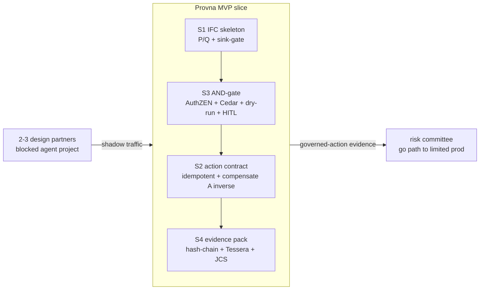
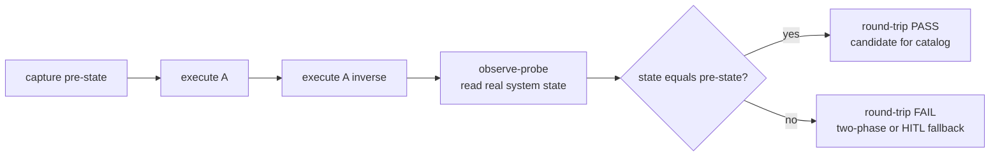
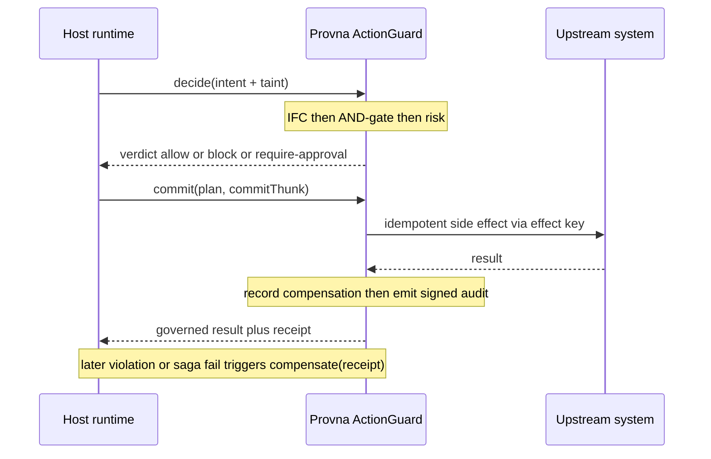
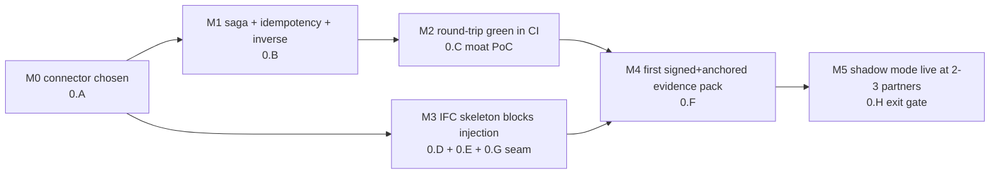

# Phase 0 - MVP

**Status:** Planned (indicative 0-3 months, pre-build)
**Last updated: 2026-06-24**
**Related:** [current.md](current.md) - [phase-0-1-enforcement.md](phase-0-1-enforcement.md) - [../architecture/action-lifecycle.md](../architecture/action-lifecycle.md) - [../architecture/build-vs-consume.md](../architecture/build-vs-consume.md) - [../architecture/integration-surfaces.md](../architecture/integration-surfaces.md) - [../architecture/pillar-1-information-flow-control.md](../architecture/pillar-1-information-flow-control.md) - [../architecture/pillar-2-transactional-compensation.md](../architecture/pillar-2-transactional-compensation.md) - [../architecture/pillar-3-runtime-authorization.md](../architecture/pillar-3-runtime-authorization.md) - [../architecture/pillar-4-tamper-evident-audit.md](../architecture/pillar-4-tamper-evident-audit.md) - [../tech-stack.md](../tech-stack.md) - [../business/design-partner-plan.md](../business/design-partner-plan.md) - [../compliance/regulatory-mapping.md](../compliance/regulatory-mapping.md) - [../risks/risk-register.md](../risks/risk-register.md)

This is the first build phase. Everything before it is the [current.md](current.md) pre-build checklist (name clearance, design-partner outreach). Phase 0 turns the four-pillar thesis into a thin-but-real vertical slice that runs in shadow mode at 2-3 design partners. It is not a feature-complete product; it is the smallest end-to-end proof that a single WRITE action can pass all four gates and be reversed, with regulator-grade evidence to show for it.

## Goal

Prove, end-to-end, on real design-partner traffic, that **one side-effecting action in one finance-ops connector can be governed as a guarded saga step** - information-flow-checked, AND-gate-authorized, dry-run + HITL gated, executed idempotently, reversed by a tested inverse, and recorded as a signed, externally-anchored evidence pack.

The phase exists to de-risk the single most critical assumption in the whole bet: that **S2 transactional compensation is genuinely hard enough to be "buy < build"** (the moat is conditional on this). Phase 0 ships the first connector inverse and the first round-trip test harness so that this assumption is tested against a real connector and a real design partner, not asserted.

Frame for the team: we are not building a security tool in Phase 0. We are building the smallest possible **permission-to-ship** demonstration - a blocked agent project that, by the end of the phase, has a credible path to risk-committee approval *because of* the evidence Provna produced from its own shadow traffic.

## Definition of Done (measurable outcomes)

Phase 0 is done when ALL of the following are true and demonstrable:

1. **One connector, one action type, governed end-to-end.** A single action type on one connector (Stripe `refund`/`void` OR a NetSuite ledger posting) passes all four gates in a single guarded saga step on a real partner request.
2. **Compensation round-trip passes in CI.** For the chosen action, the harness runs `A` then `A^-1` against a sandbox and asserts observable state-equivalence; the round-trip test is green in CI and re-runs on every commit.
3. **At least one injection is architecturally blocked.** The canonical AP-invoice injection demo (attacker IBAN hidden in untrusted invoice text) is blocked by the IFC sink-gate, not by a classifier guess, and the block is recorded as a signed audit event.
4. **AgentDojo numbers exist and are honest.** ASR and utility-tax are measured together on the IFC skeleton and written down; the guarantee boundary (implicit-flow / side-channel NOT guaranteed) is stated alongside the numbers.
5. **First evidence pack produced and externally verifiable.** A governed action yields a v1 evidence pack: JCS-canonicalized (RFC8785) events, Ed25519-signed with an embedded `kid`, hash-chained, Merkle-rooted, and anchored to a self-hosted transparency log (Tessera) + an internal HSM-backed RFC3161 TSA + a cross-organization witness cosignature, with Rekor v2 as the reference design; an independent verifier reproduces the chain offline and confirms the anchor.
6. **"Govern in two lines" works.** A host integrates the ActionGuard seam (`decide -> commit -> compensate`) via the SDK in roughly two lines and gets Layer-0 signed+anchored audit with default-OFF enforcement.
7. **Shadow mode live at 2-3 design partners.** The slice runs in shadow (observe, audit-only-but-signed) on real or replayed partner traffic; a cumulative count of governed actions is being accumulated (target gate below).
8. **Fail-closed verified.** Forcing any gate to error (IFC engine down, PDP unreachable, signer unavailable) results in BLOCK with no downgrade path, demonstrated by test.

## Scope

### In scope

- ONE connector (Stripe or NetSuite) and ONE action type. The connector choice is workstream 0.A; everything downstream depends on it.
- The MVP stack only: TypeScript/Python + DBOS + Postgres + Cedar + Claude (default provider) + simple hash-chain + a self-hosted transparency log (Tessera) + an internal HSM-backed RFC3161 TSA + a cross-organization witness cosignature (Rekor v2 as the reference design) + single container. See [../tech-stack.md](../tech-stack.md).
- IFC as a working skeleton (P/Q isolation + dual-lattice sink-gate) sufficient to block the canonical injection - not the hardened production lattice.
- AND-gate authorization via AuthZEN 1.0 + Cedar, with dry-run and HITL (four-eyes) for high-value / irreversible actions.
- Evidence pack v1 (JCS + Ed25519 + `kid` + hash-chain + Merkle root + a self-hosted transparency log (Tessera) anchor + an internal HSM-backed RFC3161 TSA + a cross-organization witness cosignature, with Rekor v2 as the reference design) mapped to EU AI Act Article 12 and Article 14.
- The ActionGuard seam (`decide() -> commit() -> compensate()`) plus a minimal SDK exposing the "govern in two lines" Layer-0 onboarding.
- Shadow-mode deployment in each partner's environment (their VPC where required), enforcement default-OFF.
- Relavium as the first reference integration of the seam (one host); the seam itself stays host-injected and optional.

### Out of scope

- Above-threshold **blocking/enforcement** of partner traffic. Phase 0 is shadow-only; enforcement is the [phase-0-1-enforcement.md](phase-0-1-enforcement.md) milestone.
- More than one connector or more than one action type. No connector breadth, no auto-runnable catalog yet - just the first hand-built inverse and the harness that will later become the flywheel.
- The inline Go hot-path PEP (Rust reserved for a future hot leaf with a proven trigger), DBOS-at-scale (Temporal kept as a seam-isolated contingency triggered only by multi-tenant fan-out / a Postgres ceiling / a buyer mandate, NOT a scheduled migration), OpenFGA/biscuit (OpenFGA deferred behind a relationship-resolver interface until a partner is provably ReBAC), expanded witness federation, K8s/Helm hardening, SOC2 - all deferred to [phase-1-scale.md](phase-1-scale.md) / production-target stack.
- Behavioral/temporal admission (the S3 "5th dimension"). The AND-gate ships in Phase 0; the post-AND-gate behavioral layer is a later increment.
- biscuit/macaroon caveat-attenuation and transitive revocation as production features (the thin resolver ships; real attenuation is hardened later).
- Transitive revocation, PQC-hybrid signatures, BAR governance-failure signal persistence beyond the basic signed-finding event.
- Any second vertical, premium IFC tier, or vendor-neutrality proof across LangChain / OpenAI-SDK / custom (Phase 1).
- A paying contract (that is the Phase 0->1 exit signal, not a Phase 0 deliverable).

## Ordered work breakdown

Workstreams are roughly ordered by dependency. 0.A gates everything. 0.B/0.C are the moat path and run as early as possible. 0.D-0.F can proceed in parallel once the seam (0.G) skeleton exists. 0.H integrates the slice into partner environments.

### 0.A - Pick the connector + one action type

Choose ONE: Stripe (`void`/`refund` on a payment intent) or NetSuite (a journal posting with a reversing entry). Decide on the basis of: which design partner has the most acute blocked agent project, which API offers the cleanest native inverse (auth->capture->void is preferred over execute-then-undo), and which gives the sharpest injection demo (the AP-invoice attacker-IBAN flow favors a payment/posting path).

**Acceptance:** one connector + one action type chosen and written down with the inverse strategy named (two-phase vs. forward+compensate) and the partner who will exercise it.

### 0.B - DBOS + idempotency + one-click compensation

Stand up the saga mechanism on DBOS Transact (consume; do not rewrite durability). Implement a **semantic effect key** so retries and resume never double-post the same side effect. Implement the hand-written inverse `A^-1` for the chosen action and expose it as one-click compensation through the seam's `compensate()`.

**Acceptance:** the action executes exactly once under retry/resume (proven by replaying with the same effect key), and a single `compensate(receipt)` call reverses it against the sandbox.

### 0.C - S2 compensation test-harness (A -> A^-1 round-trip) - the moat PoC

Build the round-trip harness: execute `A`, then `A^-1`, then **observe-probe** the real (sandbox) system state and assert equivalence to the pre-action state. Wire it into CI so the round-trip re-runs on every commit and on connector API-version changes. This is the seed of the compensation flywheel and the concrete test of the "buy < build" assumption.

**Acceptance:** the round-trip test is green in CI for the chosen action; a deliberately-broken inverse turns it red; the harness records WHY a round-trip failed (so the failure feeds the catalog decision, not a silent pass).

### 0.D - S1 fusion skeleton (CaMeL P/Q + dual-lattice sink-gate) + AgentDojo measurement

Stand up the P-LLM / Q-LLM split: the Q-LLM processes untrusted data and **cannot call tools - it returns only typed values**. Back the dual-lattice (integrity x confidentiality) sink-gate so that unlabeled data is treated as untrusted (fail-closed) and an untrusted value cannot reach a sensitive sink unless an explicitly-typed policy authorizes the flow. Declassification only through a signed, principal-bound trust-boundary node. Run AgentDojo to measure ASR and utility-tax **together**.

**Acceptance:** the canonical injection (attacker IBAN in untrusted invoice text) is blocked because the IBAN may only come from the verified supplier-master, not from untrusted content; the block is a deterministic lattice+sink-policy decision, not a classifier output; AgentDojo ASR and utility-tax are recorded with the guarantee boundary stated explicitly.

### 0.E - S3 AND-gate (AuthZEN + Cedar) + dry-run + HITL (Article 14)

Build the thin AND-gate resolver over a consumed PDP (Cedar via AuthZEN 1.0): a request is allowed only if `agent AND user AND delegation AND intent` all permit it (the user and intent axes are the differentiator). Add dry-run preview before any money-path action and risk-tiered HITL: high-value / irreversible actions route to a four-eyes human approval gate mapped to EU AI Act Article 14.

**Acceptance:** an action missing any AND-gate leg is denied and logged; a high-value action produces a dry-run preview and suspends on a durable human-approval gate; an approved gate resumes to execute, a rejected gate stops and logs.

### 0.F - S4 OTel -> hash-chain -> transparency log + Md.12/14 evidence pack v1

Emit OTel events for every gate decision, hash-chain them, compute a Merkle root, and anchor to a self-hosted transparency log (Tessera) + an internal HSM-backed RFC3161 TSA + a cross-organization witness cosignature, with Rekor v2 as the reference design. Canonicalize with RFC8785 JCS, sign with Ed25519, embed `kid` and the public key/cert so the witness is portable, and attach `policy_snapshot_ref` (the policy hash in force at decision time). Assemble the v1 evidence pack and map its fields to Article 12 (forensic reproducibility) and Article 14 (human oversight).

**Acceptance:** a governed action produces an evidence pack that an **independent offline verifier** can validate - reproduce the hash-chain, confirm the signature against the embedded `kid`, and confirm the transparency-log anchor; an attempt to rewrite a past event breaks verification.

### 0.G - ActionGuard seam + "govern in two lines" SDK

Implement the host-injected, optional, default-OFF ActionGuard seam: `decide()` (IFC + AND-gate + risk -> verdict), `commit()` (idempotent execute + record compensation + emit signed audit), `compensate()` (out-of-band reverse). Ship the minimal Python/TS SDK that lets a host turn on Layer-0 (audit-only but signed+anchored) in roughly two lines, with a clear path to Layer-1 (deny + dry-run) and Layer-2 (compensate).

**Acceptance:** a host wires Layer-0 in about two lines and immediately gets signed+anchored audit with enforcement OFF; toggling Layer-1 enables deny + dry-run without further integration work; Relavium is integrated as the first reference host through this exact seam.

### 0.H - Shadow-mode deployment with 2-3 design partners

Deploy the single-container slice into each partner's environment (their VPC where required), enforcement default-OFF. Run their real or replayed finance-ops traffic through `decide()` in observe mode so every action is information-flow-checked, authorized, and **signed+anchored-audited without blocking**. Accumulate a per-partner governed-action count and surface it for the risk committee.

**Acceptance:** the slice is live and producing signed evidence in 2-3 partner environments; a per-partner cumulative governed-action count is visible; at least one partner has, from its own shadow traffic, the makings of a risk-committee evidence pack ("N actions observed, M would-have-blocked, all reversible, Article 12 log").

## In-phase milestones

- **M0:** connector + action type locked (0.A).
- **M1:** saga runs idempotently with a hand-written inverse (0.B).
- **M2:** compensation round-trip green in CI - the moat PoC (0.C).
- **M3:** IFC skeleton + AND-gate + seam block the canonical injection end-to-end (0.D, 0.E, 0.G).
- **M4:** first independently-verifiable evidence pack produced (0.F).
- **M5:** shadow mode live at 2-3 partners, governed-action count accumulating (0.H) - feeds the exit gate.

Milestones are phase-relative; durations are indicative (pre-build) and span the indicative 0-3 month window.

## Dependencies

**Inbound (must be true before Phase 0 can finish):**

- Name/trademark clearance from [current.md](current.md) far enough along to commit brand/domain/repo identity (Slavic-connotation + provna.com/.ai/.io + USPTO/EUIPO class 9/42). This is the critical-path pre-build item.
- 2-3 design partners signed for shadow mode, each with a concrete blocked agent project in finance-ops. See [../business/design-partner-plan.md](../business/design-partner-plan.md).
- A usable sandbox for the chosen connector (Stripe test mode or a NetSuite sandbox) to run the round-trip harness against.

**Consumed / assembled (not built):**

- DBOS Transact (saga mechanism), Cedar + AuthZEN 1.0 (PDP), OTel + a self-hosted transparency log (Tessera) + an internal HSM-backed RFC3161 TSA + a cross-organization witness cosignature, with Rekor v2 as the reference design (audit substrate), Claude (default LLM provider), AgentDojo (eval). See [../architecture/build-vs-consume.md](../architecture/build-vs-consume.md) and [../tech-stack.md](../tech-stack.md).
- Relavium as the first reference host for the ActionGuard seam (one integration; the seam stays vendor-neutral by design). See [../architecture/integration-surfaces.md](../architecture/integration-surfaces.md).

**Outbound (what Phase 0 unblocks):**

- [phase-0-1-enforcement.md](phase-0-1-enforcement.md): above-threshold blocking, adversarial test blocked-and-reversed, the first paying contract, SOC2 kickoff - all depend on a working shadow-mode slice and a passing round-trip harness.

## Exit gate (go / no-go)

Proceed to [phase-0-1-enforcement.md](phase-0-1-enforcement.md) only if ALL three hold:

1. **Volume in shadow:** a target threshold of governed actions has been observed in shadow mode across the design partners (single accumulating metric; set the concrete number with the first partner, e.g. a four-figure action count from real or replayed traffic).
2. **Compensation round-trip passes:** the `A -> A^-1` harness is green in CI for the chosen connector and re-runs on every commit, with observe-probe confirming real-system state-equivalence.
3. **First evidence pack produced:** at least one governed action has yielded a signed + externally-anchored, independently-verifiable evidence pack mapped to Article 12 / Article 14.

If any fails, hold at Phase 0 and address. In particular, if the round-trip harness reveals that the inverse is **trivial** (a one-sprint job, no multi-year accumulation needed), that is a direct hit on the conditional moat assumption and must be escalated - it is a kill-criteria signal, not a thing to paper over. See [../risks/risk-register.md](../risks/risk-register.md).

## Risks

- **Compensation turns out to be easy (the moat is conditional).** If the first connector inverse is trivial, the "buy < build" thesis weakens. Mitigation: 0.C is built early precisely to surface this fast; treat a too-easy inverse as a go/no-go input, not a convenience.
- **IFC utility-tax too high.** The known IFC utility-tax reference is around 7 points [OPINION; to be validated with design partners]. If the P/Q split degrades agent utility past a partner's tolerance, the gate is unsellable. Mitigation: measure ASR and utility-tax together in 0.D from day one; keep the ML classifier as an optional pre-filter only, never as the guarantee.
- **Overclaiming the audit guarantee.** "Court-admissible" is case-by-case UNVERIFIED; the evidence is regulator-grade forensic-reproducible, not a guarantee of legal admissibility. Mitigation: ship the honest guarantee wording in the evidence pack; the audit/SOX persona punishes overclaim and trusts the honest boundary.
- **Fail-open creeping in.** Any gate that downgrades on error (lets traffic through when the IFC engine, PDP, or signer is unavailable) breaks the whole thesis. Mitigation: 0.D-0.G all ship with fail-closed tests; unlabeled => untrusted, error => BLOCK, no downgrade path; for Claude Code use a real PreToolUse deny. See [../architecture/pillar-1-information-flow-control.md](../architecture/pillar-1-information-flow-control.md).
- **Partner cannot grant write permission inside the phase window.** Shadow mode mitigates this (observe-only, default-OFF) but the exit toward enforcement depends on a partner willing to move. Mitigation: pick the connector and partner in 0.A by acuteness of the blocked project.
- **Name not cleared in time.** A late Slavic-connotation or trademark problem forces a rebrand mid-build. Mitigation: keep clearance on the critical path in [current.md](current.md); do not commit brand/domain/code identity until resolved.
- **Scope creep into a second connector or enforcement.** The temptation to add breadth or flip enforcement on early dilutes the single vertical slice. Mitigation: hold the line - one connector, one action, shadow-only; breadth and blocking belong to the next phases.
