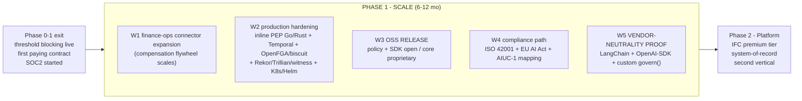
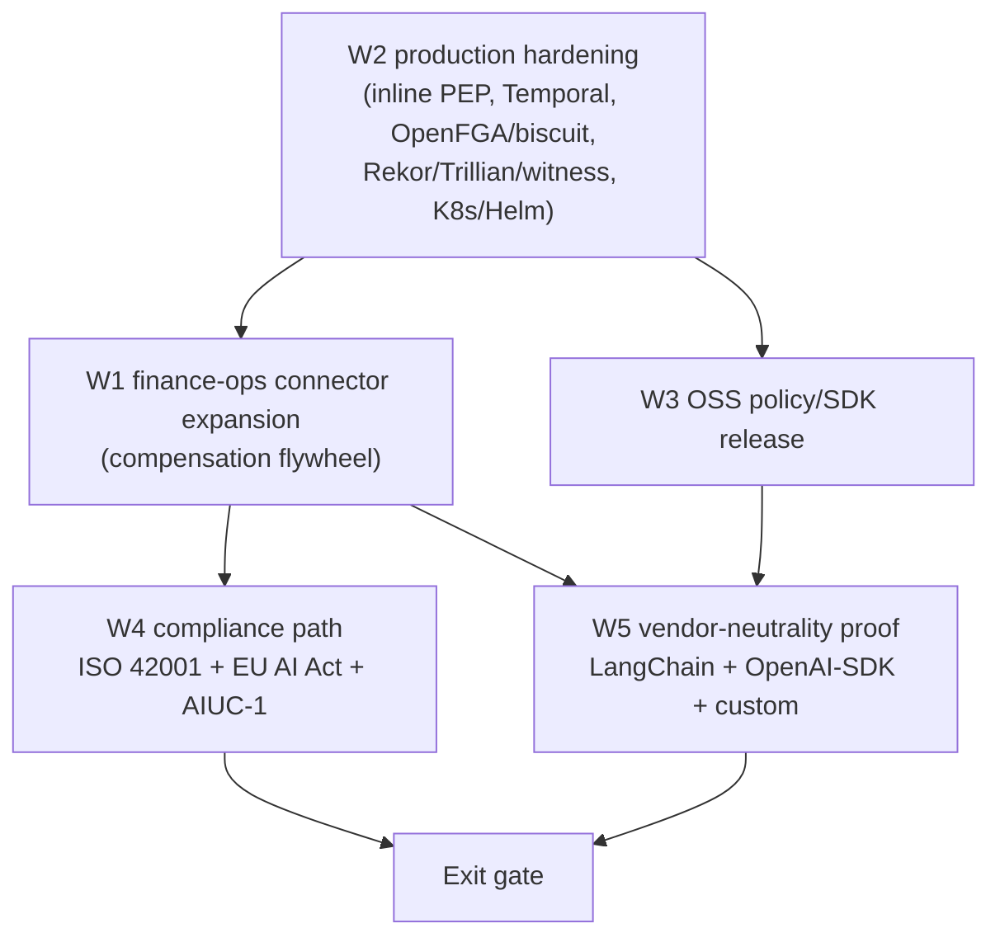

# Phase 1 - Scale

**Status:** Planned (indicative 6-12 months; pre-build, phase-relative)
**Last updated: 2026-06-24**
**Related:** [phase-0-1-enforcement.md](phase-0-1-enforcement.md) | [phase-2-platform.md](phase-2-platform.md) | [current.md](current.md) | [README.md](README.md) | [../architecture/overview.md](../architecture/overview.md) | [../architecture/integration-surfaces.md](../architecture/integration-surfaces.md) | [../compliance/regulatory-mapping.md](../compliance/regulatory-mapping.md) | [../tech-stack.md](../tech-stack.md) | [../decisions/0011-open-source-boundary-proprietary-core.md](../decisions/0011-open-source-boundary-proprietary-core.md) | [../decisions/0009-action-guard-seam-vendor-neutral.md](../decisions/0009-action-guard-seam-vendor-neutral.md) | [../risks/risk-register.md](../risks/risk-register.md)

Phase 1 is where Provna stops being a single-connector, single-partner enforcement product and becomes a defensible platform: the compensation library deepens across finance-ops, the data plane hardens to production-target technology, the policy/SDK layer is released as open source for credibility, the compliance story acquires durable anchors (ISO 42001 + EU AI Act path + AIUC-1 mapping), and - most consequentially - the **vendor-neutrality thesis is proven or it is not**. The single thread running through every workstream below is the absorption window: a roughly 12-24 month clock during which a horizontal incumbent could move into the white space. Phase 1 either turns the conditional moat into accumulated, inherited, hard-to-copy content - or it exposes that the thesis was thinner than believed.

## Goal

Turn the validated single-connector enforcement product into a **scaled, production-hardened, multi-runtime control plane** with a credible compliance and open-source posture - while the absorption window is still open.

Three outcomes define the phase:

1. **Finance-ops expansion.** The compensation library and policy catalog cover a meaningful breadth of EU finance-ops actions (payment rails, ERP postings, reconciliation writes), so the data flywheel ([phase-0-1-enforcement.md](phase-0-1-enforcement.md)) is visibly compounding - new partners inherit verified inverses they did not pay to build.
2. **OSS + compliance credibility.** The open-source policy/SDK release earns developer-side credibility and a vendor-neutral adoption surface, while the proprietary core (IFC engine, compensation library, evidence store) stays closed (see [../decisions/0011-open-source-boundary-proprietary-core.md](../decisions/0011-open-source-boundary-proprietary-core.md)). The compliance path (ISO 42001 + EU AI Act + AIUC-1 mapping) gives the Verifier persona durable, externally-recognized anchors rather than bespoke claims.
3. **Vendor-neutrality proven.** The `govern()` / ActionGuard seam ([../decisions/0009-action-guard-seam-vendor-neutral.md](../decisions/0009-action-guard-seam-vendor-neutral.md)) is demonstrated on at least two non-reference runtimes (LangChain, OpenAI-SDK) plus a custom integration - converting the neutrality claim from roadmap to evidence. This is the load-bearing goal: if neutrality is not proven, Provna collapses into "enterprise governance for one runtime" and the core defensibility (not-horizontal + owning the hard pillars across any runtime) is lost.

[OPINION] Phase 1 is the phase where the strategy is most exposed: Phase 0 proves the mechanism works, Phase 0-1 proves someone pays, and Phase 1 proves it scales and generalizes. A pilot that ships but cannot be reproduced on a second runtime or a second connector family is a feature, not a company.

## Definition of Done

Phase 1 is complete when **all** of the following hold:

- **Connector breadth.** The compensation library covers the agreed finance-ops connector set (target: payment rails + ERP + reconciliation across multiple providers, beyond the Phase 0 single connector), each with a round-trip-verified, API-version-pinned inverse in the auto-runnable catalog, and a measurable share of new-partner actions are covered by **inherited** (not bespoke) compensations.
- **Production-target stack live for at least one production deployment.** Inline PEP in Go/Rust on the hot path; Temporal as the durable substrate; OpenFGA + biscuit/macaroon attenuation as the PDP/delegation layer; Rekor/Trillian + an external witness for evidence anchoring; K8s/Helm deployment into a customer VPC. The MVP single-container stack is retired for production traffic (see [../tech-stack.md](../tech-stack.md)).
- **OSS released.** The policy language and SDK (Python/TS) are published under an OSS license with documentation, examples, and a contribution path; the IFC engine, compensation library, and evidence store remain proprietary per [../decisions/0011-open-source-boundary-proprietary-core.md](../decisions/0011-open-source-boundary-proprietary-core.md). At least one external user has run the OSS layer against the proprietary control plane.
- **Compliance path established.** A published mapping from Provna controls to ISO 42001 clauses, EU AI Act Article 12 / Article 14 obligations, and the AIUC-1 control set exists and has been reviewed by at least one design-partner's audit function. The ISO 42001 implementation path is started (not necessarily certified); SOC2 (begun in Phase 0-1) is progressing toward report.
- **Vendor neutrality proven.** The same governance semantics run via the seam on **at least three** distinct integration surfaces beyond Relavium: LangChain, OpenAI-SDK, and one custom runtime - each demonstrated end-to-end (decide -> commit -> compensate) against a real connector, with parity on the four gates.
- **Multiple paying contracts.** More than one paying customer in production (expansion beyond the single Phase 0-1 contract), with at least one expansion (land -> expand) inside an existing account.
- **Eval discipline maintained at scale.** AgentDojo ASR + utility-tax are re-measured and re-published for the expanded connector set; the determinism-honesty guarantee statement is unchanged and still accurate.

## Scope

**In scope:**

- Finance-ops connector and policy expansion (depth within the FS vertical).
- Production hardening of the data plane and control plane to the production-target stack.
- OSS release of the policy/SDK layer; packaging the proprietary core for VPC/air-gapped delivery (see [../decisions/0013-deployment-vpc-airgapped-k8s-helm.md](../decisions/0013-deployment-vpc-airgapped-k8s-helm.md)).
- ISO 42001 + EU AI Act + AIUC-1 mapping and path-start; SOC2 continuation.
- Vendor-neutrality proof across LangChain, OpenAI-SDK, and custom runtimes.

**Out of scope (deferred to [phase-2-platform.md](phase-2-platform.md)):**

- IFC premium tier as a packaged, separately-priced product.
- Agent-action evidence store positioned and sold as the system-of-record.
- A second vertical (healthcare / insurance).
- Any horizontal expansion into adjacent categories (LLM gateway, agent framework, generic PDP). Per the scope discipline, Phase 1 deepens the vertical and the four gates; it never widens sideways.

## Ordered Work Breakdown + Acceptance

Ordering reflects dependency and risk-retirement, not strict serialization - W1, W2, W3, W4 proceed in parallel where independent; W5 (vendor neutrality) gates the exit and should start early because it is the riskiest thesis.

### W1 - Finance-ops connector expansion

**What:** Grow the per-connector inverse (A^-1) catalog and policy library across the EU finance-ops surface: additional payment rails, additional ERP / general-ledger posting actions, and reconciliation writes. Every new connector follows the same flywheel - LLM proposes the inverse from the connector API, the round-trip test harness verifies A then A^-1 returns equivalent state, observe-probe confirms the real-system effect, and only then is the inverse promoted to the auto-runnable, API-version-pinned catalog. Irreversible actions get two-phase (auth -> capture -> void) instead of a false "undo", per [../architecture/pillar-2-transactional-compensation.md](../architecture/pillar-2-transactional-compensation.md).

**Why first-among-equals:** This is where the conditional moat either compounds or stalls. The whole flywheel thesis - that compensation content genuinely requires multi-year accumulation, so buy < build - is measured here at scale, not just on one connector.

**Acceptance:**
- The agreed finance-ops connector set is live, each with a round-trip-verified, version-pinned inverse in the catalog.
- A measurable and rising fraction of a new partner's required actions are covered by **inherited** catalog entries (the inheritance / flywheel effect is quantified, not asserted).
- The round-trip harness runs in CI for every connector; API-version drift is detected and flagged before it reaches a customer.
- Two-phase paths exist for the irreversible actions in scope; no connector ships claiming "undo everything".

### W2 - Production hardening (production-target stack)

**What:** Migrate from the MVP stack (TS/Python + DBOS + Postgres + Cedar + single container) to the production-target stack (see [../tech-stack.md](../tech-stack.md)):
- **Inline PEP in Go/Rust** on the hot path, replacing the MVP inline path, to meet money-path latency SLOs without a fail-open downgrade.
- **Temporal** as the durable execution substrate at scale (consumed, not rebuilt - compensation is layered on top; see [../decisions/0005-s2-dbos-substrate-compensation-library.md](../decisions/0005-s2-dbos-substrate-compensation-library.md)).
- **OpenFGA + biscuit/macaroon** for the PDP and real caveat-attenuation + recursive transitive-revocation with per-hop signature verification (see [../decisions/0006-s3-and-gate-attenuation-behavioral-admission.md](../decisions/0006-s3-and-gate-attenuation-behavioral-admission.md)).
- **Rekor/Trillian + external witness** for evidence anchoring, with RFC3161 external timestamp, RFC8785 JCS canonicalization, and kid-embedded portable witness (see [../decisions/0007-s4-merkle-external-anchor-jcs.md](../decisions/0007-s4-merkle-external-anchor-jcs.md)).
- **K8s/Helm** packaging for customer-VPC and air-gapped deployment.

**Why it gates the rest:** Connector expansion (W1) and neutrality (W5) only carry weight if the underlying enforcement holds at production latency and reliability. Fail-closed must survive the migration - error => BLOCK, no downgrade path, on every PEP surface (see [../decisions/0010-fail-closed-everywhere.md](../decisions/0010-fail-closed-everywhere.md)).

**Acceptance:**
- Inline PEP in Go/Rust serves at least one production deployment within the money-path latency SLO; the MVP inline path is no longer in the production hot path.
- Temporal-backed sagas run the compensation flow end-to-end (execute -> compensate) in production.
- OpenFGA + biscuit attenuation and recursive revocation pass adversarial tests (zombie-delegation and missing-signature cases are blocked).
- Evidence is anchored to Rekor/Trillian with an external witness; an independent verifier can validate a Merkle root and a kid-embedded witness offline.
- The full stack deploys via Helm into a customer VPC; fail-closed behavior is verified across all PEP surfaces under fault injection.

### W3 - Open-source policy/SDK release (credibility; core stays proprietary)

**What:** Publish the policy language and the SDK (Python/TS + gRPC client) as open source: documentation, runnable examples, a contribution guide, and a clear license. The two-line "govern in two lines" ergonomics (Layer-0 audit-only-but-signed-and-anchored -> Layer-1 policy deny + dry-run -> Layer-2 compensate) live in the OSS layer. The **proprietary core stays closed**: the IFC engine, the compensation library, and the evidence store are not open-sourced (see [../decisions/0011-open-source-boundary-proprietary-core.md](../decisions/0011-open-source-boundary-proprietary-core.md)).

**Why:** OSS is the credibility and adoption surface, not the business model. It earns developer trust, provides the vendor-neutral integration surface, and makes the "is this lock-in?" objection answerable. It also pre-positions the neutrality proof in W5: a developer can wire the open SDK into any runtime.

**Acceptance:**
- Policy language + SDK published under an OSS license with docs and examples; CI and versioning in place.
- The boundary is enforced in code and packaging: nothing from the IFC engine, compensation library, or evidence store ships in the OSS repos.
- At least one external (non-partner, non-employee) user runs the OSS SDK against the proprietary control plane and reaches Layer-0 signed-and-anchored audit.
- Layer-0 is demonstrably signed + anchored (not plain logging), preserving the distinction from observability/APM products.

### W4 - Compliance path: ISO 42001 + EU AI Act + AIUC-1 mapping

**What:** Build and publish a control mapping from Provna to the durable, externally-recognized frameworks: ISO 42001 (AI management system), EU AI Act Article 12 (forensic record-keeping / reproducibility) and Article 14 (human oversight), DORA and MiFID where relevant, and the AIUC-1 control set. Start the ISO 42001 implementation path. Continue SOC2 toward report. Anchor primary legitimacy in ISO 42001 + EU AI Act (the AIUC-1 mapping is a complement, not the primary legitimacy source - it carries a conflict-of-interest critique UNVERIFIED, so it is positioned as a mapping, not a seal).

**Why:** The Verifier persona (Internal Audit / SOX) is a veto. Bespoke compliance claims do not survive an audit cycle; recognized-framework mappings do. The forcing function is continuous (every audit cycle re-demands evidence; DORA obligations are ongoing), not a single calendar deadline.

**Acceptance:**
- A published mapping covering ISO 42001 + EU AI Act Art. 12/14 + DORA/MiFID + AIUC-1 exists in [../compliance/regulatory-mapping.md](../compliance/regulatory-mapping.md) and has been reviewed by at least one partner audit function.
- The ISO 42001 implementation path is started with a defined scope.
- SOC2 has progressed materially toward a report.
- The honest-guarantee boundary is preserved in all compliance materials: evidence is regulator-grade / forensic-reproducible; "court-admissible" remains case-by-case UNVERIFIED; the IFC guarantee statement (no implicit-flow / side-channel guarantee) is unchanged.

### W5 - Vendor-neutrality proof (the thesis test)

**What:** Demonstrate the ActionGuard / `govern()` seam on runtimes beyond the Relavium reference integration: **LangChain**, **OpenAI-SDK**, and at least one **custom** runtime. Each must run the full decide -> commit -> compensate protocol against a real finance-ops connector, with the four gates (IFC, AND-gate authz + behavioral admission, action contract, audit) behaving identically to the reference integration. The seam stays host-injected, optional, default-OFF (see [../architecture/integration-surfaces.md](../architecture/integration-surfaces.md) and [../decisions/0009-action-guard-seam-vendor-neutral.md](../decisions/0009-action-guard-seam-vendor-neutral.md)).

**Why it is the exit-defining workstream:** Vendor neutrality is currently a roadmap item, not proven [OPINION]. Relavium is the *first* reference integration, not the only one. If the same governance semantics cannot be made to hold across independent runtimes, the core defensibility argument - that Provna is not tied to one runtime and owns the hard pillars regardless of host - fails, and the product degrades into "governance for one runtime". This must start early because it is the highest-variance assumption in the phase.

**Acceptance:**
- LangChain, OpenAI-SDK, and one custom runtime each run decide -> commit -> compensate against a real connector, end-to-end.
- The four gates produce equivalent verdicts and equivalent signed evidence across all four runtimes (Relavium + the three new surfaces); parity is demonstrated, not assumed.
- The neutrality proof is documented and reproducible (a third party can stand up the integration from the OSS SDK + docs).
- No runtime-specific assumption has leaked into the core: the IFC engine, compensation library, and evidence store are runtime-agnostic.

## Milestones

Phase-relative; durations indicative (pre-build).

| Milestone | Marker | Primary workstream |
|---|---|---|
| **M1 - Hardened core in production** | Inline PEP (Go/Rust) + Temporal + OpenFGA/biscuit + Rekor/Trillian/witness live in one customer VPC; fail-closed verified under fault injection | W2 |
| **M2 - Catalog breadth** | Agreed finance-ops connector set round-trip-verified and version-pinned in the auto-runnable catalog; inheritance effect quantified | W1 |
| **M3 - OSS released** | Policy + SDK published; external user reaches Layer-0 signed-and-anchored audit; proprietary core boundary enforced | W3 |
| **M4 - Compliance mapping published + ISO 42001 path started** | ISO 42001 + EU AI Act Art. 12/14 + AIUC-1 mapping reviewed by a partner audit function; SOC2 progressing | W4 |
| **M5 - Vendor neutrality proven** | LangChain + OpenAI-SDK + custom each run decide/commit/compensate with four-gate parity | W5 |
| **M6 - Multi-customer production** | More than one paying customer in production; at least one land -> expand | W1, W2 |

## Dependencies

- **Inbound (from [phase-0-1-enforcement.md](phase-0-1-enforcement.md)):** above-threshold blocking is live; adversarial actions are blocked and reversed; the compensation test-harness flywheel has started; the first paying contract exists; SOC2 has begun. Phase 1 scales these - it does not re-prove enforcement.
- **Consumed technology (no rebuild):** Temporal (saga/durable substrate), Cedar/OpenFGA + AuthZEN 1.0 (PDP), OTel + Rekor/Trillian + RFC3161 (audit infrastructure), AgentDojo (eval). See [../architecture/build-vs-consume.md](../architecture/build-vs-consume.md) and [../tech-stack.md](../tech-stack.md). The build effort is confined to the white space: the IFC engine, the compensation library, the thin AND-gate resolver + attenuation, and the Article 12/14 evidence pack.
- **Design partners:** continued access to real finance-ops connectors and audit functions is required for W1 (connector validation) and W4 (mapping review). See [../business/design-partner-plan.md](../business/design-partner-plan.md).
- **Cross-workstream:** W2 (hardening) gates the production credibility of W1, W5, and M6. W3 (OSS) provides the surface that W5 (neutrality) exercises. W1 (catalog) feeds the breadth that W4 (compliance) maps and M6 (expansion) sells.
- **Outbound (to [phase-2-platform.md](phase-2-platform.md)):** the IFC engine matured in W2/W5 becomes the basis of the Phase 2 IFC premium tier; the anchored evidence store becomes the Phase 2 system-of-record; the proven neutral seam unblocks a second vertical.

## Exit Gate

Phase 1 exits to [phase-2-platform.md](phase-2-platform.md) only when **all** Definition-of-Done criteria hold, and specifically when these three hard gates are green:

1. **Hardened.** The production-target stack (inline PEP Go/Rust + Temporal + OpenFGA/biscuit + Rekor/Trillian/witness + K8s/Helm) serves real production traffic, fail-closed, within the money-path latency SLO.
2. **Compounding.** The finance-ops compensation catalog demonstrably inherits across partners - new partners receive verified inverses they did not build - and the inheritance effect is measured, validating (or qualifying) the moat assumption.
3. **Neutral.** Vendor neutrality is proven on LangChain + OpenAI-SDK + a custom runtime with four-gate parity. This gate is non-negotiable: without it, the phase is not done regardless of revenue, because the strategy's core defensibility is unproven.

## Risks

The organizing risk of Phase 1 is the **absorption window** (~12-24 months [OPINION]): the position (S3 authz, S4 audit mechanism) is not defensible, only the substance (S1 IFC fusion, S2 compensation content) is. Phase 1 must turn substance into accumulated, inherited content before a horizontal incumbent moves in. See [../risks/risk-register.md](../risks/risk-register.md).

| Risk | Why it bites in Phase 1 | Mitigation |
|---|---|---|
| **Vendor-neutrality not proven (thesis-collapse)** | If the seam cannot hold parity across LangChain / OpenAI-SDK / custom, Provna becomes "governance for one runtime" and the core defensibility is gone. This is the single highest-variance assumption of the phase. | Start W5 early; keep the core runtime-agnostic; treat parity failures as kill-signals, not bugs to paper over; the OSS SDK (W3) lowers the integration cost for a third-party reproduction. |
| **Flywheel assumption wrong (compensation not hard enough)** | If finance-ops compensation content does not genuinely require multi-year accumulation, the conditional moat is weak and copying is cheap - exactly when expansion is supposed to compound it. | Quantify the inheritance effect in W1; sell the moat as conditional until proven; if weak, lean harder on vertical-FS depth + S1 IFC fusion + signed-anchored evidence rather than on the catalog alone. |
| **Absorption move during the window** | Snyk moves down (S1), Temporal moves up (adds a compensation library), Rubrik reframes (snapshot-is-enough), Microsoft ships horizontal governance for free - any of these can erode the position before substance has compounded. | Anchor every pitch to S1+S2 substance; counter Temporal-up with IFC-aware compensation + signed/anchored regulator-grade evidence + vertical-FS connector content it cannot reach; watch for rollback/compensation/inverse terms first appearing in horizontal competitor repos as a direct-attack signal; turn the flywheel fast. |
| **Hardening regression re-opens fail-closed** | Migrating to inline Go/Rust + Temporal + OpenFGA is exactly where a downgrade path (HMAC self-verify, observe-only shim, revocation fail-open) can silently creep in - the same failure mode that sank competitors. | Fail-closed verified under fault injection on every PEP surface (W2 acceptance); no downgrade path; revocation fail-closed; PreToolUse real-deny preserved. |
| **OSS leaks the core** | Pressure to open more (to win developer adoption) can erode the proprietary boundary, giving away the IFC engine / compensation library / evidence store. | Enforce the boundary in code and packaging (W3 acceptance); the boundary decision is fixed in [../decisions/0011-open-source-boundary-proprietary-core.md](../decisions/0011-open-source-boundary-proprietary-core.md). |
| **Compliance overreach** | Over-claiming ("court-admissible", AIUC-1-as-seal) is punished by the audit persona and can poison the deal it was meant to unblock. | Anchor legitimacy in ISO 42001 + EU AI Act; position AIUC-1 as a mapping; keep the honest-guarantee boundary (forensic-reproducible, not court-admissible; no implicit-flow / side-channel guarantee) in all materials. |
| **Latency at production scale** | The inline PEP on the money path must meet the SLO without fail-open; a latency miss forces a downgrade that breaks the fail-closed principle and the audit story. | Go/Rust hot path; measure against the money-path SLO as a W2 acceptance criterion; if the SLO cannot be met without downgrade, that is a kill-criterion, not a tuning task. |
| **Horizontal / scope drift while scaling** | Expansion pressure tempts adding adjacent categories (gateway, framework, generic PDP) or becoming "enterprise Relavium". | Deepen the vertical and the four gates only; apply the single scope test - does this make one guarded saga step more reversible / authorized / provable, or does it turn Provna into a platform; if the latter, reject or consume. |
