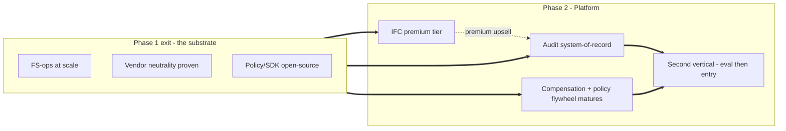
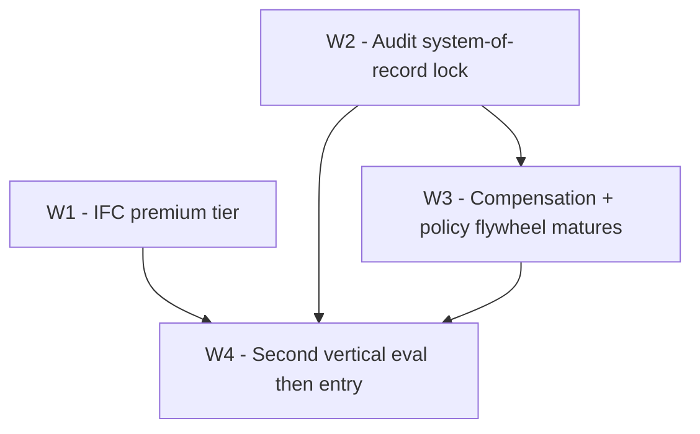
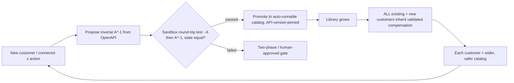
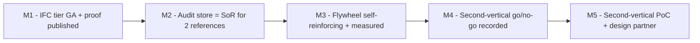
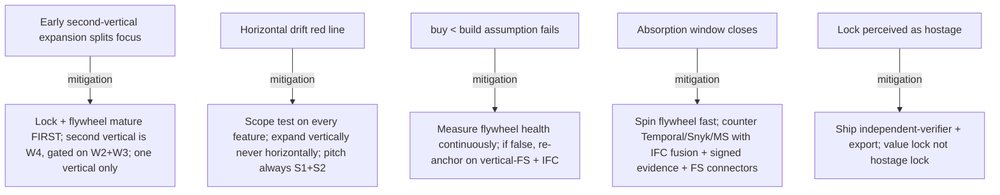

# Phase 2 - Platform

**Status:** Planned - phase-relative, indicative 12-18 months (post Phase 1 Scale; pre-build, durations indicative)
**Last updated: 2026-06-24**
**Related:** [phase-1-scale.md](phase-1-scale.md), [current.md](current.md), [README.md](README.md), [../vision.md](../vision.md), [../positioning.md](../positioning.md), [../architecture/pillar-1-information-flow-control.md](../architecture/pillar-1-information-flow-control.md), [../architecture/pillar-2-transactional-compensation.md](../architecture/pillar-2-transactional-compensation.md), [../architecture/pillar-4-tamper-evident-audit.md](../architecture/pillar-4-tamper-evident-audit.md), [../business/pricing-and-packaging.md](../business/pricing-and-packaging.md), [../risks/risk-register.md](../risks/risk-register.md)

Phase 2 is where Provna stops being "the thing that unblocks one agent project" and becomes **infrastructure you cannot leave**. Three things compound at once: the audit evidence store hardens into the *system-of-record* for agent actions (the switching-cost lock), the S2 compensation library and policy corpus mature into a self-reinforcing flywheel, and the IFC fusion is packaged as a premium tier. Only after these are anchored do we open a carefully-bounded **second vertical** (healthcare RCM or insurance). The red line of this phase: depth, not horizontal breadth. We add a second *vertical*; we never add a second *product category*.

---

## Goal

Turn Provna from a deployed control plane into a **platform with structural lock-in and a path to a second market**, without diluting the S1+S2 substance moat.

Three goal pillars:

1. **Platform + IFC premium tier.** Package the CaMeL P/Q-LLM isolation + runtime-taint fusion (S1) as a distinct, paid premium capability on top of the base governed-action platform. The base platform (deny + dry-run + compensate + signed audit) sells "permission to ship"; the IFC tier sells the *architectural* (not probabilistic) prompt-injection guarantee that no horizontal competitor offers.
2. **Agent-action audit system-of-record.** Make the signed + externally-anchored evidence store the authoritative record of every governed agent action. When the auditor's history of record lives in Provna, leaving means losing audit history - the strongest switching cost we have.
3. **Second vertical.** Run a disciplined evaluation of healthcare RCM (revenue-cycle management) and insurance as the next regulated vertical, and execute a controlled entry into the winner - reusing the four-gate guarded-saga-step machinery, replacing only the connector catalog and regulatory mapping.

This phase assumes Phase 1 has already proven vendor neutrality beyond Relavium (LangChain / OpenAI-SDK / custom), opened the policy/SDK open-source surface, and put the EU AI Act / ISO 42001 path in motion. Phase 2 builds the durable-business layer on top of that.

---

## Definition of Done

Phase 2 is complete when ALL of the following hold:

- **IFC premium tier is GA and monetized.** At least a meaningful share of expansion revenue is attributable to the IFC tier; the published AgentDojo numbers (ASR + utility-tax together, plus FS-domain ground-truth) are strong enough to be quoted in a buyer's risk-committee pack; the utility-tax is within an acceptable, disclosed band. [OPINION] The known IFC utility-tax reference is roughly seven points; the tier is only saleable if measured tax stays near or below that band - UNVERIFIED, to be confirmed with design partners and re-measured each release.
- **Audit store is the customer's system-of-record.** At least two reference customers have formally designated the Provna evidence store as their authoritative record for agent-action audit (i.e. their internal-audit / SOX function relies on it, not on app logs), and a documented export + independent-verifier path exists so the lock is a *value* lock, not a hostage lock.
- **Flywheel is self-reinforcing and measured.** The compensation library covers the FS-ops connector surface such that a *new* customer inherits validated, round-trip-tested inverses on day one for the majority of their actions; the marginal cost of onboarding a new customer's actions is materially lower than it was at the start of Phase 1; the per-customer policy corpus and the inherited-catalog ratio are both tracked as flywheel-health metrics.
- **Second vertical decision is made and de-risked.** A written go/no-go on healthcare RCM vs insurance is recorded as a decision, with a working PoC of one connector + one action type + the new regulatory mapping in the chosen vertical, and at least one design-partner conversation in that vertical that mirrors the Phase 0 discovery rigor.
- **The horizontal-drift red line held.** A retrospective confirms no Phase 2 work turned Provna into an agent platform / gateway / framework. Every shipped capability passes the scope test (below).

---

## Scope

### In scope

- Packaging, hardening, and monetizing the S1 IFC fusion as a premium tier (the engine itself is Phase 0-1 work; Phase 2 is productization + pricing + proof depth).
- Hardening the S4 evidence store into a system-of-record: retention, independent-verifier tooling, export, portable witness (`kid`-embedded), `policy_snapshot_ref` completeness, and the BAR-style governance-failure signal persisted as a signed audit event.
- Maturing the S2 compensation flywheel: broadening the connector inverse catalog, the round-trip test-harness coverage, observe-probe robustness, and API-version-pinning so inheritance is real.
- Maturing the policy-accumulation flywheel: per-customer IFC/authz policy corpora and shareable FS-ops policy packs.
- A disciplined second-vertical evaluation and a bounded entry (one connector, one action type, new regulatory mapping).

### Out of scope (explicit red lines)

- **No second product category.** No LLM gateway, no agent framework/orchestrator, no generic PDP, no durable-execution engine, no KYC/AML transaction-content analysis. These are consumed or left to others; building them dilutes the moat. The scope test for every feature request: *does this make a single guarded saga step more safe / reversible / provable, or does it turn Provna into a platform?* If the latter - reject or consume.
- **No horizontal "agent governance control plane" repositioning.** Microsoft buries horizontal governance for free; competing there is a loss. Expansion is vertical, never horizontal.
- **No third vertical in this phase.** One second vertical, entered with discipline. A second second-vertical is Phase 3+ territory.
- **No premature broad GA of the second vertical.** Phase 2 ends at a de-risked entry (PoC + design partner), not at full scale in the new vertical.

---

## Ordered work breakdown + acceptance

Ordered by dependency: the lock (audit SoR) and the flywheel must mature *before* the second vertical splits any focus, because the second vertical's economics depend on inheriting a working flywheel.

### W1 - IFC premium tier

Package S1 (CaMeL P/Q-LLM isolation core + FIDES/MVAR runtime-taint dual-lattice sink-gate complement) as a distinct paid tier on top of the base platform. The base platform already sells permission to ship via deny + dry-run + compensate + signed audit; the IFC tier adds the deterministic information-flow guarantee.

- Productize the tier boundary: base customers get the four gates with a baseline IFC posture; premium customers get the full P/Q isolation engine, the typed fail-closed lattice (unlabeled => untrusted), node-immutable labels, signed principal-bound `trust_boundary` declassification, and the DSL ergonomics backed by capability/label-propagation.
- Publish proof at premium depth: AgentDojo ASR + utility-tax *together*, plus FS-domain ground-truth (reconcile correctness). Sell the honest guarantee verbatim: untrusted data cannot reach a sensitive sink unless an explicitly-typed policy authorizes the flow; implicit-flow / side-channel leakage is NOT guaranteed.
- Wire the tier into pricing as a compliance-tier paywall alongside the Article 12/14 + DORA evidence packs.

**Acceptance:** IFC tier is GA; expansion revenue is demonstrably attributable to it; published ASR + utility-tax numbers are quotable in a buyer risk-committee pack and the disclosed utility-tax stays within the agreed band; the guarantee statement and its honest limits are stated identically in product, docs, and sales.

### W2 - Audit-action system-of-record (the switching-cost lock)

Move the S4 evidence store from "better audit" to "the authoritative record of agent actions." This is the strongest, most durable lock we have: when the auditor's history lives in Provna, leaving means losing audit history.

- Harden the evidence store as a record-of-truth: Merkle root + external anchor (a self-hosted transparency log (Tessera) + an internal HSM-backed RFC3161 TSA + a cross-organization witness cosignature, with Rekor v2 as the reference design) + RFC8785 JCS canonicalization + `kid`-embedded portable witness + complete `policy_snapshot_ref` on every decision (the S4<->S3 bridge), so an independent auditor - not just Provna - can verify history and even an insider / key-holder cannot rewrite it.
- Persist the BAR-style governance-failure signal as a signed audit event (forensic proof that enforcement was actually active), and map every record to EU AI Act Article 12 (forensic reproducibility) / Article 14 (human oversight) + DORA + MiFID II.
- Ship the independent-verifier + one-click export path. The lock must be a *value* lock (history that is too valuable to abandon), never a hostage lock; portability is what makes auditors trust it as their record. Honesty anchor: the evidence is regulator-grade forensic-reproducible; court-admissibility is case-by-case and jurisdiction-dependent UNVERIFIED - never conflate the two.

**Acceptance:** at least two reference customers have formally designated the Provna store as their system-of-record for agent-action audit; an independent third party can verify a customer's history end-to-end from an export; the BAR governance-failure signal is queryable as signed evidence.

### W3 - Compensation + policy-accumulation flywheel matures

The S2 compensation library is the real moat, but its moat-status is **conditional**: it only holds if compensation content genuinely requires multi-year accumulation ("buy < build"). Phase 2 is where we either prove the flywheel spins or learn it does not and lean harder on vertical-FS + IFC fusion. This is the single most critical assumption and is validated continuously, not assumed.

- Broaden the per-connector inverse catalog across the FS-ops surface (Stripe void/refund, NetSuite reversing entries, SWIFT/ledger, etc.), keep each entry round-trip tested in CI and API-version-pinned, and use observe-probe to confirm real-system completion. Never sell "undo everything"; for irreversible actions prefer two-phase (auth -> capture -> void).
- Mature the policy-accumulation side: per-customer IFC/authz policy corpora that compound switching cost, plus shareable FS-ops policy packs a new customer inherits.
- Instrument the flywheel: track the inherited-catalog ratio (share of a new customer's actions covered on day one), marginal onboarding cost, and policy-corpus growth as first-class health metrics - these are also the live measurement of the "buy < build" assumption.

**Acceptance:** a new FS-ops customer inherits validated, round-trip-tested compensation for the majority of their actions on day one; marginal onboarding cost is materially lower than start-of-Phase-1; the inherited-catalog ratio and policy-corpus growth are tracked and trending up; the "buy < build" assumption is either confirmed with evidence or explicitly flagged as failing (triggering a strategy adjustment toward vertical-FS + IFC).

### W4 - Second vertical: evaluation then bounded entry

With the lock and flywheel mature, open the next regulated vertical. Healthcare RCM and insurance are the standing #2 candidates; FS-ops was chosen over them because RCM integration is hostile and insurance is slow - so this is a deliberate, evidence-led choice, not a default.

- **Evaluate** both against the FS beachhead criteria: irreversible + pre-budgeted errors, dense date-stamped regulation, live business pull (blocked agent projects), idempotency-native integrations, and founder/team fit. Record a written go/no-go decision.
- **Enter** the winner with maximal reuse and minimal new surface: the four-gate guarded-saga-step machinery (IFC -> AND-gate authz + behavioral admission -> action contract -> signed audit) is unchanged; only the connector inverse catalog and the regulatory mapping (e.g. HIPAA / payer rules for RCM) are new. One connector, one action type, one new regulatory mapping - mirroring the Phase 0 MVP shape, not a full build-out.
- Run at least one Phase-0-grade design-partner discovery in the chosen vertical (a blocked agent project, an economic buyer with budget + urgency, a verifier who must produce evidence).

**Acceptance:** a recorded go/no-go decision with rationale; a working PoC (one connector A -> A^-1 round-trip + new regulatory-mapping evidence pack) in the chosen vertical; at least one design-partner conversation that surfaces a blocked project and a buyer; explicit confirmation that the four-gate core was reused, not rebuilt.

---

## Milestones

Phase-relative, in dependency order. Durations indicative (pre-build).

- **M1 - IFC premium tier GA.** Tier productized and monetized; AgentDojo ASR + utility-tax + FS ground-truth published; first expansion revenue attributable to the tier.
- **M2 - Audit system-of-record established.** Hardened evidence store + independent-verifier + export shipped; two reference customers designate it as their agent-action audit SoR.
- **M3 - Flywheel matured.** New-customer day-one inheritance across the majority of FS-ops actions; flywheel-health metrics tracked and trending; "buy < build" assumption explicitly evaluated.
- **M4 - Second-vertical decision.** Written go/no-go between healthcare RCM and insurance, recorded as a decision with rationale.
- **M5 - Second-vertical bounded entry.** One-connector PoC + new regulatory mapping + at least one Phase-0-grade design-partner conversation in the chosen vertical.

---

## Dependencies

- **Phase 1 exit must hold.** Vendor neutrality proven beyond Relavium (LangChain / OpenAI-SDK / custom), policy/SDK open-sourced, EU AI Act / ISO 42001 path in motion, FS-ops expanded. Without these the platform layer has no substrate. See [phase-1-scale.md](phase-1-scale.md).
- **S1 IFC engine production-ready** (the engine itself is Phase 0-1 build; Phase 2 productizes it). See [../architecture/pillar-1-information-flow-control.md](../architecture/pillar-1-information-flow-control.md).
- **S4 anchoring stack production-grade** (a self-hosted transparency log (Tessera) + an internal HSM-backed RFC3161 TSA + a cross-organization witness cosignature, with Rekor v2 as the reference design + JCS + witness). See [../architecture/pillar-4-tamper-evident-audit.md](../architecture/pillar-4-tamper-evident-audit.md).
- **S2 compensation harness + connector catalog** mature enough that inheritance is real. See [../architecture/pillar-2-transactional-compensation.md](../architecture/pillar-2-transactional-compensation.md).
- **Compliance mapping depth** (Article 12/14 + DORA + MiFID II for FS; HIPAA/payer rules for a healthcare second vertical). See [../compliance/regulatory-mapping.md](../compliance/regulatory-mapping.md).
- **Pricing model** that supports a compliance-tier paywall + metered governed-action (avoid per-seat). See [../business/pricing-and-packaging.md](../business/pricing-and-packaging.md).
- **Name/brand clearance resolved** (Slavic connotation + domains + USPTO/EUIPO) - a hard prerequisite long before the brand carries a second vertical. UNVERIFIED; must be closed earlier in the program.

---

## Exit gate

Provna exits Phase 2 and is ready for Phase 3 (deeper second-vertical scale-out) only when:

1. The IFC premium tier is GA, monetized, and backed by published proof (ASR + utility-tax + FS ground-truth).
2. The audit evidence store is the designated system-of-record for at least two reference customers, with a working independent-verifier + export path (value lock, not hostage lock).
3. The compensation + policy flywheel is self-reinforcing and measured, and the "buy < build" moat assumption has been explicitly evaluated against real onboarding-cost data.
4. A recorded go/no-go decision and a de-risked PoC + design-partner conversation exist for the chosen second vertical.
5. A retrospective confirms the horizontal-drift red line held: no work turned Provna into a platform/gateway/framework, and every shipped capability passed the scope test.

If the flywheel evaluation (3) shows compensation content is *not* hard enough to require multi-year accumulation, do NOT proceed to second-vertical scale on the flywheel thesis; re-anchor the moat on vertical-FS depth + IFC fusion and revise pricing/positioning before opening Phase 3.

---

## Risks

- **Early second-vertical expansion splits focus (primary Phase 2 risk).** Chasing healthcare/insurance before the FS lock and flywheel are solid spreads a small team across two regulated domains with opposite integration profiles and kills momentum. **Rule:** the second vertical (W4) is hard-gated on W2 (system-of-record) and W3 (flywheel) being done; enter exactly one vertical; the entry is a bounded PoC, not a scale-out. If the lock and flywheel are not done, the second vertical does not start - full stop.

- **The horizontal-drift red line.** The most lethal way to die in this phase is to answer a big customer's feature request by becoming an agent platform / gateway / framework. Microsoft buries horizontal governance for free; on that ground Provna gets crushed. **Rule:** every request passes the scope test - *does this make a single guarded saga step more safe / reversible / provable, or does it turn Provna into a platform?* If the latter, reject or consume. Expansion is vertical, never horizontal; the pitch always rests on the S1+S2 substance, never on "a bit of governance."

- **The "buy < build" moat assumption fails.** If compensation content turns out NOT to require multi-year accumulation, the flywheel is a weak moat. **Rule:** measure flywheel health (inherited-catalog ratio, marginal onboarding cost) continuously; if the assumption fails, re-anchor the moat on vertical-FS depth + IFC fusion and revise positioning - do not keep selling a flywheel that does not spin.

- **Absorption window closes.** The defensible-in-substance, not-in-position clock is roughly 12-24 months [OPINION]. Temporal moving up, Snyk moving down, or Microsoft moving organically can erode position. **Rule:** spin the flywheel fast while the window is open; counter absorbers with IFC-aware compensation + signed/anchored regulator-grade evidence + vertical-FS connector content - the depth a horizontal firm cannot reach.

- **System-of-record lock perceived as a hostage lock.** If customers feel trapped rather than well-served, the lock backfires in procurement and audit. **Rule:** ship the independent-verifier + one-click export so the lock is the *value* of the accumulated history, not captivity. Honesty anchor stays intact: regulator-grade forensic-reproducible, court-admissibility case-by-case UNVERIFIED.
