# Tech Stack

**Status:** Planned (pre-build); MVP and production-target stacks distinguished below
**Last updated: 2026-06-24**
**Related:** [architecture/build-vs-consume.md](architecture/build-vs-consume.md), [architecture/overview.md](architecture/overview.md), [project-structure.md](project-structure.md), [glossary.md](glossary.md)

## What is Provna built with?

Provna is a runtime control plane — a Policy Enforcement Point (PEP) + a saga coordinator + an evidence ledger — that sits inline between an agent and regulated enterprise systems. The stack reflects one rule: **build only the white-space the four-pillar fusion does not already get for free (S1 IFC + S2 compensation content); consume or assemble everything commoditized (durability, PDP, audit infrastructure, eval).** The canonical build-vs-consume boundary lives in [architecture/build-vs-consume.md](architecture/build-vs-consume.md); this page is the pinned technology view.

## Pinned layer table

| Layer | Decision | Technology | Why |
|---|---|---|---|
| Inline PEP / data-plane | BUILD | **Go** (Rust where needed) | Hot-path, synchronous on the money path; needs predictable low latency and a tight failure model (fail-closed). |
| IFC engine (S1) | BUILD (core IP) | CaMeL P/Q-LLM isolation + FIDES/MVAR-style runtime-taint dual-lattice sink-gate; typed, fail-closed, node-immutable; optional ML pre-filter (e.g. PromptGuard 2) | No vendor-neutral production IFC plane exists; the deterministic guarantee is anchored in the lattice + sink-policy, not the classifier. |
| Transactional substrate (S2 mechanism) | CONSUME | **DBOS Transact** (Postgres-backed) for MVP; **Temporal** at scale | Saga/resumability is commodity; do not rewrite the mechanism. Stand it up in a weekend. |
| Compensation library + harness (S2 content) | BUILD (the real moat) | Per-connector inverse (A^-1) + round-trip test harness + observe-probe + dry-run + API-version-pinned auto-runnable catalog | Compensation is semantic, per-connector, version-sensitive — no horizontal/durability vendor builds it. The content, not the mechanism, is the company. |
| AuthZ PDP (S3) | CONSUME + thin resolver BUILD | **Cedar** (embedded) + **OpenFGA** + **AuthZEN 1.0**; **biscuit/macaroon** for delegation; IETF transaction-tokens | S3 is a saturated market (SGNL <- CrowdStrike ~$740M); align and consume. Build only the AND-gate resolver, real caveat-attenuation, transitive revocation, and behavioral admission. AuthZEN is a genuine differentiator competitors skip. |
| Tamper-evident audit (S4) | ASSEMBLE + evidence-pack BUILD | **OpenTelemetry** + hash-chain + Merkle root + **Rekor/Trillian** + **RFC3161** TSA + **RFC8785 JCS** + kid-embedded portable witness | Mechanism is commodity; value is the assembly + EU AI Act Article 12/14 / DORA / MiFID evidence pack and the external anchor that closes insider-rewrite. |
| Data | CONSUME | **PostgreSQL** + **Redis** + **S3 / MinIO** | Postgres for state/ledger, Redis for hot-path caches/cooldown counters, object store for evidence blobs (MinIO for air-gapped). |
| Web panel | BUILD | **TypeScript / React / Next.js** | Operator + auditor console: verdicts, dry-run previews, evidence export, approvals. |
| SDK | BUILD | **Python + TypeScript**, **gRPC** wire protocol | Vendor-neutral surface for host runtimes (alongside MCP hook and proxy). |
| Deployment | CONSUME | **Docker / OCI** + **Kubernetes / Helm** (customer VPC, air-gapped) + **Terraform** | Regulated FS buyers require in-VPC / air-gapped deployment they control. |
| Evaluation | CONSUME | **AgentDojo** | Measure ASR + utility-tax together; FS-domain ground-truth (reconcile correctness) on top. |
| LLM | CONSUME (provider-agnostic) | Provider-agnostic, **default Claude** | Used for the Q-LLM, compensation-inverse suggestion, and risk scoring; never on the critical deterministic guarantee path. |

## Polyglot language strategy — rationale

Provna is deliberately polyglot, split by what each part must optimize for:

- **Hot-path PEP / IFC / action-contract = Go (Rust where needed).** This code runs inline on the money path. It must be fast, predictable, and fail-closed. A compiled language with a tight error model fits a reference monitor; a downgrade path is not acceptable.
- **Control-plane logic + LLM orchestration = Python / TS.** The PDP resolver, compensation orchestration, audit assembler, and LLM-driven inverse suggestion / risk scoring evolve fast and lean on rich ecosystems (policy engines, crypto, OTel, LLM SDKs). Iteration speed beats raw latency here because this is off the synchronous critical path.
- **Web panel = TS / React / Next.** Standard for the operator/auditor console.
- **SDK = Python + TS, gRPC on the wire.** Python and TS cover the agent ecosystems we target; gRPC gives a typed, language-neutral contract for the ActionGuard seam.

The seam between data-plane and control-plane is the gRPC ActionGuard protocol (`decide` / `commit` / `compensate`); see [architecture/integration-surfaces.md](architecture/integration-surfaces.md).

## MVP stack vs production-target stack

The MVP optimizes for speed-to-validation; the production target hardens for enforcement, scale, and procurement. We ship the MVP on the commodity substrate first and pull the inline PEP into Go/Rust only once the value (S1 + S2 fusion) is proven with design partners.

```mermaid
flowchart LR
  subgraph MVP["MVP 0 to 3 months -- speed"]
    M1["TypeScript / Python"]
    M2["DBOS + Postgres"]
    M3["Cedar PDP + AuthZEN"]
    M4["Claude default LLM"]
    M5["simple hash-chain + Rekor"]
    M6["single container, shadow-mode"]
  end
  subgraph PROD["Production target 6 to 12 months -- hardening"]
    P1["inline PEP in Go / Rust"]
    P2["Temporal at scale"]
    P3["OpenFGA + biscuit attenuation"]
    P4["Rekor / Trillian + witness + RFC3161"]
    P5["K8s / Helm in VPC / air-gapped"]
    P6["SOC 2"]
  end
  MVP ==> PROD
```

**MVP (Phase-0, indicative pre-build, 0-3 months):** TS/Python on a single container; DBOS + Postgres for the saga substrate; Cedar + AuthZEN for the AND-gate; Claude as default LLM; a simple hash-chain anchored to Rekor for the evidence pack v1; one connector (Stripe or NetSuite) and one action type; shadow-mode with 2-3 design partners.

**Production target (6-12 months):** inline PEP moved to Go/Rust; Temporal for scale; OpenFGA + biscuit for delegation/attenuation; full Rekor/Trillian + RFC3161 + portable witness audit; K8s/Helm deployment into customer VPC / air-gapped; SOC 2.

Pinned version numbers are intentionally not repeated here; the canonical boundary and the build/consume rationale live in [architecture/build-vs-consume.md](architecture/build-vs-consume.md).
