# Tech Stack

**Status:** Planned (pre-build); MVP and production-target stacks distinguished below
**Last updated: 2026-06-24**
**Related:** [architecture/build-vs-consume.md](architecture/build-vs-consume.md), [architecture/overview.md](architecture/overview.md), [architecture/tech-stack-analysis.md](architecture/tech-stack-analysis.md), [project-structure.md](project-structure.md), [glossary.md](glossary.md)

## What is Provna built with?

Provna is a runtime control plane — a Policy Enforcement Point (PEP) + a saga coordinator + an evidence ledger — that sits inline between an agent and regulated enterprise systems. The stack reflects one rule: **build only the white-space the four-pillar fusion does not already get for free (S1 IFC + S2 compensation content); consume or assemble everything commoditized (durability, PDP, audit infrastructure, eval).** The canonical build-vs-consume boundary lives in [architecture/build-vs-consume.md](architecture/build-vs-consume.md); the full per-layer evaluation (versions, licenses, GA status, source URLs) lives in [architecture/tech-stack-analysis.md](architecture/tech-stack-analysis.md); this page is the pinned technology view.

## Pinned layer table

| Layer | Decision | Technology | Why |
|---|---|---|---|
| Inline PEP / data-plane | BUILD | **Go >= 1.24** (FIPS 140-3 module on, `GODEBUG=fips140=on` for regulated builds); narrow guarantee-kernel interface so a leaf CAN move to Rust later | Hot-path, synchronous on the money path; needs predictable low latency and a tight failure model (fail-closed). Go wins on FIPS-in-stdlib + Stable OTel + canonical grpc-go + hiring; Rust reserved for a future leaf with a proven trigger. Zig and C++ dropped. |
| IFC engine (S1) | BUILD (core IP) | P/Q-LLM isolation + dual-lattice runtime-taint sink-gate; typed, fail-closed, node-immutable; signed principal-bound declassification. **FIDES** (microsoft/agent-framework) + **dromedary** (CaMeL impl) as reference/prototype substrate; **Llama Prompt Guard 2** self-hosted, off-path | The deterministic guarantee is anchored in the lattice + sink-policy, not a classifier. Build the inline fail-closed reference monitor; consume FIDES/dromedary as blueprints; the ML pre-filter is a load-shedder below the lattice, never the guarantee. |
| Transactional substrate (S2 mechanism) | CONSUME | **DBOS Transact** (Postgres-backed) now, behind a thin **SagaCoordinator** interface; **Temporal** as a seam-isolated contingency (not a scheduled migration) | Saga/resumability is commodity; do not rewrite the mechanism. DBOS stands up in a weekend with the cleanest air-gap story; Temporal only when a concrete trigger fires (multi-tenant fan-out, Postgres ceiling, buyer mandate). |
| Compensation library + harness (S2 content) | BUILD (the real moat) | Per-connector inverse (A^-1) + round-trip test harness + observe-probe + dry-run + API-version-pinned auto-runnable catalog; semantic-effect-key idempotency | Compensation is semantic, per-connector, version-sensitive — no horizontal/durability vendor builds it. The content, not the mechanism, is the company; it is substrate-independent. |
| AuthZ PDP (S3) | CONSUME + thin resolver BUILD | **Cedar** (embedded) for MVP + **AuthZEN 1.0**; **OpenFGA** deferred behind a relationship-resolver interface; **biscuit** caveat-attenuation; IETF transaction-tokens | S3 is a saturated market; align and consume. Cedar is the only Lean-proof-gated, in-process PDP — single failure domain, lowest latency, best air-gap. Build only the AND-gate resolver, real caveat-attenuation, transitive revocation, and behavioral admission. |
| Tamper-evident audit (S4) | ASSEMBLE + evidence-pack BUILD | **OpenTelemetry** (transport only) + hash-chain + Merkle root + **Tessera** (Go successor to Trillian) + internal HSM-backed **RFC3161** TSA + **cross-org witness cosignature** + **RFC8785 JCS** + kid-embedded portable witness; optional **ML-DSA** for long retention | Mechanism is commodity; value is the assembly + EU AI Act Article 12/14 / DORA / MiFID evidence pack. Self-hosted log + internal TSA + independent cross-org witness close insider-rewrite in the air gap without public-network egress. |
| Data | CONSUME | **PostgreSQL 18** + **SeaweedFS** (or the customer's in-VPC S3 endpoint) + **Valkey** only if a hot cache is later justified | Postgres for state/ledger (partitioning, logical decoding for the audit stream, RLS, encryption-at-rest); SeaweedFS (Apache-2.0) for evidence blobs with the S3 API as a swappable seam; cooldown/rate counters fold into Postgres for the MVP. |
| Secrets / KMS | CONSUME | **OpenBao** (MPL OSS fork) + **External Secrets Operator** | Vault-compatible API, clean OSS license, air-gap friendly; avoids HashiCorp Vault (BSL + IBM-owned). |
| Web panel | BUILD | **TypeScript / React / Next.js** | Operator + auditor console: verdicts, dry-run previews, evidence export, approvals. |
| SDK / wire | BUILD | **Python + TypeScript** SDK; **gRPC** on the inline money-path; **Connect-ES** for TS + browser edge; **buf** as schema source-of-truth | Vendor-neutral surface for host runtimes (alongside MCP hook and proxy). gRPC stays inline; Connect fixes the browser/TS DX without an Envoy hop; connect-python deferred to its 1.0. |
| Deployment / supply-chain | CONSUME | **Docker / OCI** + **Kubernetes / Helm** + **Terraform** (customer VPC, air-gapped); **cosign** / offline signing + **SLSA** provenance + **SBOM** for Provna's own releases | Regulated FS buyers require in-VPC / air-gapped deployment they control; signed, attested releases are a procurement asset (distinct from the S4 evidence chain). |
| Evaluation | CONSUME | **AgentDojo** + FS-domain ground-truth | Measure ASR + utility-tax together; FS-domain ground-truth (reconcile correctness) on top. |
| LLM | CONSUME (provider-agnostic) | Thin internal provider abstraction, **default Claude** | Used for the Q-LLM, compensation-inverse suggestion, and risk scoring; never on the critical deterministic guarantee path. |

## Decisions taken (2026-06-24)

Four founder-confirmed forks pin the stack; the full evaluation and source URLs live in [architecture/tech-stack-analysis.md](architecture/tech-stack-analysis.md).

1. **Data-plane hot-path language = Go-first.** Go >= 1.24 (FIPS 140-3 validated crypto module in the standard library; build with `GODEBUG=fips140=on` for regulated/air-gapped deployments; Stable OpenTelemetry traces + metrics; canonical grpc-go). Carve a narrow guarantee-kernel interface (lattice label-propagation + sink-policy decide + JCS canonicalize + sign) so it CAN be reimplemented in Rust later without touching the rest of the PEP. Rust is reserved ONLY for a future leaf with a proven trigger (a sub-millisecond-p99 inline proxy datapath, an untrusted-connector sandbox/WASM host, or a constrained sidecar). Zig and C++ are dropped. The control-plane stays Python/TS; the seam is gRPC, not FFI.
2. **S2 substrate = DBOS now, Temporal as a contingency.** Ship on DBOS Transact + Postgres for the MVP and early production, behind the gRPC ActionGuard seam plus a thin SagaCoordinator interface; pre-write a Temporal adapter spike but migrate ONLY if a concrete trigger fires (multi-tenant fan-out, a Postgres throughput/latency ceiling, or a buyer mandate). This is NOT a scheduled DBOS-to-Temporal migration. The compensation library/content remains the moat (BUILD), independent of the substrate.
3. **S3 PDP = Cedar-only for the MVP.** Embedded Cedar (formally verified, single failure domain, lowest latency, best air-gap story); model relationships as Cedar entities; defer OpenFGA behind a relationship-resolver interface and add it only when a design partner's entitlements are provably ReBAC. Keep AuthZEN 1.0 alignment; biscuit for caveat-attenuation; IETF transaction-tokens for delegation wire-format.
4. **S4 air-gapped anchoring = internal anchor + cross-organization witness.** Self-hosted transparency log (Tessera, the Go successor to Trillian) + an internal HSM-backed RFC3161 TSA, PLUS the log checkpoint is countersigned (tlog-witness / cosignature) by an independent trust domain whose root of trust is pre-provisioned on both sides of the air gap — giving genuine third-party non-repudiation without public-network egress. Keep Merkle root + RFC8785 JCS + kid-embedded portable witness; Rekor v2 as a reference design; optional ML-DSA (FIPS 204) signatures for long retention.

## Polyglot language strategy — rationale

Provna is deliberately polyglot, split by what each part must optimize for:

- **Hot-path PEP / IFC / action-contract = Go >= 1.24 (Rust reserved for a triggered leaf).** This code runs inline on the money path. It must be fast, predictable, and fail-closed. Go's FIPS 140-3 module in the standard library, Stable OTel, and canonical grpc-go make it the procurement-clean choice for regulated/air-gapped builds; a narrow guarantee-kernel interface keeps a future Rust reimplementation cheap without rewriting the rest of the PEP. A compiled language with a tight error model fits a reference monitor; a downgrade path is not acceptable.
- **Control-plane logic + LLM orchestration = Python / TS.** The PDP resolver, compensation orchestration, audit assembler, and LLM-driven inverse suggestion / risk scoring evolve fast and lean on rich ecosystems (policy engines, crypto, OTel, LLM SDKs). Iteration speed beats raw latency here because this is off the synchronous critical path.
- **Web panel = TS / React / Next.** Standard for the operator/auditor console.
- **SDK = Python + TS, gRPC on the inline wire, Connect at the edge.** Python and TS cover the agent ecosystems we target; gRPC gives a typed, language-neutral contract for the ActionGuard money-path; Connect-ES serves the browser/TS edge without an Envoy hop; buf is the schema source-of-truth. connect-python is deferred to its 1.0 and kept off the money-path.

The seam between data-plane and control-plane is the gRPC ActionGuard protocol (`decide` / `commit` / `compensate`); see [architecture/integration-surfaces.md](architecture/integration-surfaces.md).

## MVP stack vs production-target stack

The MVP optimizes for speed-to-validation; the production target hardens for enforcement, scale, and procurement. We prototype the S1 IFC plane on the FIDES/dromedary reference substrate and pull the inline PEP into Go once the value (S1 + S2 fusion) is proven with design partners. The substrate, PDP, and anchoring choices are deliberately seam-isolated so production hardening is additive, not a rewrite.

```mermaid
flowchart LR
  subgraph MVP["MVP 0 to 3 months -- speed"]
    M1["FIDES / dromedary IFC prototype, Python"]
    M2["DBOS + Postgres behind SagaCoordinator"]
    M3["Cedar embedded PDP + AuthZEN 1.0"]
    M4["Claude default LLM, off-path"]
    M5["hash-chain + Tessera + internal RFC3161 TSA"]
    M6["single container, shadow-mode"]
  end
  subgraph PROD["Production target 6 to 12 months -- hardening"]
    P1["inline PEP in Go 1.24, FIPS on"]
    P2["Temporal only if a trigger fires"]
    P3["OpenFGA deferred + biscuit attenuation"]
    P4["Tessera + cross-org witness + RFC3161"]
    P5["K8s / Helm in VPC / air-gapped, OpenBao"]
    P6["SOC 2"]
  end
  MVP ==> PROD
```

**MVP (Phase-0, indicative pre-build, 0-3 months):** Python/TS on a single container, prototyping the S1 IFC plane on FIDES (microsoft/agent-framework) with dromedary as the interpreter/capability reference; DBOS + Postgres for the saga substrate behind a thin SagaCoordinator; embedded Cedar + AuthZEN 1.0 for the AND-gate (OpenFGA deferred); Claude as default LLM (off the guarantee path); a hash-chain anchored to a self-hosted Tessera log plus an internal HSM-backed RFC3161 TSA for the evidence pack v1; SeaweedFS (or the customer's S3 endpoint) for evidence blobs; counters folded into Postgres; one connector (Stripe or NetSuite) and one action type; shadow-mode with 2-3 design partners. Llama Prompt Guard 2 self-hosted as an optional pre-filter, off the deterministic path.

**Production target (6-12 months):** inline PEP moved to Go >= 1.24 with the FIPS 140-3 module on, behind the guarantee-kernel interface; DBOS retained, Temporal added only if a concrete trigger fires; OpenFGA added behind the relationship-resolver interface only when a partner's entitlements are provably ReBAC, plus biscuit for delegation/attenuation; full Tessera + internal RFC3161 TSA + cross-org witness cosignature audit, with optional ML-DSA for long retention; OpenBao + External Secrets Operator; cosign / SLSA / SBOM signed releases; K8s/Helm deployment into customer VPC / air-gapped; SOC 2.

Pinned version numbers and the full per-layer rationale live in [architecture/tech-stack-analysis.md](architecture/tech-stack-analysis.md); the canonical build/consume boundary lives in [architecture/build-vs-consume.md](architecture/build-vs-consume.md).
