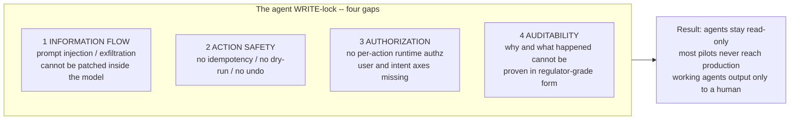
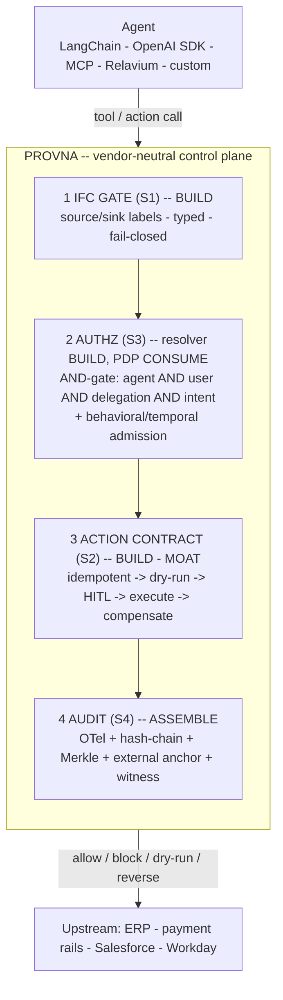
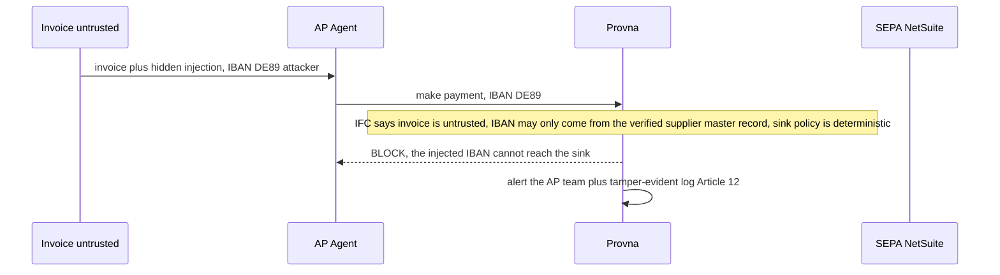

# Vision

**Status:** Draft / founding reference (pre-build)
**Last updated: 2026-06-24**
**Related:** [product-scope.md](product-scope.md), [positioning.md](positioning.md), [glossary.md](glossary.md), [architecture/overview.md](architecture/overview.md), [architecture/action-lifecycle.md](architecture/action-lifecycle.md)

This is the entry document for a newcomer. Read it first, then [product-scope.md](product-scope.md) for hard rules and [positioning.md](positioning.md) for the competitive case.

## One-sentence definition

**Provna is a vendor-neutral runtime control plane that turns every WRITE action an agent takes in regulated enterprise systems into a contract that is reversible, authorized, information-flow-controlled, and regulator-grade provable.**

Tagline: **Provna - every agent action, proven.** The `prov-` root binds the four pillars: *prove* (S1 information-flow + S4 audit), *provenance* (S4 audit trail), *provision* (S3 authorization), *approve* (human-in-the-loop / EU AI Act Article 14).

Provna is not an application. It is a triple - a Policy Enforcement Point (PEP) plus a transaction (saga) coordinator plus an evidence ledger - that sits inline between an agent and real-world side effects (payment rails, ERP, reconciliation, PHI). Its atomic unit is not a single tool call; it is that call wrapped into a *guarded saga step*: blockable, attenuable, dry-runnable, gated on approval, and - if it fails or is later found in violation - reversible via a reverse saga.

## The problem

The root cause is **compounding error**. At roughly 85% success per step, an 8-10 step agent run lands at only ~20-27% end-to-end reliability. The durable-execution wave (Temporal, LangGraph) solved *resumability*. It did NOT solve correctness, safe side effects, authorization, or pre-deployment trustworthiness. Provna lives in that residue.

Concretely, the agent WRITE-lock has four gaps. An agent that can read but never write is a demo; an agent that can write but is not governed is a liability. The gaps are:

1. **Information flow.** The lethal trifecta - private data plus untrusted content plus external communication - makes any such agent unconditionally exploitable. The model vendors themselves concede this cannot be patched inside the model. Only an architectural defense (information-flow control plus sink policies) gives a guarantee.
2. **Action safety.** Writes have no idempotency and no compensation, so an agent that crashes mid-run leaves the world broken.
3. **Authorization.** Per-action, delegation-aware and intent-aware runtime authz is still largely a research problem.
4. **Auditability.** Six months later a regulator asks why an action happened, who authorized it, on what data, and whether the log was altered - and the team has only an unstructured LLM trace plus an app log.

*[OPINION]* The industry narrative is that most agent pilots never reach production and that the overwhelming majority of working agents output only to a human. UNVERIFIED (secondary / vendor-sourced; avoid false precision such as a specific percentage). The shape of the claim is what matters: the WRITE-lock is real, and these four gaps are why it stays locked.

## The category

Provna's technical class is a **control plane / middleware** - a PEP plus a transaction (saga) coordinator plus an evidence ledger. On an analyst map it falls under the broad *Agentic AI Runtime Security and Governance* umbrella (AI-TRiSM, Guardian Agents) UNVERIFIED. But the horizontal side of that umbrella is dead - it is being given away for free by hyperscalers. Provna owns the sub-class that no one has claimed:

**Transactional Action Governance** - the discipline in which an action becomes a contract that is *reversible + authorized + information-flow-controlled + auditable*. Competitors do either *inspection* (injection blocking) or *exactly-once forward execution*. No one fuses the transactional and information-flow sides into one enforceable, reversible action contract. That fusion is the new sub-class.

## The escrow metaphor

Think of Provna as **escrow for agent actions**. Escrow holds value in a trusted intermediate state until conditions (information-flow checks + authorization + risk) are satisfied, then releases or refunds it. Two-phase execution (auth -> capture -> void) and compensation (reverse saga) are exactly this mechanism. Escrow is the CISO's language: the question stops being "do we trust the agent?" and becomes "do we trust the gate?"

## Not security - permission to ship

Provna does not sell a security *tool*. It sells the **gate** that lets a blocked agent project go live with risk-committee approval. You do not buy the tool; you buy passage through the gate. The budget therefore does not come from the scarce, saturated "new security tool" pool - it comes from the prioritized, deadline-driven "we must ship the agent + compliance obligation" pool. Provna competes with the cost of a cancelled agent project, not with a line item in the security-tooling budget.

## The atomic unit

Provna's atomic unit is the **guarded saga step**: every side-effecting call the agent proposes passes four gates in a single pass and a fixed order.

1. **IFC gate [S1]** - untrusted data cannot reach a sensitive sink unless an explicitly-typed policy authorizes the flow; typed and fail-closed (unlabeled implies untrusted).
2. **Authorization [S3]** - an AND-gate over agent AND user AND delegation AND intent, followed by a post-AND-gate behavioral/temporal admission layer.
3. **Action contract [S2]** - idempotent -> dry-run -> human-in-the-loop -> execute -> compensate; the real moat.
4. **Audit [S4]** - tamper-evident, regulator-grade evidence.

**Why this unit is the heart of the product:** split it and the moat dilutes. Information-flow control without compensation is just a guardrail; compensation without information-flow control is just durable-execution. The fusion IS the product. The companion architecture documents - [architecture/overview.md](architecture/overview.md) and [architecture/action-lifecycle.md](architecture/action-lifecycle.md) - walk the four gates and the lifecycle in detail.

## The sharpest demo

An accounts-payable agent reads an inbound invoice (*untrusted*), matches it to a PO, and releases payment via SEPA / NetSuite (*irreversible*). The invoice hides an injection: `IBAN = DE89 (attacker account)`. Without Provna, the agent pays the attacker. With Provna:

This block rests on an architectural rule, not a classifier guess: a value from an untrusted source cannot reach a sensitive sink unless an explicitly-typed policy authorizes the flow. That single sentence converts the CISO's "do we trust the agent?" into "do we trust the gate?" - which is the core of why Provna is indispensable.
